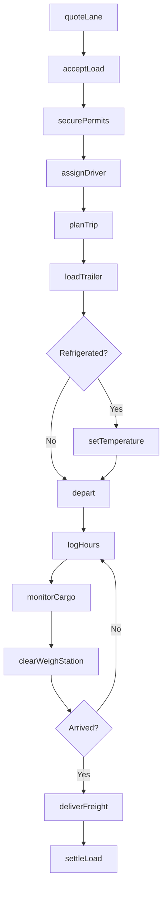
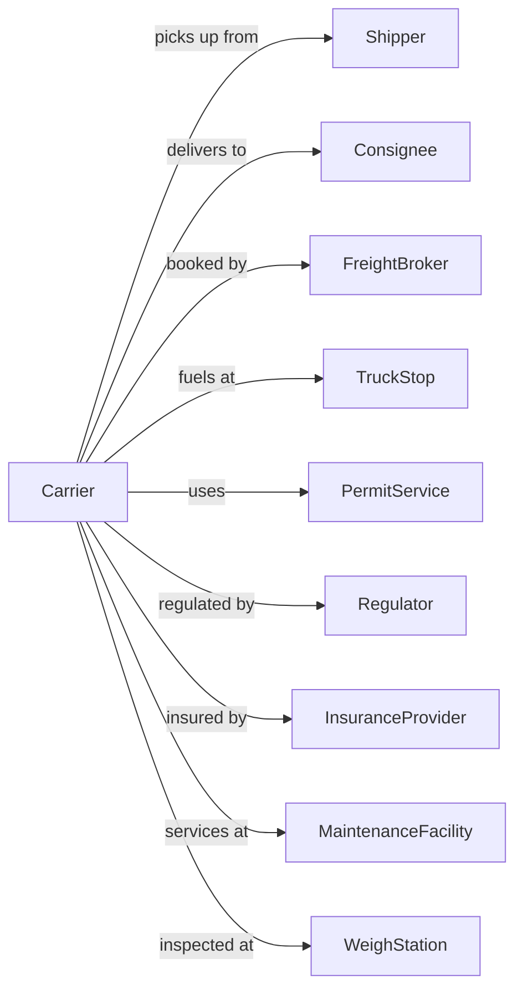

# Specialized Freight (except Used Goods) Trucking, Long-Distance

> Business-as-Code definition for long-distance specialized freight trucking operations. Models the complete over-the-road hauling lifecycle for automobile carriers, refrigerated products, bulk liquids, hazardous materials, and oversized equipment across metropolitan areas and state lines.

## Overview

Long-distance specialized freight trucking involves providing trucking services between metropolitan areas for cargo requiring specialized equipment. This includes car haulers, refrigerated trailers, tankers, flatbeds, and lowboys. This definition exposes actions for managing multi-day dispatch, route planning with permits, driver hours compliance, and delivery for interstate specialty hauling operations.

## Actors

| Actor | Description |
|-------|-------------|
| Shipper | Origin company sending specialized freight |
| Consignee | Final destination receiving cargo |
| FreightBroker | Arranges loads and connects carriers with shippers |
| TruckStop | Provides fuel, parking, and driver amenities |
| PermitService | Obtains state oversize and overweight permits |
| Regulator | FMCSA, DOT, and state transport authorities |
| InsuranceProvider | Cargo, liability, and equipment coverage |
| MaintenanceFacility | Services reefer units, tanks, and specialty trailers |
| WeighStation | State-operated commercial vehicle inspection point |

## Roles

| Role | Description |
|------|-------------|
| Driver | CDL holder operating long-haul specialized equipment |
| Dispatcher | Plans loads, routes, and driver assignments |
| LoadPlanner | Optimizes cargo placement and securement |
| ComplianceManager | Ensures ELD, hazmat, and permit compliance |
| FleetDirector | Manages equipment procurement and lifecycle |
| CustomerService | Handles shipper and broker communications |
| SafetyCoordinator | Conducts driver training and accident response |
| SettlementClerk | Processes driver pay and accessorial charges |

## Entities

| Entity | Description |
|--------|-------------|
| Tractor | Power unit for pulling specialized trailers |
| Trailer | Reefer, tanker, flatbed, car hauler, or lowboy |
| Shipment | Cargo with origin, destination, and specifications |
| Permit | State-issued oversize, overweight, or escort permits |
| Route | Multi-state path with restrictions and fuel stops |
| ELD | Electronic logging device tracking hours of service |
| BOL | Bill of lading with cargo and consignee details |
| ReeferUnit | Refrigeration unit with temperature settings |
| HazmatPlacard | Required hazmat identification signage |
| LoadStraps | Specialized securement equipment for cargo type |

## Actions

| Action | Description |
|--------|-------------|
| quoteLane | Provide rate for origin-destination pair |
| acceptLoad | Confirm specialized freight for transport |
| securePemits | Obtain all required state permits for route |
| assignDriver | Dispatch driver with appropriate endorsements |
| planTrip | Calculate route with fuel stops and rest periods |
| loadTrailer | Load cargo using specialized techniques |
| setTemperature | Configure reefer unit for cargo requirements |
| depart | Begin long-haul trip from origin |
| logHours | Record driving and on-duty time in ELD |
| monitorCargo | Track temperature, pressure, or position |
| clearWeighStation | Pass through inspection checkpoint |
| deliverFreight | Complete unloading at consignee |
| settleLoad | Calculate pay and finalize billing |

## Events

| Event | Description |
|-------|-------------|
| laneQuoted | Rate provided for specialized lane |
| loadAccepted | Freight confirmed for transport |
| permitsSecured | All state permits obtained |
| driverAssigned | Qualified driver dispatched |
| tripPlanned | Route and stops calculated |
| trailerLoaded | Cargo placed and secured |
| temperatureSet | Reefer configured for cargo |
| departed | Trip started from origin |
| hoursLogged | ELD entry recorded |
| cargoMonitored | Condition check completed |
| weighStationCleared | Inspection passed |
| freightDelivered | Cargo unloaded at destination |
| loadSettled | Payment and billing finalized |

## Searches

| Search | Description |
|--------|-------------|
| findAvailableDrivers | List drivers with required endorsements and hours |
| getPermitRequirements | Retrieve permits needed by state for load |
| trackShipment | Get real-time location and cargo status |
| getTemperatureLog | Retrieve reefer temperature history |
| findFuelStops | Locate truck stops along planned route |
| getDriverHOS | Check driver hours of service remaining |
| getLaneRates | Get market rates for origin-destination |
| getMaintenanceDue | List equipment needing service |

## Workflow



## Actor Relationships



## Usage

### Calling Actions

```typescript
import { truckLongDistanceSpecializedFreight } from '@headlessly/truck-long-distance-specialized-freight'

const carrier = truckLongDistanceSpecializedFreight()

// Quote a refrigerated lane
const quote = await carrier.quoteLane({
  origin: 'Salinas, CA',
  destination: 'Chicago, IL',
  cargoType: 'produce',
  weight: 42000,
  trailerType: 'reefer',
  temperature: 34
})

// Accept the load
const shipment = await carrier.acceptLoad({
  quoteId: quote.id,
  shipper: { name: 'Valley Fresh Farms', contact: 'shipping@valleyfresh.com' },
  consignee: { name: 'Midwest Grocers DC', contact: 'receiving@mwgrocers.com' },
  pickupDate: '2024-03-15',
  deliveryWindow: { start: '2024-03-18 06:00', end: '2024-03-18 18:00' }
})

// Monitor cargo in transit
const status = await carrier.trackShipment({
  shipmentId: shipment.id
})

const temps = await carrier.getTemperatureLog({
  shipmentId: shipment.id,
  last: '24h'
})
```

### Event-Driven Automation

```typescript
// Alert on temperature deviation
carrier.cargoMonitored(async ({ shipmentId, temperature, setpoint }) => {
  if (Math.abs(temperature - setpoint) > 3) {
    await createAlert({
      type: 'temperature-deviation',
      shipmentId,
      current: temperature,
      setpoint,
      severity: 'high'
    })
  }
})

// Auto-notify consignee of ETA
carrier.departed(async ({ shipmentId, eta }) => {
  const shipment = await carrier.trackShipment({ shipmentId })

  await sendNotification({
    to: shipment.consignee.contact,
    subject: 'Shipment Departed',
    body: `Your refrigerated shipment is en route. ETA: ${eta}`
  })
})

// Auto-settle on delivery
carrier.freightDelivered(async ({ shipmentId, podSignature, actualTime }) => {
  await carrier.settleLoad({
    shipmentId,
    pod: podSignature,
    deliveryTime: actualTime
  })
})
```
