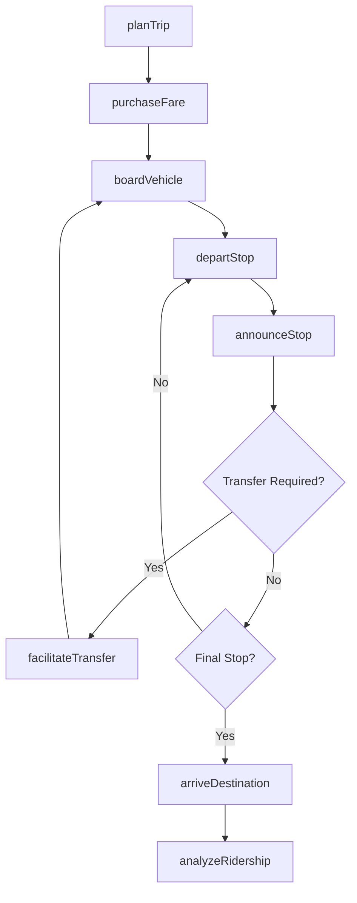
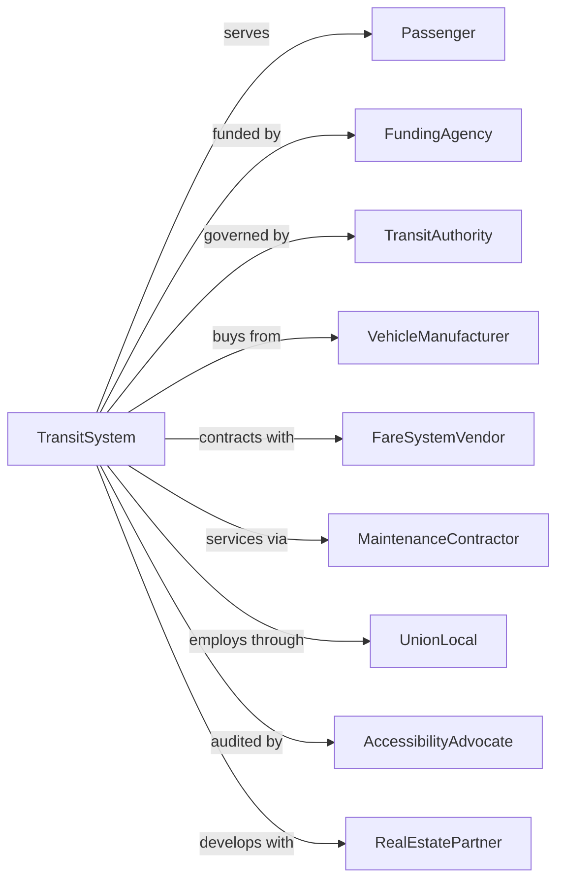

# Mixed Mode Transit Systems

> Business-as-Code definition for mixed mode transit system operations. Models the complete multi-modal urban transportation lifecycle integrating buses, light rail, streetcars, and other transit modes across metropolitan service areas.

## Overview

Mixed mode transit systems operate local and suburban ground passenger transportation using multiple modes of transport over regular routes and schedules within metropolitan areas. This includes integrated networks of buses, light rail, streetcars, trolleys, and ferries. This definition exposes actions for managing multi-modal schedules, fare integration, fleet coordination, and passenger services across transit modes.

## Actors

| Actor | Description |
|-------|-------------|
| Passenger | Rider using one or more transit modes |
| FundingAgency | Federal, state, or local transit funding source |
| TransitAuthority | Regional body governing transit operations |
| VehicleManufacturer | Supplies buses, railcars, and transit vehicles |
| FareSystemVendor | Provides integrated ticketing technology |
| MaintenanceContractor | Services vehicles and infrastructure |
| UnionLocal | Represents transit workers |
| AccessibilityAdvocate | Ensures ADA compliance and accessibility |
| RealEstatePartner | Develops transit-oriented properties |

## Roles

| Role | Description |
|------|-------------|
| Operator | Drives buses or operates rail vehicles |
| Dispatcher | Coordinates vehicle movements across modes |
| StationAgent | Assists passengers at transit stations |
| MaintenanceTech | Services vehicles and equipment |
| SchedulePlanner | Designs routes and timetables |
| FareAnalyst | Manages pricing and fare policy |
| SafetyOfficer | Ensures passenger and employee safety |
| CustomerServiceRep | Handles rider inquiries and complaints |

## Entities

| Entity | Description |
|--------|-------------|
| Bus | Motor coach for fixed-route service |
| Railcar | Light rail or streetcar vehicle |
| Route | Fixed path with scheduled stops |
| Schedule | Timetable for vehicle departures |
| Stop | Boarding location with shelter and signage |
| Station | Major transfer point between modes |
| FareCard | Integrated payment medium for all modes |
| Trip | Single vehicle run from origin to terminus |
| Transfer | Connection between modes or routes |
| ServiceAlert | Real-time notification of delays or changes |

## Actions

| Action | Description |
|--------|-------------|
| planTrip | Calculate multi-modal route for passenger |
| purchaseFare | Sell ticket or load fare card |
| boardVehicle | Allow passenger entry with fare validation |
| departStop | Begin vehicle movement from station |
| announceStop | Provide audio and visual stop information |
| facilitateTransfer | Enable passenger connection between modes |
| arriveDestination | Complete trip at final stop |
| trackVehicle | Monitor real-time vehicle location |
| adjustSchedule | Modify service for delays or demand |
| reportIncident | Document safety or service issue |
| maintainVehicle | Perform scheduled or emergency maintenance |
| analyzeRidership | Review passenger counts and patterns |

## Events

| Event | Description |
|-------|-------------|
| tripPlanned | Multi-modal route calculated |
| farePurchased | Payment processed |
| passengerBoarded | Rider entered vehicle |
| vehicleDeparted | Bus or train left stop |
| stopAnnounced | Next stop information provided |
| transferCompleted | Passenger changed modes |
| destinationReached | Rider arrived at final stop |
| vehicleTracked | Location updated |
| scheduleAdjusted | Service modified |
| incidentReported | Issue documented |
| vehicleMaintained | Maintenance completed |
| ridershipAnalyzed | Data review completed |

## Searches

| Search | Description |
|--------|-------------|
| findRoutes | List routes serving origin-destination pair |
| getSchedule | Retrieve timetable for route or station |
| trackVehicles | Get real-time locations for route |
| getServiceAlerts | List active delays and detours |
| findStations | Locate stops near specified address |
| getRidership | Retrieve passenger counts by route or time |
| getTransferPoints | List stations with multi-modal connections |
| getFareOptions | Get pricing for trip types |

## Workflow



## Actor Relationships



## Usage

### Calling Actions

```typescript
import { transitMixedMode } from '@headlessly/transit-mixed-mode'

const transit = transitMixedMode()

// Plan a multi-modal trip
const trip = await transit.planTrip({
  origin: '100 Main St, Denver',
  destination: 'Denver International Airport',
  departureTime: '2024-03-15T08:00:00',
  preferences: { wheelchair: false, fewestTransfers: true }
})

// Purchase fare for the trip
const fare = await transit.purchaseFare({
  tripId: trip.id,
  fareType: 'regional',
  paymentMethod: 'fareCard',
  cardId: 'FC-123456'
})

// Track vehicle in real-time
const vehicles = await transit.trackVehicles({
  routeId: trip.legs[0].routeId
})
```

### Event-Driven Automation

```typescript
// Auto-notify passengers of delays
transit.scheduleAdjusted(async ({ routeId, delayMinutes, reason }) => {
  if (delayMinutes > 10) {
    const affectedTrips = await transit.findRoutes({ routeId })

    await broadcastAlert({
      routes: [routeId],
      message: `${delayMinutes} minute delay due to ${reason}`,
      channels: ['app', 'display', 'audio']
    })
  }
})

// Auto-dispatch replacement vehicles
transit.incidentReported(async ({ vehicleId, incidentType, location }) => {
  if (incidentType === 'breakdown') {
    await transit.adjustSchedule({
      vehicleId,
      action: 'replace',
      dispatchFrom: 'nearest-depot'
    })
  }
})

// Auto-analyze peak ridership
transit.ridershipAnalyzed(async ({ routeId, period, count }) => {
  const capacity = await transit.getSchedule({ routeId })

  if (count > capacity.seatedCapacity * 1.2) {
    await requestAdditionalService({
      routeId,
      period,
      recommendation: 'add-trip'
    })
  }
})
```
