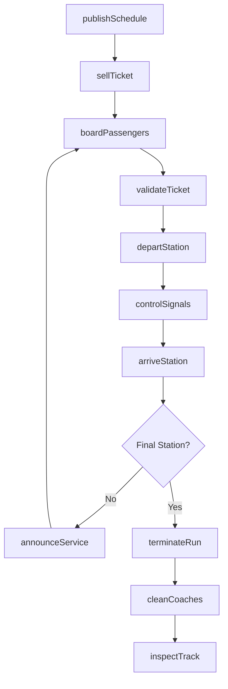
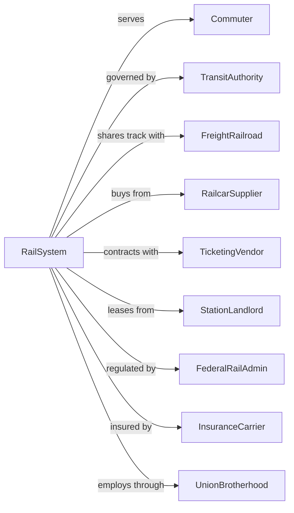

# Commuter Rail Systems

> Business-as-Code definition for commuter rail system operations. Models the complete suburban rail transportation lifecycle from schedule planning through ticketing, train operations, and station services for peak-period commuter travel.

## Overview

Commuter rail systems operate local and suburban passenger rail services over regular routes and schedules within metropolitan areas and adjacent suburbs. Service is typically characterized by reduced fares, multiple-ride tickets, and peak-period focus serving morning and evening commuters. This definition exposes actions for managing train schedules, fare collection, station operations, and passenger services.

## Actors

| Actor | Description |
|-------|-------------|
| Commuter | Daily rider traveling to and from work |
| TransitAuthority | Regional body overseeing rail operations |
| FreightRailroad | Host railroad sharing track infrastructure |
| RailcarSupplier | Provides passenger coaches and locomotives |
| TicketingVendor | Supplies fare collection systems |
| StationLandlord | Owns or leases station properties |
| FederalRailAdmin | Federal Railroad Administration regulator |
| InsuranceCarrier | Provides liability and equipment coverage |
| UnionBrotherhood | Represents conductors and engineers |

## Roles

| Role | Description |
|------|-------------|
| Engineer | Operates locomotive and controls train |
| Conductor | Manages passenger boarding and fare collection |
| Dispatcher | Controls train movements on tracks |
| StationAgent | Assists passengers and sells tickets |
| TrackMaintainer | Inspects and repairs rail infrastructure |
| CoachCleaner | Cleans and prepares passenger cars |
| SchedulePlanner | Designs timetables and service patterns |
| SafetyInspector | Ensures FRA compliance and safety |

## Entities

| Entity | Description |
|--------|-------------|
| Train | Locomotive and passenger car consist |
| Locomotive | Power unit pulling passenger coaches |
| Coach | Passenger railcar with seating |
| Track | Rail infrastructure including switches and signals |
| Station | Passenger boarding platform and facilities |
| Schedule | Published timetable of train departures |
| Ticket | Proof of fare payment for travel |
| Zone | Geographic area determining fare price |
| Signal | Track-side indication controlling train movement |
| Platform | Raised area for passenger boarding |

## Actions

| Action | Description |
|--------|-------------|
| publishSchedule | Release timetable for upcoming service period |
| sellTicket | Process fare payment for travel |
| validateTicket | Check ticket validity on board |
| boardPassengers | Allow riders to enter train at station |
| departStation | Begin train movement from platform |
| controlSignals | Manage track signals for safe movement |
| arriveStation | Stop train at scheduled station |
| announceService | Provide audio information to passengers |
| delayTrain | Hold train for connections or issues |
| terminateRun | Complete trip at final destination |
| inspectTrack | Examine rail infrastructure condition |
| cleanCoaches | Prepare cars for next service |

## Events

| Event | Description |
|-------|-------------|
| schedulePublished | Timetable released to public |
| ticketSold | Fare payment processed |
| ticketValidated | Proof of payment confirmed |
| passengersBoarded | Riders entered train |
| trainDeparted | Movement started from station |
| signalsControlled | Track authority established |
| trainArrived | Reached scheduled station |
| serviceAnnounced | Information broadcast to riders |
| trainDelayed | Departure held for specified reason |
| runTerminated | Trip completed at final station |
| trackInspected | Infrastructure checked |
| coachesCleaned | Cars prepared for service |

## Searches

| Search | Description |
|--------|-------------|
| getSchedule | Retrieve timetable for line or station |
| findTrains | List trains serving origin-destination pair |
| trackTrain | Get real-time location and status |
| getDelays | List current service disruptions |
| getFares | Get pricing by zone and ticket type |
| findStations | Locate stations on specified line |
| getRidership | Retrieve passenger counts by train |
| getCapacity | Check available seats on train |

## Workflow



## Actor Relationships



## Usage

### Calling Actions

```typescript
import { transitCommuterRail } from '@headlessly/transit-commuter-rail'

const rail = transitCommuterRail()

// Find trains for commute
const trains = await rail.findTrains({
  origin: 'Suburban Station',
  destination: 'Downtown Terminal',
  departureAfter: '07:00',
  departureBefore: '09:00'
})

// Purchase monthly pass
const ticket = await rail.sellTicket({
  ticketType: 'monthly',
  zones: [1, 2, 3],
  startDate: '2024-04-01',
  paymentMethod: 'creditCard'
})

// Track specific train
const status = await rail.trackTrain({
  trainNumber: 'NE-425'
})
```

### Event-Driven Automation

```typescript
// Auto-notify passengers of delays
rail.trainDelayed(async ({ trainNumber, delayMinutes, reason }) => {
  await broadcastAlert({
    train: trainNumber,
    message: `Train ${trainNumber} delayed ${delayMinutes} minutes: ${reason}`,
    channels: ['app', 'station-display', 'platform-audio']
  })
})

// Auto-hold connecting trains
rail.trainDelayed(async ({ trainNumber, arrivalStation, delayMinutes }) => {
  const connections = await rail.findTrains({
    origin: arrivalStation,
    departureAfter: scheduleTime,
    departureBefore: addMinutes(scheduleTime, delayMinutes + 5)
  })

  for (const conn of connections) {
    if (conn.connectingPassengers > threshold) {
      await rail.delayTrain({
        trainNumber: conn.trainNumber,
        holdMinutes: Math.min(delayMinutes, 5),
        reason: 'connection-hold'
      })
    }
  }
})

// Auto-schedule extra cars for high ridership
rail.ridership(async ({ trainNumber, count, capacity }) => {
  if (count > capacity * 0.95) {
    await requestEquipment({
      trainNumber,
      additionalCars: 1,
      effectiveDate: nextWeekday()
    })
  }
})
```
