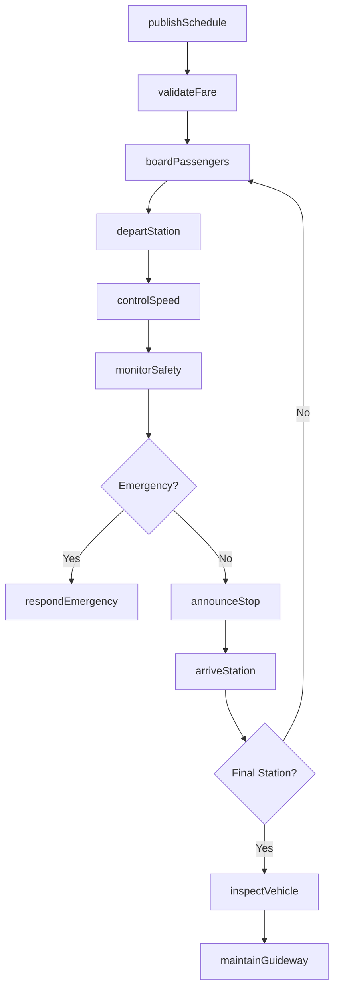
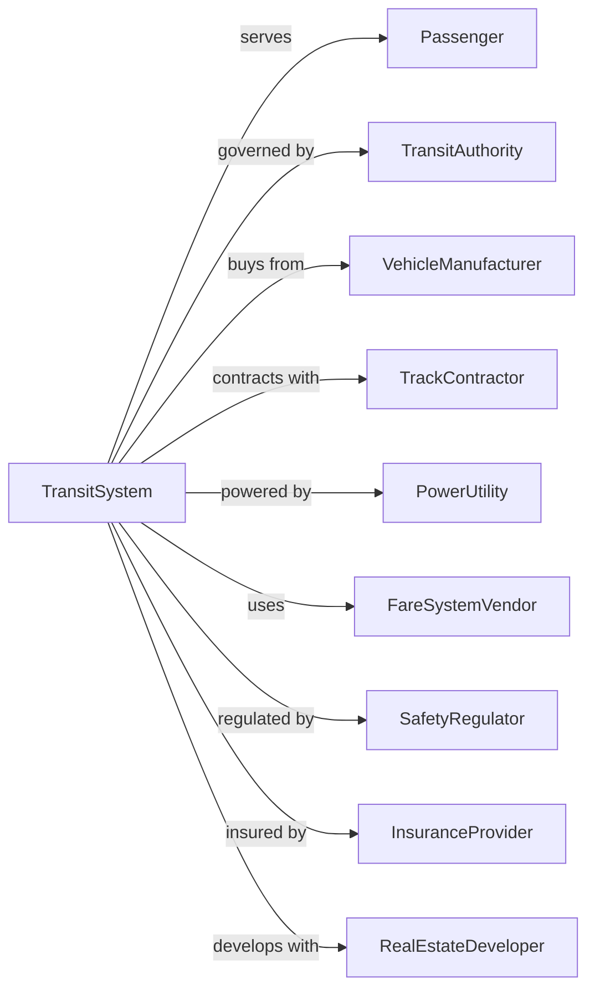

# Other Urban Transit Systems

> Business-as-Code definition for specialized urban transit system operations. Models the complete passenger transportation lifecycle for light rail, monorail, cable cars, tramways, and other fixed-guideway transit systems within metropolitan areas.

## Overview

Other urban transit systems operate local and suburban ground passenger transportation using specialized modes such as light rail, monorail, cable cars, tramways, and funiculars over regular routes and schedules. These systems provide fixed-guideway transit services distinct from buses and commuter rail. This definition exposes actions for managing specialized vehicle operations, station services, fare collection, and passenger safety for urban rail and cable transit.

## Actors

| Actor | Description |
|-------|-------------|
| Passenger | Rider using specialized transit service |
| TransitAuthority | Regional body governing transit operations |
| VehicleManufacturer | Supplies railcars, cable cars, and specialty vehicles |
| TrackContractor | Constructs and maintains guideway infrastructure |
| PowerUtility | Supplies electricity for system operation |
| FareSystemVendor | Provides ticketing and fare collection |
| SafetyRegulator | Federal and state transit safety oversight |
| InsuranceProvider | Covers liability and equipment |
| RealEstateDeveloper | Builds transit-oriented development |

## Roles

| Role | Description |
|------|-------------|
| Operator | Controls vehicle movement and passenger boarding |
| StationAttendant | Assists passengers and monitors platforms |
| Dispatcher | Coordinates vehicle movements and spacing |
| MaintenanceTech | Services vehicles and infrastructure |
| TrackInspector | Examines guideway and switch condition |
| PowerSystemTech | Maintains electrical and propulsion systems |
| SafetyOfficer | Ensures compliance and emergency response |
| CustomerServiceRep | Handles rider inquiries and complaints |

## Entities

| Entity | Description |
|--------|-------------|
| Vehicle | Light rail car, cable car, monorail, or tram |
| Guideway | Track, cable, or monorail beam infrastructure |
| Station | Passenger boarding platform and facilities |
| Route | Fixed path with scheduled service |
| Schedule | Published timetable of vehicle departures |
| FareGate | Entry point with fare validation |
| PowerSystem | Overhead wire, third rail, or cable mechanism |
| Switch | Track device for routing vehicles |
| Signal | Indication system for vehicle control |
| EmergencyStop | Safety device for immediate halt |

## Actions

| Action | Description |
|--------|-------------|
| publishSchedule | Release timetable for service period |
| validateFare | Check passenger payment at entry |
| boardPassengers | Allow riders to enter vehicle |
| departStation | Begin vehicle movement from platform |
| controlSpeed | Manage vehicle velocity on guideway |
| arriveStation | Stop vehicle at scheduled station |
| announceStop | Provide audio and visual information |
| monitorSafety | Check clearances and passenger safety |
| respondEmergency | Execute emergency stop or evacuation |
| maintainGuideway | Service track, cable, or beam |
| inspectVehicle | Check vehicle condition and safety |
| analyzeRidership | Review passenger counts and patterns |

## Events

| Event | Description |
|-------|-------------|
| schedulePublished | Timetable released to public |
| fareValidated | Passenger payment confirmed |
| passengersBoarded | Riders entered vehicle |
| vehicleDeparted | Movement started from station |
| speedControlled | Velocity adjusted on guideway |
| vehicleArrived | Reached scheduled station |
| stopAnnounced | Information provided to riders |
| safetyMonitored | Clearance check completed |
| emergencyResponded | Safety action executed |
| guidewayMaintained | Infrastructure serviced |
| vehicleInspected | Condition verified |
| ridershipAnalyzed | Data review completed |

## Searches

| Search | Description |
|--------|-------------|
| getSchedule | Retrieve timetable for route |
| trackVehicle | Get real-time location and status |
| getArrivals | List upcoming vehicles at station |
| findStations | Locate stations on route |
| getServiceAlerts | List delays and disruptions |
| getRidership | Get passenger counts by route |
| getMaintenanceStatus | Check infrastructure condition |
| getFares | Retrieve pricing information |

## Workflow



## Actor Relationships



## Usage

### Calling Actions

```typescript
import { transitUrbanTransit } from '@headlessly/transit-urban-transit'

const transit = transitUrbanTransit()

// Get light rail schedule
const schedule = await transit.getSchedule({
  routeId: 'BLUE-LINE',
  date: '2024-03-15'
})

// Track vehicle in real-time
const vehicle = await transit.trackVehicle({
  vehicleId: 'LRV-2045'
})

// Get station arrivals
const arrivals = await transit.getArrivals({
  stationId: 'DOWNTOWN-CENTRAL',
  limit: 5
})
```

### Event-Driven Automation

```typescript
// Auto-alert on service disruption
transit.emergencyResponded(async ({ vehicleId, location, emergencyType }) => {
  await broadcastAlert({
    route: vehicleId.route,
    message: `Service disruption at ${location}: ${emergencyType}`,
    channels: ['app', 'station-display', 'audio']
  })
})

// Auto-adjust headways for crowding
transit.ridershipAnalyzed(async ({ stationId, loadFactor, timePeriod }) => {
  if (loadFactor > 0.9) {
    await requestAdditionalService({
      stationId,
      timePeriod,
      recommendation: 'reduce-headway'
    })
  }
})

// Auto-schedule maintenance based on usage
transit.vehicleInspected(async ({ vehicleId, mileage, condition }) => {
  if (mileage > maintenanceThreshold || condition === 'needs-service') {
    await scheduleMaintenance({
      vehicleId,
      type: 'preventive',
      priority: condition === 'needs-service' ? 'high' : 'normal'
    })
  }
})
```
