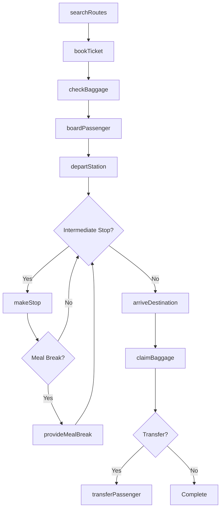
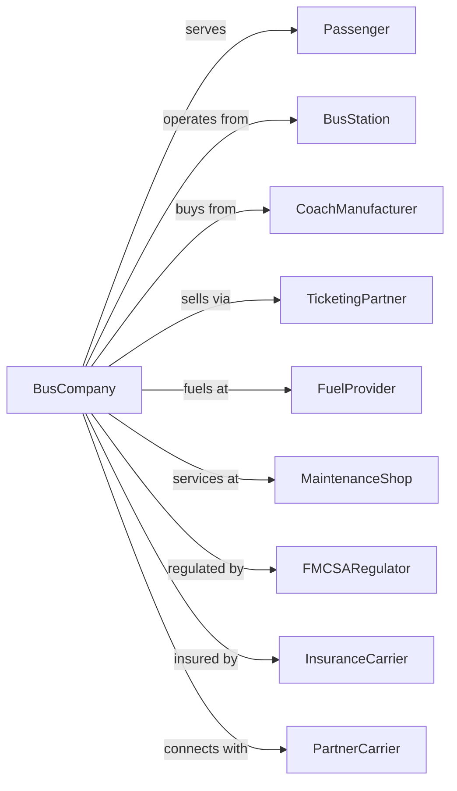

# Interurban and Rural Bus Transportation

> Business-as-Code definition for interurban and rural bus transportation operations. Models the complete intercity passenger bus service lifecycle from schedule planning through ticketing, coach operations, and passenger services across cities and rural areas.

## Overview

Interurban and rural bus transportation involves providing scheduled bus passenger services over regular routes principally outside metropolitan areas. Services connect cities, towns, and rural communities with motorcoach travel. This definition exposes actions for managing intercity schedules, reservation systems, baggage handling, and passenger services for long-distance bus travel.

## Actors

| Actor | Description |
|-------|-------------|
| Passenger | Traveler using intercity bus service |
| BusStation | Terminal facility for boarding and ticketing |
| CoachManufacturer | Supplies motorcoaches and parts |
| TicketingPartner | Online and retail ticket sales channels |
| FuelProvider | Supplies diesel for coach operations |
| MaintenanceShop | Services motorcoaches and equipment |
| FMCSARegulator | Federal Motor Carrier Safety Administration |
| InsuranceCarrier | Provides liability and passenger coverage |
| PartnerCarrier | Connecting bus line for interline service |

## Roles

| Role | Description |
|------|-------------|
| Driver | Operates motorcoach and assists passengers |
| Dispatcher | Coordinates schedules and driver assignments |
| TicketAgent | Sells tickets and assists travelers |
| BaggageHandler | Loads and unloads passenger luggage |
| StationManager | Oversees terminal operations |
| SafetyManager | Ensures FMCSA compliance and driver training |
| CustomerService | Handles passenger inquiries and complaints |
| FleetManager | Maintains motorcoach fleet |

## Entities

| Entity | Description |
|--------|-------------|
| Motorcoach | Over-the-road bus for intercity travel |
| Route | Regular path between cities with scheduled stops |
| Schedule | Published timetable of departures |
| Ticket | Proof of fare payment with seat assignment |
| Station | Terminal facility for passenger boarding |
| Stop | Intermediate boarding location on route |
| Baggage | Passenger luggage checked or carried |
| Reservation | Advance booking for specific departure |
| Transfer | Connection to another route or carrier |
| LayoverFacility | Rest stop for passengers and drivers |

## Actions

| Action | Description |
|--------|-------------|
| searchRoutes | Find available routes between cities |
| bookTicket | Reserve seat on scheduled departure |
| checkBaggage | Accept luggage for under-coach storage |
| boardPassenger | Verify ticket and allow coach entry |
| departStation | Begin coach movement from terminal |
| makeStop | Pause at intermediate boarding location |
| provideMealBreak | Stop at layover facility for passengers |
| arriveDestination | Complete trip at final terminal |
| claimBaggage | Return checked luggage to passenger |
| transferPassenger | Connect to another route or carrier |
| refundTicket | Process cancellation and return payment |
| trackCoach | Monitor real-time coach location |

## Events

| Event | Description |
|-------|-------------|
| routesSearched | Available services identified |
| ticketBooked | Reservation confirmed |
| baggageChecked | Luggage accepted for transport |
| passengerBoarded | Traveler entered coach |
| coachDeparted | Movement started from terminal |
| stopMade | Intermediate pickup completed |
| mealBreakProvided | Layover stop completed |
| destinationReached | Trip completed at final terminal |
| baggageClaimed | Luggage returned to passenger |
| passengerTransferred | Connection made to another service |
| ticketRefunded | Cancellation processed |
| coachTracked | Location updated |

## Searches

| Search | Description |
|--------|-------------|
| findRoutes | List routes between origin and destination |
| getSchedule | Retrieve timetable for route |
| checkAvailability | Get seat availability for departure |
| trackCoach | Get real-time coach location |
| getStations | List stations on route |
| getFares | Get pricing for route |
| getAmenities | List coach features and services |
| getConnections | Find connecting routes at station |

## Workflow



## Actor Relationships



## Usage

### Calling Actions

```typescript
import { busInterurbanRural } from '@headlessly/bus-interurban-rural'

const busLine = busInterurbanRural()

// Search for routes
const routes = await busLine.findRoutes({
  origin: 'Chicago, IL',
  destination: 'Indianapolis, IN',
  date: '2024-03-20'
})

// Book a ticket
const ticket = await busLine.bookTicket({
  routeId: routes[0].id,
  departureTime: '09:00',
  passenger: { name: 'John Smith', email: 'john@example.com' },
  seatPreference: 'window'
})

// Track coach in transit
const location = await busLine.trackCoach({
  coachId: ticket.coachId
})
```

### Event-Driven Automation

```typescript
// Auto-notify passengers of delays
busLine.coachDeparted(async ({ coachId, delay, reason }) => {
  if (delay > 15) {
    const passengers = await busLine.getPassengerList({ coachId })

    for (const passenger of passengers) {
      await sendNotification({
        to: passenger.email,
        subject: 'Bus Delay Notification',
        body: `Your bus is delayed ${delay} minutes due to ${reason}`
      })
    }
  }
})

// Auto-update connections for late arrivals
busLine.destinationReached(async ({ coachId, arrivalTime, scheduledTime }) => {
  const delay = minutesBetween(scheduledTime, arrivalTime)

  if (delay > 10) {
    const connections = await busLine.getConnections({
      station: destination,
      after: arrivalTime
    })

    await notifyConnectingCarriers({
      inboundCoach: coachId,
      delay,
      connections
    })
  }
})

// Auto-process refunds for cancellations
busLine.ticketRefunded(async ({ ticketId, reason, amount }) => {
  await processRefund({
    ticketId,
    amount,
    method: 'original-payment'
  })

  await sendConfirmation({
    ticketId,
    message: `Refund of $${amount} processed for ${reason}`
  })
})
```
