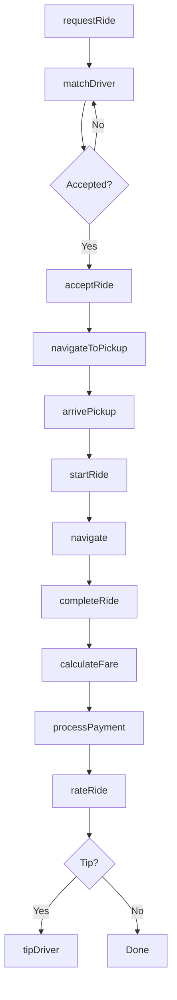
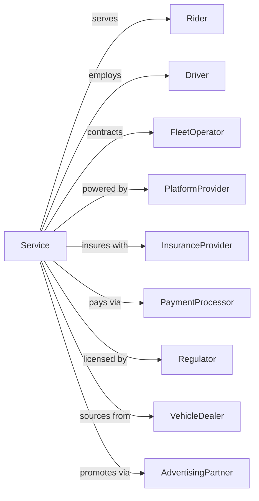

# Taxi and Ridesharing Services

> Business-as-Code definition for on-demand passenger transportation operations. Models the complete ride lifecycle from request through driver matching, pickup, transport, and payment.

## Overview

Taxi and ridesharing services provide on-demand passenger transportation by automobile or van without fixed routes, including traditional taxi dispatch, app-based ridesharing, and ride-hailing platforms. This definition exposes actions for managing ride requests, driver matching, navigation, fare calculation, and payment processing.

## Actors

| Actor | Description |
|-------|-------------|
| Rider | Passenger requesting transportation |
| Driver | Operator providing ride service |
| FleetOperator | Owns and manages taxi fleet |
| PlatformProvider | Rideshare technology platform |
| InsuranceProvider | Covers driver and passenger liability |
| PaymentProcessor | Handles fare transactions |
| Regulator | TLC and local licensing authority |
| VehicleDealer | Supplies and maintains vehicles |
| AdvertisingPartner | Provides in-vehicle promotions |

## Roles

| Role | Description |
|------|-------------|
| TaxiDriver | Licensed taxi operator |
| RideshareDriver | Independent contractor driver |
| Dispatcher | Assigns rides to drivers |
| FleetManager | Oversees vehicle operations |
| CustomerSupport | Handles rider and driver issues |
| ComplianceOfficer | Ensures licensing compliance |
| RateAnalyst | Sets pricing and surge calculations |
| SafetyMonitor | Reviews incidents and ratings |

## Entities

| Entity | Description |
|--------|-------------|
| Ride | Single passenger trip |
| Vehicle | Taxi, sedan, or rideshare car |
| Driver | Licensed operator |
| Rider | Passenger account |
| Route | Path from pickup to dropoff |
| Fare | Price for completed ride |
| Rating | Driver and rider feedback score |
| Surge | Dynamic pricing multiplier |
| Zone | Geographic service area |
| Dispatch | Ride assignment |

## Actions

| Action | Description |
|--------|-------------|
| requestRide | Submit pickup and destination |
| matchDriver | Assign available driver to ride |
| acceptRide | Driver confirms assignment |
| navigateToPickup | Route driver to rider |
| arrivePickup | Driver at pickup location |
| startRide | Begin metered trip |
| navigate | Route to destination |
| completeRide | End trip at destination |
| calculateFare | Determine ride price |
| processPayment | Charge rider for fare |
| rateRide | Submit feedback scores |
| tipDriver | Add gratuity |
| reportIssue | Flag safety or service problem |
| disputeFare | Challenge ride charges |

## Events

| Event | Description |
|-------|-------------|
| rideRequested | Pickup request submitted |
| driverMatched | Available driver assigned |
| rideAccepted | Driver confirmed |
| driverEnRoute | Heading to pickup |
| driverArrived | At pickup location |
| rideStarted | Trip began |
| rideInProgress | En route to destination |
| rideCompleted | Trip ended |
| fareCalculated | Price determined |
| paymentProcessed | Charge completed |
| rideRated | Feedback submitted |
| driverTipped | Gratuity added |
| issueReported | Problem flagged |
| fareDisputed | Charges challenged |

## Searches

| Search | Description |
|--------|-------------|
| findDrivers | List available drivers nearby |
| estimateFare | Calculate expected ride cost |
| getRide | Retrieve ride details |
| trackDriver | Get driver location |
| getRideHistory | List past rides |
| getDriverRating | View driver feedback |
| findPromotions | List available discounts |
| getReceipt | Download ride invoice |

## Workflow



## Actor Relationships



## Usage

### Calling Actions

```typescript
import { driveTaxiRidesharing } from '@headlessly/drive-taxi-ridesharing'

const rideshare = driveTaxiRidesharing()

// Request a ride
const ride = await rideshare.requestRide({
  rider: { id: 'rider-123', phone: '555-1234' },
  pickup: { lat: 40.7128, lng: -74.0060, address: '123 Broadway' },
  dropoff: { lat: 40.7580, lng: -73.9855, address: 'Times Square' },
  vehicleType: 'standard',
  passengers: 2
})

// Get fare estimate before request
const estimate = await rideshare.estimateFare({
  pickup: { lat: 40.7128, lng: -74.0060 },
  dropoff: { lat: 40.7580, lng: -73.9855 },
  vehicleType: 'standard'
})

// Track ride in progress
const status = await rideshare.trackDriver({
  rideId: ride.id
})
```

### Event-Driven Automation

```typescript
// Auto-notify on driver arrival
rideshare.driverArrived(async ({ rideId, driverName, vehicleInfo }) => {
  const ride = await rideshare.getRide({ rideId })

  await sendSMS({
    to: ride.rider.phone,
    message: `${driverName} has arrived in ${vehicleInfo.color} ${vehicleInfo.make}. License: ${vehicleInfo.plate}`
  })
})

// Auto-apply surge pricing
rideshare.rideRequested(async ({ pickup, timestamp }) => {
  const demand = await rideshare.findDrivers({ location: pickup })

  if (demand.waitTime > 10) {
    const surgeMultiplier = calculateSurge(demand.waitTime)

    return {
      surge: surgeMultiplier,
      message: `High demand - ${surgeMultiplier}x pricing`
    }
  }
})

// Auto-review low ratings
rideshare.rideRated(async ({ rideId, driverRating, riderRating }) => {
  if (driverRating < 3) {
    await createReview({
      type: 'driver-performance',
      rideId,
      rating: driverRating,
      priority: 'high'
    })
  }

  if (riderRating < 3) {
    await flagRider({
      rideId,
      rating: riderRating
    })
  }
})
```
