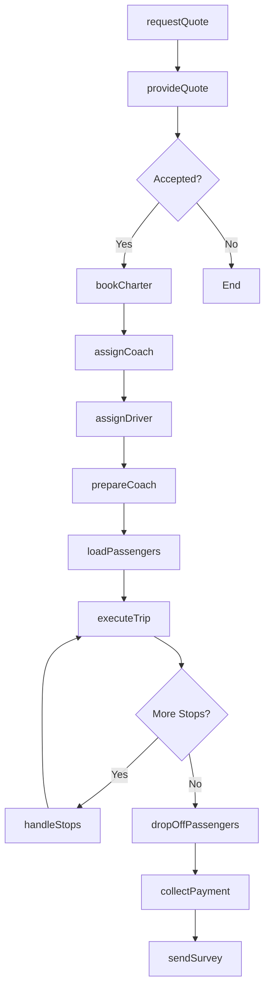

# Charter Bus Industry

> Business-as-Code definition for charter bus operations. Models the complete group transportation lifecycle from quote request through vehicle dispatch, trip execution, and billing for tours, events, and private group transportation services.

## Overview

Charter bus service involves providing motorcoaches for hire to transport groups on customized itineraries. Services include corporate events, school trips, sports team travel, wedding shuttles, and multi-day tours. This definition exposes actions for managing charter quotes, vehicle allocation, driver scheduling, and passenger services for non-scheduled group transportation.

## Actors

| Actor | Description |
|-------|-------------|
| Client | Organization or individual booking charter |
| TourOperator | Company packaging multi-day excursions |
| EventPlanner | Coordinates transportation for gatherings |
| SchoolDistrict | Books field trips and athletic travel |
| Corporation | Books employee and executive transport |
| CoachManufacturer | Supplies motorcoaches and parts |
| FMCSARegulator | Federal Motor Carrier Safety Administration |
| InsuranceProvider | Covers passenger liability and equipment |
| FuelSupplier | Provides diesel fuel for fleet |

## Roles

| Role | Description |
|------|-------------|
| Driver | Operates motorcoach and assists passengers |
| CharterCoordinator | Plans trip logistics and schedules |
| SalesRep | Provides quotes and books charters |
| Dispatcher | Assigns coaches and drivers to trips |
| FleetManager | Maintains coaches and compliance |
| TourGuide | Provides narration on sightseeing trips |
| MechanicTech | Services and repairs motorcoaches |
| BillingClerk | Processes invoices and payments |

## Entities

| Entity | Description |
|--------|-------------|
| Motorcoach | Full-size charter bus with amenities |
| Minibus | Mid-size vehicle for smaller groups |
| Charter | Booked trip with itinerary and pricing |
| Itinerary | Planned route with stops and timing |
| Quote | Pricing proposal for requested service |
| Driver | Operator with CDL and passenger endorsement |
| Client | Customer with contact and billing info |
| Contract | Service agreement for recurring charters |
| Manifest | Passenger list for trip |
| Amenity | WiFi, restroom, entertainment features |

## Actions

| Action | Description |
|--------|-------------|
| requestQuote | Submit charter requirements for pricing |
| provideQuote | Return pricing for requested charter |
| bookCharter | Confirm trip with deposit |
| assignCoach | Allocate specific vehicle to charter |
| assignDriver | Dispatch qualified driver for trip |
| prepareCoach | Clean, fuel, and inspect vehicle |
| loadPassengers | Board group at pickup location |
| executeTrip | Drive itinerary with scheduled stops |
| handleStops | Manage rest breaks and attractions |
| dropOffPassengers | Discharge group at final destination |
| collectPayment | Process final billing for service |
| sendSurvey | Request feedback on charter experience |

## Events

| Event | Description |
|-------|-------------|
| quoteRequested | Charter inquiry received |
| quoteProvided | Pricing sent to client |
| charterBooked | Trip confirmed with deposit |
| coachAssigned | Vehicle allocated to charter |
| driverAssigned | Operator dispatched to trip |
| coachPrepared | Vehicle ready for service |
| passengersLoaded | Group boarded at pickup |
| tripExecuting | Charter in progress |
| stopHandled | Rest break or attraction completed |
| passengersDropped | Group discharged at destination |
| paymentCollected | Final billing processed |
| surveySent | Feedback request delivered |

## Searches

| Search | Description |
|--------|-------------|
| checkAvailability | Find coaches available for dates |
| getQuote | Calculate pricing for charter |
| findCharters | List bookings by date or client |
| trackCoach | Get real-time coach location |
| getDriverSchedule | View driver assignments |
| getFleetStatus | Check coach availability and condition |
| getClientHistory | Review past charters for client |
| getCoachAmenities | List features for specific vehicle |

## Workflow



## Actor Relationships

```mermaid
graph LR
    C[CharterCompany]

    C -->|serves| Client
    C -->|partners with| TourOperator
    C -->|contracts with| EventPlanner
    C -->|serves| SchoolDistrict
    C -->|serves| Corporation
    C -->|buys from| CoachManufacturer
    C -->|regulated by| FMCSARegulator
    C -->|insured by| InsuranceProvider
    C -->|fuels at| FuelSupplier
```



## Usage

### Calling Actions

```typescript
import { charterCharterBus } from '@headlessly/charter-charter-bus'

const charter = charterCharterBus()

// Request quote for school trip
const quote = await charter.requestQuote({
  pickupAddress: 'Lincoln High School, 100 School St',
  destinations: [
    { name: 'Science Museum', address: '500 Museum Dr', duration: 180 },
    { name: 'Lunch Stop', address: '200 Restaurant Row', duration: 60 }
  ],
  returnAddress: 'Lincoln High School, 100 School St',
  date: '2024-04-15',
  departureTime: '08:00',
  passengers: 45,
  amenities: ['restroom', 'wifi']
})

// Book the charter
const booking = await charter.bookCharter({
  quoteId: quote.id,
  client: {
    name: 'Lincoln High School',
    contact: 'Mrs. Johnson',
    email: 'johnson@lincoln.edu',
    phone: '555-0200'
  },
  deposit: quote.depositAmount
})

// Track coach during trip
const location = await charter.trackCoach({
  charterId: booking.id
})
```

### Event-Driven Automation

```typescript
// Auto-notify client of coach arrival
charter.coachPrepared(async ({ charterId, coachId, driver }) => {
  const booking = await charter.findCharters({ id: charterId })

  await sendSMS({
    to: booking.client.phone,
    message: `Your coach ${coachId} with driver ${driver.name} is en route. ETA: 15 minutes.`
  })
})

// Auto-send trip updates to client contact
charter.tripExecuting(async ({ charterId, currentLocation, nextStop }) => {
  const booking = await charter.findCharters({ id: charterId })

  await sendNotification({
    to: booking.client.email,
    subject: 'Trip Update',
    body: `Your group is currently at ${currentLocation}. Next stop: ${nextStop.name}`
  })
})

// Auto-send feedback survey after trip
charter.passengersDropped(async ({ charterId, actualArrival, scheduledArrival }) => {
  const booking = await charter.findCharters({ id: charterId })

  // Wait 24 hours then send survey
  await scheduleTask({
    delay: '24h',
    action: async () => {
      await charter.sendSurvey({
        charterId,
        recipient: booking.client.email
      })
    }
  })
})
```
