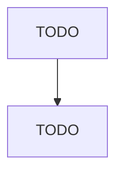

# All Other Transit and Ground Passenger Transportation

> TODO: Business-as-Code definition

## Overview

This U.S. industry comprises establishments primarily engaged in providing ground passenger transportation (except urban transit systems; interurban and rural bus transportation, taxi and/or limousine services (except shuttle services), school and employee bus transportation, charter bus services, and special needs transportation). Establishments primarily engaged in operating shuttle services and car pools or vanpools (except ridesharing and ridesharing arrangement services) are included in thi

## Actors

| Actor | Description |
|-------|-------------|
| TODO | TODO |

## Roles

| Role | Description |
|------|-------------|
| TODO | TODO |

## Entities

| Entity | Description |
|--------|-------------|
| TODO | TODO |

## Actions

| Action | Description |
|--------|-------------|
| TODO | TODO |

## Events

| Event | Description |
|-------|-------------|
| TODO | TODO |

## Searches

| Search | Description |
|--------|-------------|
| TODO | TODO |

## Workflow

## Actor Relationships

