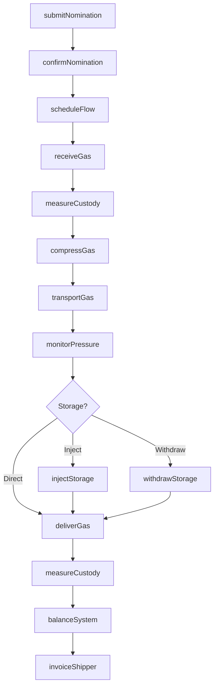
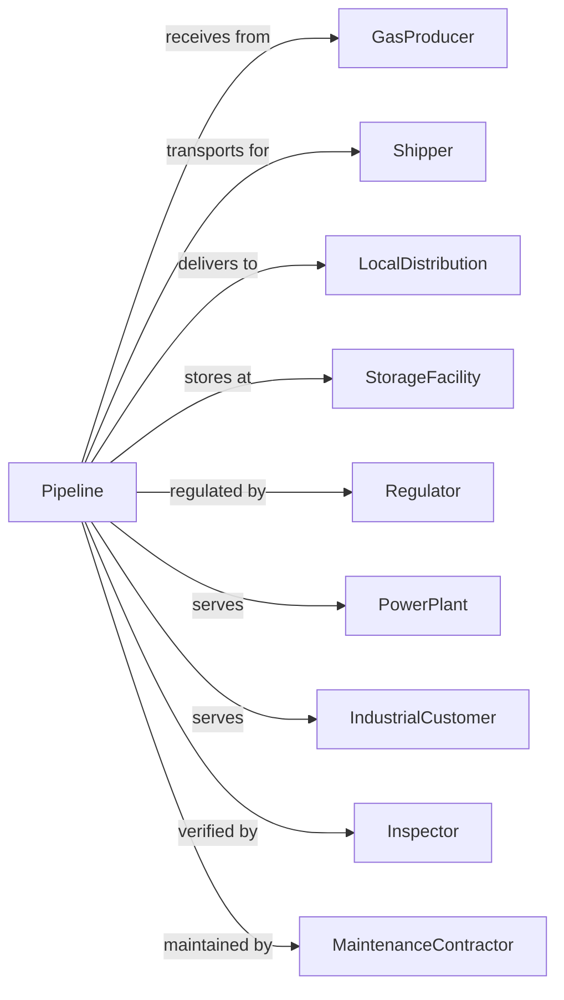

# Pipeline Transportation of Natural Gas

> Business-as-Code definition for natural gas pipeline transportation operations. Models the complete gas transmission lifecycle from receipt at processing plants through compression, transportation, storage, and delivery to local distribution systems.

## Overview

Pipeline transportation of natural gas involves operating transmission pipeline systems to move natural gas from processing plants to local distribution systems and end users. This includes gas storage in underground facilities and depleted reservoirs. This definition exposes actions for managing gas nominations, scheduling, compression operations, storage injection and withdrawal, and delivery to city gates.

## Actors

| Actor | Description |
|-------|-------------|
| GasProducer | Natural gas well operator or processor |
| Shipper | Company nominating gas for transport |
| LocalDistribution | LDC receiving gas at city gate |
| StorageFacility | Underground storage reservoir operator |
| Regulator | FERC, PHMSA, and state commissions |
| PowerPlant | Large volume gas consumer |
| IndustrialCustomer | Direct-connect industrial user |
| Inspector | Third-party measurement verification |
| MaintenanceContractor | Pipeline repair and pigging services |

## Roles

| Role | Description |
|------|-------------|
| PipelineOperator | Manages transmission system operations |
| GasController | Monitors SCADA and system pressures |
| SchedulingCoordinator | Plans nominations and capacity |
| MeasurementTech | Calibrates meters and verifies volumes |
| CompressorOperator | Runs compression stations |
| StorageEngineer | Manages injection and withdrawal |
| IntegrityEngineer | Assesses pipeline condition |
| RegulatoryAnalyst | Ensures FERC tariff compliance |

## Entities

| Entity | Description |
|--------|-------------|
| Pipeline | Transmission line system |
| CompressorStation | Facility boosting gas pressure |
| Meter | Custody transfer measurement point |
| Nomination | Shipper request for transport capacity |
| Storage | Underground gas storage facility |
| Tariff | FERC-approved transportation rate |
| SCADA | Supervisory control system |
| Receipt | Gas delivery point to pipeline |
| Delivery | Gas exit point from pipeline |
| Pressure | System operating pressure levels |

## Actions

| Action | Description |
|--------|-------------|
| submitNomination | Request pipeline capacity for gas |
| confirmNomination | Accept shipper volume and path |
| scheduleFlow | Plan gas movement for operating day |
| receiveGas | Accept gas at receipt point |
| measureCustody | Record transfer volume and quality |
| compressGas | Boost pressure through station |
| transportGas | Move gas through transmission system |
| monitorPressure | Track system operating conditions |
| injectStorage | Place gas in underground storage |
| withdrawStorage | Remove gas from storage |
| deliverGas | Transfer gas at city gate |
| balanceSystem | Reconcile receipts and deliveries |
| invoiceShipper | Bill for transportation services |

## Events

| Event | Description |
|-------|-------------|
| nominationSubmitted | Capacity request received |
| nominationConfirmed | Volume and path accepted |
| flowScheduled | Operating day plan set |
| gasReceived | Gas accepted at receipt |
| custodyMeasured | Transfer recorded |
| gasCompressed | Pressure boosted |
| gasTransported | Moving through system |
| pressureMonitored | Conditions tracked |
| storageInjected | Gas placed in storage |
| storageWithdrawn | Gas removed from storage |
| gasDelivered | Transfer at city gate completed |
| systemBalanced | Receipts and deliveries reconciled |
| shipperInvoiced | Bill sent |

## Searches

| Search | Description |
|--------|-------------|
| getNominations | List shipper requests by date |
| getPipelineStatus | Get system operating conditions |
| getCapacity | Check available transportation space |
| getStorageInventory | Review gas volumes in storage |
| getMeterReadings | Retrieve custody transfer data |
| getTariffs | Get current transportation rates |
| getDeliverySchedule | List planned deliveries |
| getMaintenanceSchedule | Review planned pipeline work |

## Workflow



## Actor Relationships



## Usage

### Calling Actions

```typescript
import { pipeNaturalGas } from '@headlessly/pipe-natural-gas'

const pipeline = pipeNaturalGas()

// Submit nomination for gas transport
const nomination = await pipeline.submitNomination({
  shipper: 'permian-gas-marketing',
  receiptPoint: 'waha-hub',
  deliveryPoint: 'houston-citygate',
  volume: 100000, // Dth/day
  effectiveDate: '2024-04-01',
  contractId: 'FT-2024-001'
})

// Check storage inventory
const storage = await pipeline.getStorageInventory({
  facility: 'moss-bluff-cavern'
})

// Monitor system pressure
const status = await pipeline.getPipelineStatus({
  segment: 'gulf-coast-mainline'
})
```

### Event-Driven Automation

```typescript
// Auto-respond to pressure fluctuations
pipeline.pressureMonitored(async ({ segment, pressure, threshold }) => {
  if (pressure < threshold.low) {
    await pipeline.compressGas({
      station: getNearestCompressor(segment),
      targetPressure: threshold.normal
    })
  }
})

// Auto-inject storage during low demand
pipeline.gasReceived(async ({ volume, demandForecast, date }) => {
  if (volume > demandForecast) {
    const excess = volume - demandForecast

    await pipeline.injectStorage({
      facility: getAvailableStorage(),
      volume: excess,
      date
    })
  }
})

// Auto-balance end of day
pipeline.systemBalanced(async ({ date, imbalance, shippers }) => {
  for (const shipper of shippers) {
    if (Math.abs(shipper.imbalance) > tolerance) {
      await pipeline.invoiceShipper({
        shipperId: shipper.id,
        imbalanceVolume: shipper.imbalance,
        rate: getImbalanceRate(shipper.imbalance)
      })
    }
  }
})
```
