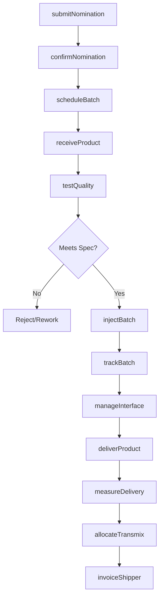
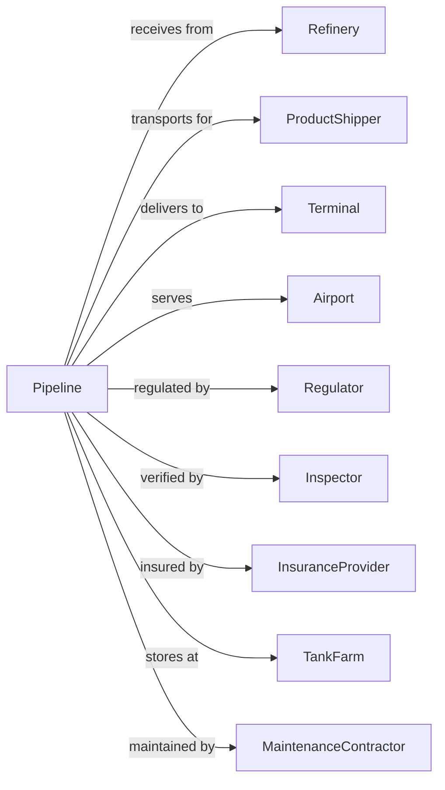

# Pipeline Transportation of Refined Petroleum Products

> Business-as-Code definition for refined petroleum products pipeline operations. Models the complete products pipeline lifecycle from refinery receipt through batching, transportation, and delivery to terminals for gasoline, diesel, jet fuel, and other refined products.

## Overview

Pipeline transportation of refined petroleum products involves operating pipeline systems to move gasoline, diesel, jet fuel, heating oil, and other refined products from refineries to distribution terminals. Products are transported in sequential batches with different specifications. This definition exposes actions for managing product nominations, batch scheduling, interface management, and terminal delivery.

## Actors

| Actor | Description |
|-------|-------------|
| Refinery | Origin of refined petroleum products |
| ProductShipper | Company nominating product for transport |
| Terminal | Distribution facility receiving products |
| Airport | Jet fuel delivery destination |
| Regulator | FERC, PHMSA, and state agencies |
| Inspector | Third-party quality and quantity verification |
| InsuranceProvider | Covers product loss and liability |
| TankFarm | Intermediate storage facility |
| MaintenanceContractor | Pipeline service and repair |

## Roles

| Role | Description |
|------|-------------|
| PipelineOperator | Manages products pipeline system |
| BatchController | Schedules and tracks product batches |
| QualityTech | Tests product specifications |
| MeasurementTech | Calibrates meters and records transfers |
| TerminalOperator | Receives products at delivery point |
| InterfaceTech | Manages transmix between batches |
| IntegrityEngineer | Assesses pipeline condition |
| SchedulingAnalyst | Plans capacity and nominations |

## Entities

| Entity | Description |
|--------|-------------|
| Pipeline | Products transmission line |
| Batch | Volume of specific product in transit |
| Product | Refined petroleum grade with specifications |
| Interface | Transition zone between product batches |
| Transmix | Off-spec product at batch interfaces |
| Terminal | Delivery point with storage tanks |
| Meter | Custody transfer measurement |
| Tariff | Published transportation rate |
| Nomination | Shipper capacity request |
| Tank | Storage vessel for product receipt |

## Actions

| Action | Description |
|--------|-------------|
| submitNomination | Request capacity for product shipment |
| confirmNomination | Accept shipper volume and grade |
| scheduleBatch | Plan product batch sequence |
| receiveProduct | Accept refined product from refinery |
| testQuality | Verify product meets specifications |
| injectBatch | Begin batch movement into pipeline |
| trackBatch | Monitor product location in system |
| managementInterface | Handle transmix between batches |
| deliverProduct | Transfer to terminal tank |
| measureDelivery | Record custody transfer volume |
| allocateTransmix | Assign interface product to shippers |
| invoiceShipper | Bill for transportation service |

## Events

| Event | Description |
|-------|-------------|
| nominationSubmitted | Capacity request received |
| nominationConfirmed | Volume and grade accepted |
| batchScheduled | Sequence planned |
| productReceived | Accepted at origin |
| qualityTested | Specifications verified |
| batchInjected | Movement started |
| batchTracked | Location updated |
| interfaceManaged | Transmix handled |
| productDelivered | Terminal transfer completed |
| deliveryMeasured | Volume recorded |
| transmixAllocated | Interface assigned |
| shipperInvoiced | Bill sent |

## Searches

| Search | Description |
|--------|-------------|
| getNominations | List shipper requests |
| getBatchStatus | Track product location |
| getLineSchedule | View batch sequence |
| getProductSpecs | Retrieve grade specifications |
| getTerminalInventory | Check tank levels |
| getTransmixBalance | Review interface allocations |
| getTariffs | Get transportation rates |
| getDeliveryHistory | List past deliveries |

## Workflow



## Actor Relationships



## Usage

### Calling Actions

```typescript
import { pipeRefinedPetroleum } from '@headlessly/pipe-refined-petroleum'

const pipeline = pipeRefinedPetroleum()

// Submit nomination for gasoline transport
const nomination = await pipeline.submitNomination({
  shipper: 'gulf-coast-refining',
  product: 'RBOB-gasoline',
  origin: 'houston-refinery',
  destination: 'dallas-terminal',
  volume: 25000, // barrels
  cycleDate: '2024-04-15'
})

// Track batch in transit
const batch = await pipeline.getBatchStatus({
  batchId: 'BATCH-RBOB-2024-1234'
})

// Check terminal inventory
const inventory = await pipeline.getTerminalInventory({
  terminal: 'dallas-terminal',
  product: 'RBOB-gasoline'
})
```

### Event-Driven Automation

```typescript
// Auto-test quality on receipt
pipeline.productReceived(async ({ batchId, product, origin }) => {
  const testResults = await pipeline.testQuality({
    batchId,
    tests: getRequiredTests(product)
  })

  if (!testResults.meetsSpec) {
    await rejectBatch({
      batchId,
      reason: testResults.failureReason,
      notifyShipper: true
    })
  }
})

// Auto-notify terminal of incoming batch
pipeline.batchInjected(async ({ batchId, destination, eta }) => {
  await notifyTerminal({
    terminal: destination,
    batchId,
    product: batch.product,
    volume: batch.volume,
    eta
  })
})

// Auto-allocate transmix
pipeline.interfaceManaged(async ({ leadingBatch, trailingBatch, transmixVolume }) => {
  await pipeline.allocateTransmix({
    leadingShipper: leadingBatch.shipper,
    trailingShipper: trailingBatch.shipper,
    volume: transmixVolume,
    allocation: '50-50' // or per tariff rules
  })
})
```
