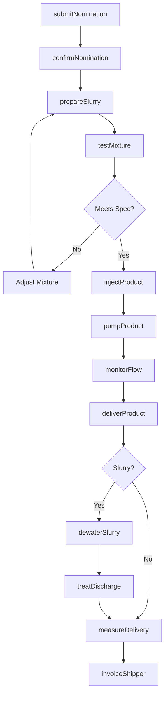
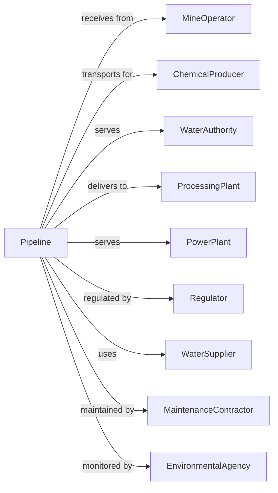

# All Other Pipeline Transportation

> Business-as-Code definition for miscellaneous pipeline transportation operations. Models the complete pipeline lifecycle for coal slurry, chemicals, water, and other products transported via pipeline systems not classified elsewhere.

## Overview

All other pipeline transportation involves operating pipeline systems for products other than crude oil, natural gas, and refined petroleum. This includes coal slurry pipelines, chemical pipelines, water transmission systems, and industrial product pipelines. This definition exposes actions for managing specialized product nominations, slurry preparation, pipeline operations, and delivery to processing facilities.

## Actors

| Actor | Description |
|-------|-------------|
| MineOperator | Coal mine producing slurry feedstock |
| ChemicalProducer | Manufacturer shipping liquid chemicals |
| WaterAuthority | Municipal water supply operator |
| ProcessingPlant | Destination for pipeline products |
| PowerPlant | Coal slurry consumer for generation |
| Regulator | PHMSA and environmental agencies |
| WaterSupplier | Source of slurry preparation water |
| MaintenanceContractor | Pipeline service and cleaning |
| EnvironmentalAgency | Monitors discharge and spills |

## Roles

| Role | Description |
|------|-------------|
| PipelineOperator | Manages specialized pipeline system |
| SlurryTech | Prepares and monitors slurry mixture |
| PumpOperator | Runs booster stations |
| QualityController | Tests product specifications |
| MeasurementTech | Records flow and transfers |
| IntegrityEngineer | Assesses pipeline condition |
| EnvironmentalSpec | Ensures regulatory compliance |
| SchedulingCoordinator | Plans capacity and deliveries |

## Entities

| Entity | Description |
|--------|-------------|
| Pipeline | Transmission system for specialty products |
| Slurry | Coal and water mixture for transport |
| Chemical | Liquid chemical product |
| PumpStation | Facility boosting flow pressure |
| Mixer | Equipment preparing slurry |
| Dewatering | Facility separating water from coal |
| Meter | Flow measurement device |
| Tank | Storage for liquid products |
| Nomination | Shipper capacity request |
| Discharge | Water release from dewatering |

## Actions

| Action | Description |
|--------|-------------|
| submitNomination | Request pipeline capacity |
| confirmNomination | Accept shipper volume |
| prepareSlurry | Mix coal with water for transport |
| testMixture | Verify slurry consistency |
| injectProduct | Begin pipeline movement |
| pumpProduct | Boost flow through stations |
| monitorFlow | Track product movement |
| deliverProduct | Transfer to destination |
| dewaterSlurry | Separate coal from water |
| treatDischarge | Process water for release |
| measureDelivery | Record transfer volume |
| invoiceShipper | Bill for service |

## Events

| Event | Description |
|-------|-------------|
| nominationSubmitted | Capacity request received |
| nominationConfirmed | Volume accepted |
| slurryPrepared | Mixture ready for injection |
| mixtureTested | Consistency verified |
| productInjected | Pipeline movement started |
| productPumped | Flow boosted |
| flowMonitored | Movement tracked |
| productDelivered | Transfer completed |
| slurryDewatered | Coal separated |
| dischargeTreated | Water processed |
| deliveryMeasured | Volume recorded |
| shipperInvoiced | Bill sent |

## Searches

| Search | Description |
|--------|-------------|
| getNominations | List shipper requests |
| getPipelineStatus | Get system operating conditions |
| getSlurrySpecs | Retrieve mixture specifications |
| getFlowRate | Check current throughput |
| getPumpStatus | Review station operations |
| getWaterBalance | Track water usage and discharge |
| getDeliveryHistory | List completed deliveries |
| getMaintenanceSchedule | View planned pipeline work |

## Workflow



## Actor Relationships



## Usage

### Calling Actions

```typescript
import { pipeSlurryProducts } from '@headlessly/pipe-slurry-products'

const pipeline = pipeSlurryProducts()

// Submit nomination for coal slurry
const nomination = await pipeline.submitNomination({
  shipper: 'wyoming-coal-mining',
  product: 'coal-slurry',
  origin: 'gillette-mine',
  destination: 'houston-powerplant',
  volume: 50000, // tons
  startDate: '2024-04-01',
  endDate: '2024-04-30'
})

// Check pipeline status
const status = await pipeline.getPipelineStatus({
  lineId: 'coal-slurry-mainline'
})

// Get slurry specifications
const specs = await pipeline.getSlurrySpecs({
  productType: 'sub-bituminous-slurry'
})
```

### Event-Driven Automation

```typescript
// Auto-adjust slurry mixture for consistency
pipeline.mixtureTested(async ({ batchId, viscosity, solidContent }) => {
  if (viscosity > specs.maxViscosity) {
    await pipeline.prepareSlurry({
      batchId,
      adjustWater: calculateWaterAddition(viscosity)
    })
  }
})

// Auto-monitor pump station performance
pipeline.productPumped(async ({ stationId, pressure, flowRate }) => {
  if (pressure > threshold.max || flowRate < threshold.min) {
    await createAlert({
      type: 'pump-performance',
      station: stationId,
      metrics: { pressure, flowRate },
      action: 'inspect-required'
    })
  }
})

// Auto-treat discharge water
pipeline.slurryDewatered(async ({ facilityId, waterVolume, coalDelivered }) => {
  await pipeline.treatDischarge({
    facilityId,
    volume: waterVolume,
    treatmentType: 'settling-filtration',
    dischargePermit: getPermit(facilityId)
  })

  await reportToRegulator({
    facility: facilityId,
    waterDischarged: waterVolume,
    coalDelivered,
    date: today()
  })
})
```
