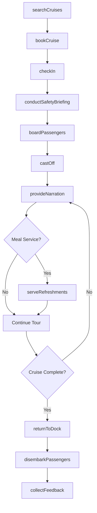
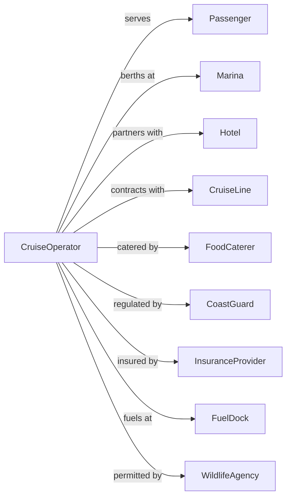

# Scenic and Sightseeing Transportation, Water

> Business-as-Code definition for water-based scenic and sightseeing transportation operations. Models the complete excursion lifecycle from booking through vessel operations, narrated tours, and guest services for harbor cruises, dinner cruises, charter fishing, and sightseeing boats.

## Overview

Scenic and sightseeing transportation on water involves providing local sightseeing services using boats and vessels. Services include harbor tours, dinner cruises, airboat rides, whale watching, charter fishing, and excursion boats with same-day return to port. This definition exposes actions for managing cruise bookings, vessel operations, onboard services, and marine safety for water-based sightseeing.

## Actors

| Actor | Description |
|-------|-------------|
| Passenger | Guest booking water excursion |
| Marina | Berth and dock facility |
| Hotel | Partner referring guests |
| CruiseLine | Coordinates shore excursions |
| FoodCaterer | Provides onboard dining service |
| CoastGuard | Maritime safety regulator |
| InsuranceProvider | Covers marine liability |
| FuelDock | Provides marine fuel |
| WildlifeAgency | Regulates fishing and wildlife tours |

## Roles

| Role | Description |
|------|-------------|
| Captain | Commands vessel and ensures safety |
| Deckhand | Assists passengers and handles lines |
| TourNarrator | Provides commentary on sights |
| ReservationAgent | Books excursions and manages guests |
| Chef | Prepares food for dinner cruises |
| BarServer | Serves beverages onboard |
| MaintenanceTech | Services vessels and equipment |
| MarketingManager | Promotes cruises and excursions |

## Entities

| Entity | Description |
|--------|-------------|
| Vessel | Tour boat, yacht, or excursion craft |
| Cruise | Scheduled sightseeing excursion |
| Route | Planned waterway with points of interest |
| Booking | Guest reservation for cruise |
| Dock | Boarding and departure location |
| Ticket | Proof of cruise purchase |
| Menu | Food and beverage offerings |
| SafetyBriefing | Required passenger safety instruction |
| LifeJacket | Required safety equipment |
| Narration | Audio or guide commentary |

## Actions

| Action | Description |
|--------|-------------|
| searchCruises | Find available water excursions |
| bookCruise | Reserve seats on scheduled cruise |
| checkIn | Process guest arrival at dock |
| conductSafetyBriefing | Deliver required safety instructions |
| boardPassengers | Load guests onto vessel |
| castOff | Depart from dock |
| provideNarration | Deliver commentary on sights |
| serveRefreshments | Provide food and beverages |
| returnToDock | Complete cruise at marina |
| disembarkPassengers | Assist guests off vessel |
| collectFeedback | Request guest review |
| maintainVessel | Service boat and safety equipment |

## Events

| Event | Description |
|-------|-------------|
| cruisesSearched | Available options displayed |
| cruiseBooked | Reservation confirmed |
| guestCheckedIn | Arrival processed |
| safetyBriefingConducted | Instructions delivered |
| passengersBoarded | Guests loaded |
| vesselCastOff | Cruise departed |
| narrationProvided | Commentary delivered |
| refreshmentsServed | Food and drinks provided |
| vesselDocked | Returned to marina |
| passengersDisembarked | Guests assisted off |
| feedbackCollected | Review received |
| vesselMaintained | Service completed |

## Searches

| Search | Description |
|--------|-------------|
| findCruises | List available excursions by date |
| checkAvailability | Get seat availability for cruise |
| getCruiseDetails | Retrieve route and amenities |
| getSchedule | List departure times |
| getBookings | Review reservations by date |
| getVesselStatus | Check fleet availability |
| getWeather | Retrieve marine weather forecast |
| getMenuOptions | List food and beverage choices |

## Workflow



## Actor Relationships



## Usage

### Calling Actions

```typescript
import { cruiseScenicSightseeing } from '@headlessly/cruise-scenic-sightseeing'

const cruises = cruiseScenicSightseeing()

// Search for cruises
const available = await cruises.findCruises({
  port: 'San Diego',
  date: '2024-04-15',
  type: 'harbor-tour'
})

// Book a cruise
const booking = await cruises.bookCruise({
  cruiseId: available[0].id,
  departureTime: '14:00',
  guests: [
    { name: 'John Smith', type: 'adult' },
    { name: 'Jane Smith', type: 'adult' }
  ],
  mealOption: 'sunset-dinner'
})

// Check marine weather
const weather = await cruises.getWeather({
  port: 'San Diego',
  date: '2024-04-15'
})
```

### Event-Driven Automation

```typescript
// Auto-cancel for weather
cruises.weatherAlert(async ({ port, date, conditions }) => {
  if (conditions.windSpeed > 25 || conditions.waveHeight > 6) {
    const affectedCruises = await cruises.findCruises({ port, date })

    for (const cruise of affectedCruises) {
      await cruises.cancelCruise({
        cruiseId: cruise.id,
        reason: 'weather',
        offerReschedule: true
      })
    }
  }
})

// Auto-send boarding pass
cruises.cruiseBooked(async ({ bookingId }) => {
  const booking = await cruises.getBooking({ bookingId })

  await sendEmail({
    to: booking.email,
    subject: 'Your Boarding Pass',
    template: 'boarding-pass',
    attachments: [generateBoardingPass(booking)]
  })
})

// Auto-coordinate catering
cruises.passengersBoarded(async ({ cruiseId, mealCounts }) => {
  await notifyCaterer({
    cruiseId,
    mealCounts,
    serviceTime: getCruiseMealTime(cruiseId)
  })
})
```
