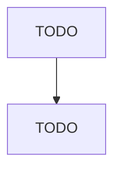

# Scenic and Sightseeing Transportation, Other

> TODO: Business-as-Code definition

## Overview

This industry comprises establishments primarily engaged in providing scenic and sightseeing transportation (except on land and water). The services provided are usually local and involve same-day return to place of departure. Illustrative Examples: Aerial cable cars, scenic and sightseeing operation Helicopter rides, scenic and sightseeing operation Glider excursions Aerial tramways, scenic and sightseeing operation Hot air balloon rides, scenic and sightseeing operation Cross-References. Estab

## Actors

| Actor | Description |
|-------|-------------|
| TODO | TODO |

## Roles

| Role | Description |
|------|-------------|
| TODO | TODO |

## Entities

| Entity | Description |
|--------|-------------|
| TODO | TODO |

## Actions

| Action | Description |
|--------|-------------|
| TODO | TODO |

## Events

| Event | Description |
|-------|-------------|
| TODO | TODO |

## Searches

| Search | Description |
|--------|-------------|
| TODO | TODO |

## Workflow

## Actor Relationships

