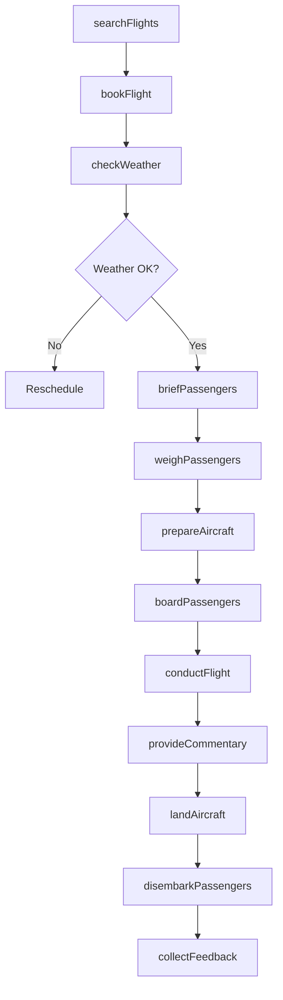
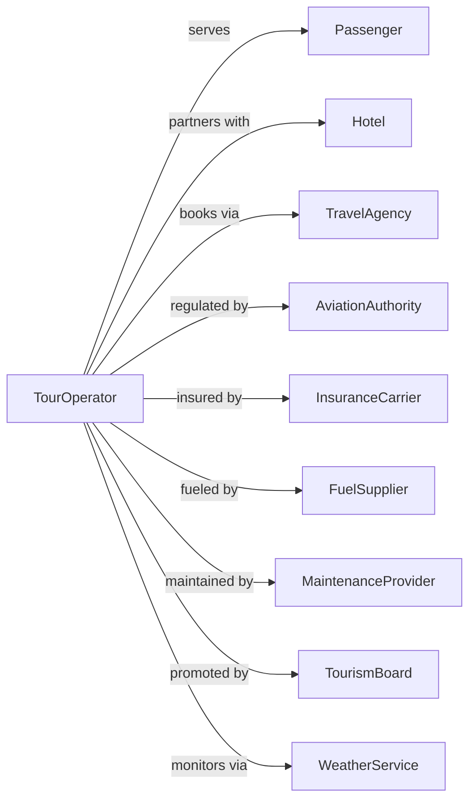

# Scenic and Sightseeing Transportation, Other

> Business-as-Code definition for aerial and other scenic transportation operations. Models the complete excursion lifecycle from booking through flight operations and guest services for helicopter tours, hot air balloon rides, glider excursions, and aerial tramways.

## Overview

Other scenic and sightseeing transportation involves providing aerial sightseeing services not classified as land or water based. Services include helicopter tours, hot air balloon rides, glider excursions, aerial tramways, and cable car operations. This definition exposes actions for managing aerial bookings, flight operations, safety compliance, and guest experiences for aerial sightseeing.

## Actors

| Actor | Description |
|-------|-------------|
| Passenger | Guest booking aerial experience |
| Hotel | Partner referring guests |
| TravelAgency | Books aerial tours for groups |
| AviationAuthority | FAA or civil aviation regulator |
| InsuranceCarrier | Aviation liability coverage |
| FuelSupplier | Provides aviation fuel |
| MaintenanceProvider | Services aircraft and equipment |
| TourismBoard | Destination marketing partner |
| WeatherService | Provides flight weather data |

## Roles

| Role | Description |
|------|-------------|
| Pilot | Commands aircraft and ensures safety |
| BalloonPilot | Operates hot air balloon |
| GroundCrew | Assists with launch and recovery |
| ReservationAgent | Books flights and manages guests |
| Narrator | Provides aerial commentary |
| SafetyBriefer | Delivers preflight safety instructions |
| MaintenanceTech | Services aircraft and equipment |
| Dispatcher | Coordinates flight schedules |

## Entities

| Entity | Description |
|--------|-------------|
| Helicopter | Rotorcraft for sightseeing flights |
| Balloon | Hot air balloon for scenic flights |
| Glider | Unpowered aircraft for excursions |
| Tramway | Aerial cable transportation |
| Flight | Scheduled aerial excursion |
| Route | Planned flight path with viewpoints |
| Booking | Guest reservation for flight |
| Manifest | Passenger list and weights |
| WeatherBrief | Preflight weather assessment |
| SafetyEquipment | Required passenger safety gear |

## Actions

| Action | Description |
|--------|-------------|
| searchFlights | Find available aerial experiences |
| bookFlight | Reserve seats on scheduled flight |
| checkWeather | Assess conditions for flight safety |
| briefPassengers | Deliver preflight safety instructions |
| weighPassengers | Record weights for aircraft balance |
| prepareAircraft | Complete preflight inspection |
| boardPassengers | Load guests into aircraft |
| conductFlight | Execute scenic flight |
| provideCommentary | Narrate aerial sights |
| landAircraft | Complete flight and return to base |
| disembarkPassengers | Assist guests from aircraft |
| collectFeedback | Request guest review |

## Events

| Event | Description |
|-------|-------------|
| flightsSearched | Available options displayed |
| flightBooked | Reservation confirmed |
| weatherChecked | Conditions assessed |
| passengersBriefed | Safety instructions delivered |
| passengersWeighed | Weights recorded |
| aircraftPrepared | Preflight completed |
| passengersBoarded | Guests loaded |
| flightConducted | Scenic flight in progress |
| commentaryProvided | Narration delivered |
| aircraftLanded | Flight completed |
| passengersDisembarked | Guests assisted out |
| feedbackCollected | Review received |

## Searches

| Search | Description |
|--------|-------------|
| findFlights | List available aerial experiences |
| checkAvailability | Get seat availability for flight |
| getFlightDetails | Retrieve route and aircraft info |
| getWeather | Retrieve aviation weather forecast |
| getSchedule | List departure times |
| getBookings | Review reservations by date |
| getAircraftStatus | Check fleet availability |
| getSunsetTime | Get optimal lighting times |

## Workflow



## Actor Relationships



## Usage

### Calling Actions

```typescript
import { tourAerialSightseeing } from '@headlessly/tour-aerial-sightseeing'

const aerial = tourAerialSightseeing()

// Search for flights
const flights = await aerial.findFlights({
  location: 'Grand Canyon',
  date: '2024-04-15',
  type: 'helicopter'
})

// Book a helicopter tour
const booking = await aerial.bookFlight({
  flightId: flights[0].id,
  departureTime: '10:00',
  passengers: [
    { name: 'John Smith', weight: 180 },
    { name: 'Jane Smith', weight: 140 }
  ]
})

// Check flight weather
const weather = await aerial.getWeather({
  location: 'Grand Canyon',
  flightTime: '10:00'
})
```

### Event-Driven Automation

```typescript
// Auto-check weather and notify
aerial.flightBooked(async ({ bookingId, flightDate }) => {
  // Schedule weather check morning of flight
  await scheduleTask({
    runAt: setTime(flightDate, '06:00'),
    action: async () => {
      const weather = await aerial.checkWeather({ flightDate })

      if (!weather.suitable) {
        await aerial.notifyPassengers({
          bookingId,
          message: 'Weather conditions may affect your flight. We will update you by 8am.'
        })
      }
    }
  })
})

// Auto-balance aircraft loading
aerial.passengersWeighed(async ({ flightId, passengers }) => {
  const totalWeight = passengers.reduce((sum, p) => sum + p.weight, 0)
  const aircraft = await aerial.getAircraftDetails({ flightId })

  if (totalWeight > aircraft.maxPayload) {
    await createAlert({
      type: 'weight-limit',
      flightId,
      overweight: totalWeight - aircraft.maxPayload,
      action: 'reassign-passengers'
    })
  }
})

// Auto-offer sunrise/sunset flights
aerial.flightBooked(async ({ bookingId, flightType }) => {
  if (flightType === 'balloon') {
    const booking = await aerial.getBooking({ bookingId })
    const sunsetTime = await aerial.getSunsetTime({ date: booking.date })

    await sendUpsell({
      to: booking.email,
      subject: 'Upgrade to Sunset Flight?',
      offer: {
        flightTime: subtractMinutes(sunsetTime, 90),
        additionalCost: 50
      }
    })
  }
})
```
