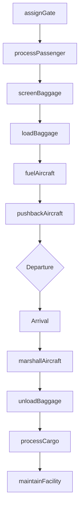
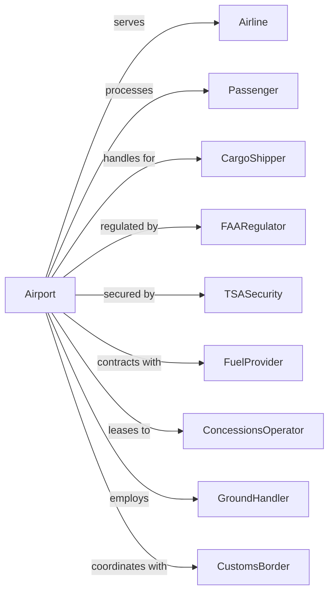

# Other Airport Operations

> Business-as-Code definition for airport operations and ground support services. Models the complete airport operations lifecycle including terminal management, hangar rental, baggage handling, cargo operations, and aircraft ground services.

## Overview

Other airport operations involves operating airports, public flying fields, or providing support services such as hangar rental, baggage handling, and cargo handling. Services include terminal operations, ground handling, fueling, and passenger services at airports. This definition exposes actions for managing airport facilities, ground operations, baggage systems, and cargo processing.

## Actors

| Actor | Description |
|-------|-------------|
| Airline | Air carrier using airport facilities |
| Passenger | Traveler using airport services |
| CargoShipper | Company shipping freight via air |
| FAARegulator | Federal aviation oversight |
| TSASecurity | Transportation Security Administration |
| FuelProvider | Supplies jet fuel to aircraft |
| ConcessionsOperator | Manages retail and food services |
| GroundHandler | Provides aircraft ground services |
| CustomsBorder | Handles international arrivals |

## Roles

| Role | Description |
|------|-------------|
| AirportManager | Oversees airport operations |
| TerminalAgent | Manages passenger services |
| RampAgent | Handles aircraft ground operations |
| BaggageHandler | Processes passenger luggage |
| CargoAgent | Manages freight operations |
| FuelTechnician | Operates aircraft fueling |
| SecurityOfficer | Ensures airport security |
| MaintenanceTech | Maintains airport facilities |

## Entities

| Entity | Description |
|--------|-------------|
| Terminal | Passenger processing building |
| Hangar | Aircraft storage and maintenance facility |
| Gate | Aircraft boarding position |
| Runway | Aircraft takeoff and landing surface |
| Baggage | Passenger luggage in transit |
| Cargo | Air freight shipment |
| GroundEquipment | Tugs, belts, and ground support vehicles |
| FuelTruck | Aircraft refueling vehicle |
| Lease | Facility rental agreement |
| FlightInfo | Arrival and departure data |

## Actions

| Action | Description |
|--------|-------------|
| assignGate | Allocate boarding position to flight |
| processPassenger | Check in traveler and issue boarding pass |
| screenBaggage | Inspect luggage for security |
| loadBaggage | Transfer luggage to aircraft |
| fuelAircraft | Pump jet fuel into aircraft |
| pushbackAircraft | Move aircraft from gate |
| marshallAircraft | Guide aircraft to parking position |
| unloadBaggage | Remove luggage from aircraft |
| processCargo | Handle freight shipments |
| rentHangar | Lease aircraft storage space |
| maintainFacility | Service airport infrastructure |
| displayFlightInfo | Update departure and arrival boards |

## Events

| Event | Description |
|-------|-------------|
| gateAssigned | Boarding position allocated |
| passengerProcessed | Traveler checked in |
| baggageScreened | Luggage inspected |
| baggageLoaded | Luggage transferred to aircraft |
| aircraftFueled | Fuel pumped |
| aircraftPushedBack | Movement from gate started |
| aircraftMarshalled | Parking position reached |
| baggageUnloaded | Luggage removed |
| cargoProcessed | Freight handled |
| hangarRented | Lease executed |
| facilityMaintained | Service completed |
| flightInfoDisplayed | Boards updated |

## Searches

| Search | Description |
|--------|-------------|
| getGateStatus | Check gate availability |
| trackBaggage | Locate passenger luggage |
| getFlightStatus | Retrieve arrival and departure info |
| getCargoStatus | Track freight shipment |
| getHangarAvailability | Check storage space |
| getFuelLevels | Review fuel inventory |
| getGroundEquipment | List available equipment |
| getTerminalCapacity | Check passenger processing capacity |

## Workflow



## Actor Relationships



## Usage

### Calling Actions

```typescript
import { supportAirportOperations } from '@headlessly/support-airport-operations'

const airport = supportAirportOperations()

// Assign gate to arriving flight
const gate = await airport.assignGate({
  flightNumber: 'UA123',
  aircraftType: 'B738',
  arrivalTime: '14:30',
  preferredTerminal: 'B'
})

// Track passenger baggage
const baggage = await airport.trackBaggage({
  tagId: 'BAG-123456',
  flightNumber: 'UA123'
})

// Check hangar availability
const hangars = await airport.getHangarAvailability({
  aircraftSize: 'large',
  startDate: '2024-04-01',
  duration: 30
})
```

### Event-Driven Automation

```typescript
// Auto-assign gates for arriving flights
airport.flightScheduled(async ({ flightNumber, aircraftType, arrivalTime }) => {
  const gate = await airport.assignGate({
    flightNumber,
    aircraftType,
    arrivalTime,
    optimize: 'passenger-connection'
  })

  await airport.displayFlightInfo({
    flightNumber,
    gate: gate.number,
    status: 'on-time'
  })
})

// Auto-alert for delayed baggage
airport.baggageLoaded(async ({ flightNumber, bags, deadline }) => {
  const missingBags = await airport.trackBaggage({ flightNumber, status: 'not-loaded' })

  if (missingBags.length > 0 && isApproaching(deadline)) {
    await createAlert({
      type: 'baggage-delay',
      flightNumber,
      missingCount: missingBags.length,
      priority: 'high'
    })
  }
})

// Auto-schedule fueling
airport.gateAssigned(async ({ flightNumber, gate, departureTime }) => {
  const aircraft = await airport.getAircraftDetails({ flightNumber })

  await airport.scheduleFueling({
    flightNumber,
    gate,
    fuelRequired: aircraft.fuelNeeded,
    completeBy: subtractMinutes(departureTime, 30)
  })
})
```
