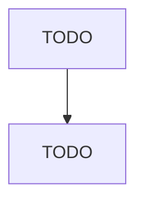

# Other Airport Operations

> TODO: Business-as-Code definition

## Overview

This U.S. industry comprises establishments primarily engaged in (1) operating international, national, or civil airports, or public flying fields or (2) supporting airport operations, such as rental of hangar space, and providing baggage handling and/or cargo handling services. Cross-References. Establishments primarily engaged in--

## Actors

| Actor | Description |
|-------|-------------|
| TODO | TODO |

## Roles

| Role | Description |
|------|-------------|
| TODO | TODO |

## Entities

| Entity | Description |
|--------|-------------|
| TODO | TODO |

## Actions

| Action | Description |
|--------|-------------|
| TODO | TODO |

## Events

| Event | Description |
|-------|-------------|
| TODO | TODO |

## Searches

| Search | Description |
|--------|-------------|
| TODO | TODO |

## Workflow

## Actor Relationships

