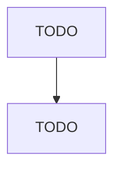

# Support Activities for Rail Transportation

> TODO: Business-as-Code definition

## Overview

This industry comprises establishments primarily engaged in providing specialized services for railroad transportation, including servicing, routine repairing (except factory conversion, overhaul, or rebuilding of rolling stock), and maintaining rail cars; loading and unloading rail cars; and operating independent terminals. Cross-References. Establishments primarily engaged in--

## Actors

| Actor | Description |
|-------|-------------|
| TODO | TODO |

## Roles

| Role | Description |
|------|-------------|
| TODO | TODO |

## Entities

| Entity | Description |
|--------|-------------|
| TODO | TODO |

## Actions

| Action | Description |
|--------|-------------|
| TODO | TODO |

## Events

| Event | Description |
|-------|-------------|
| TODO | TODO |

## Searches

| Search | Description |
|--------|-------------|
| TODO | TODO |

## Workflow

## Actor Relationships

