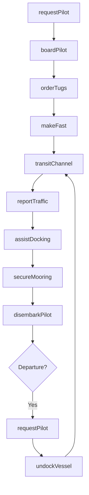
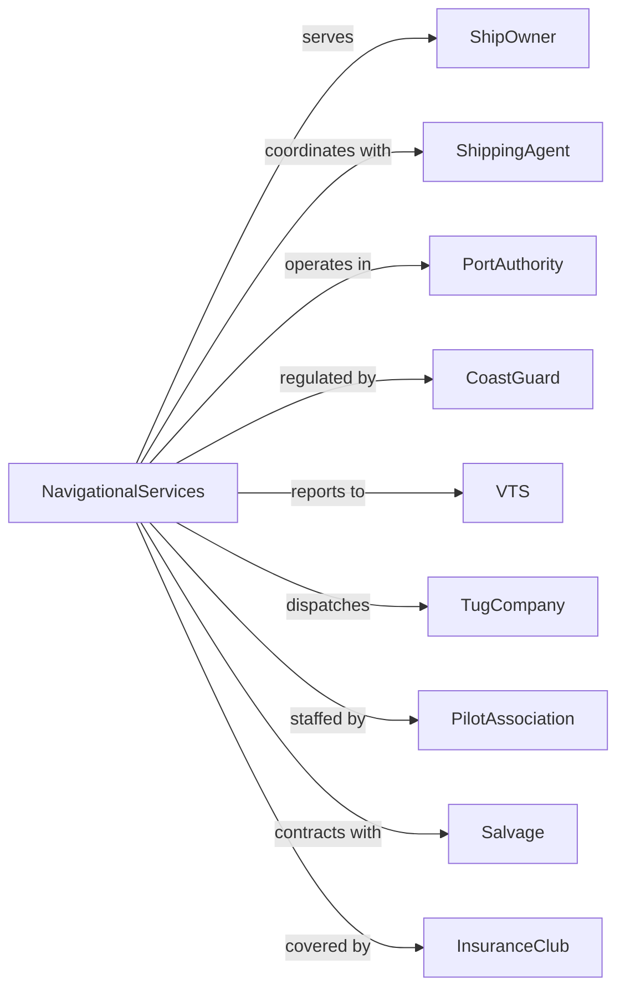

# Navigational Services to Shipping

> Business-as-Code definition for marine navigational services operations. Models the complete pilotage lifecycle from vessel approach through harbor piloting, tugboat assistance, docking operations, and marine salvage services.

## Overview

Navigational services to shipping comprises establishments providing piloting services, tugboat operations, vessel docking and undocking, vessel traffic reporting, and marine salvage. Services ensure safe navigation of vessels through harbors, channels, and restricted waterways. This definition exposes actions for managing pilot dispatch, tugboat coordination, and docking operations.

## Actors

| Actor | Description |
|-------|-------------|
| ShipOwner | Vessel operator requiring services |
| ShippingAgent | Coordinates vessel port calls |
| PortAuthority | Manages harbor operations |
| CoastGuard | Maritime safety regulator |
| VTS | Vessel Traffic Service center |
| TugCompany | Provides tugboat services |
| PilotAssociation | Harbor pilots organization |
| Salvage | Marine salvage contractor |
| InsuranceClub | P&I club coverage |

## Roles

| Role | Description |
|------|-------------|
| HarborPilot | Navigates vessels in port |
| TugCaptain | Commands tugboat operations |
| Dispatcher | Coordinates pilot and tug services |
| VTSOperator | Monitors vessel traffic |
| Linehandler | Handles mooring lines |
| SalvageMaster | Directs salvage operations |
| PortCaptain | Oversees navigational services |
| Deckhand | Assists tug and line operations |

## Entities

| Entity | Description |
|--------|-------------|
| Vessel | Ship requiring navigational services |
| Pilot | Licensed harbor pilot |
| Tugboat | Assist vessel for maneuvering |
| Channel | Navigable waterway |
| Berth | Vessel mooring position |
| PilotStation | Pilot boarding location |
| VTSArea | Traffic monitoring zone |
| MooringLine | Rope securing vessel to dock |
| SalvageOperation | Distressed vessel recovery |
| NavigationPlan | Planned transit route |

## Actions

| Action | Description |
|--------|-------------|
| requestPilot | Order harbor pilot for vessel |
| boardPilot | Transfer pilot to vessel |
| transitChannel | Navigate vessel through waterway |
| orderTugs | Request tugboat assistance |
| makeFast | Secure tugs to vessel |
| assistDocking | Maneuver vessel to berth |
| secureMooring | Attach lines to dock |
| undockVessel | Release vessel from berth |
| disembarkPilot | Transfer pilot off vessel |
| reportTraffic | Update VTS on vessel movement |
| dispatchSalvage | Respond to distressed vessel |
| conductSalvage | Execute vessel recovery |

## Events

| Event | Description |
|-------|-------------|
| pilotRequested | Service ordered |
| pilotBoarded | Pilot on vessel |
| channelTransited | Waterway navigated |
| tugsOrdered | Assistance requested |
| tugsMadeFast | Secured to vessel |
| dockingAssisted | Vessel maneuvered |
| mooringSecured | Lines attached |
| vesselUndocked | Released from berth |
| pilotDisembarked | Pilot off vessel |
| trafficReported | VTS updated |
| salvageDispatched | Response initiated |
| salvageConducted | Recovery executed |

## Searches

| Search | Description |
|--------|-------------|
| getPilotSchedule | List pilot assignments |
| getTugAvailability | Check tugboat status |
| getVesselTraffic | View vessels in area |
| getBerthStatus | Check dock availability |
| getChannelConditions | Review waterway status |
| getTideSchedule | Get tide predictions |
| getWeatherMarine | Retrieve marine forecast |
| getSalvageAssets | List available equipment |

## Workflow



## Actor Relationships



## Usage

### Calling Actions

```typescript
import { supportNavigationalServices } from '@headlessly/support-navigational-services'

const nav = supportNavigationalServices()

// Request pilot for arriving vessel
const pilot = await nav.requestPilot({
  vesselName: 'MV Pacific Star',
  imo: '9123456',
  eta: '2024-04-15T06:00:00',
  draft: 12.5,
  loa: 294,
  destination: 'Berth-17'
})

// Order tugs for docking
const tugs = await nav.orderTugs({
  vesselName: 'MV Pacific Star',
  vesselSize: 'panamax',
  operation: 'docking',
  berth: 'Berth-17',
  quantity: 2
})

// Get vessel traffic in port
const traffic = await nav.getVesselTraffic({
  area: 'main-channel',
  includeAnchored: true
})
```

### Event-Driven Automation

```typescript
// Auto-dispatch tugs for large vessels
nav.pilotBoarded(async ({ vesselId, vesselSize, destination }) => {
  if (vesselSize === 'panamax' || vesselSize === 'post-panamax') {
    await nav.orderTugs({
      vesselId,
      quantity: calculateTugRequirement(vesselSize),
      operation: 'transit-assist'
    })
  }
})

// Auto-report traffic movements
nav.channelTransited(async ({ vesselId, position, heading, speed }) => {
  await nav.reportTraffic({
    vesselId,
    position,
    heading,
    speed,
    destination: getVesselDestination(vesselId)
  })
})

// Auto-dispatch salvage for emergencies
nav.emergencyReported(async ({ vesselId, emergencyType, position }) => {
  if (emergencyType === 'grounding' || emergencyType === 'collision') {
    await nav.dispatchSalvage({
      vesselId,
      position,
      emergencyType,
      assets: getSalvageAssetsNearby(position)
    })

    await nav.notifyCoastGuard({
      incident: emergencyType,
      vessel: vesselId,
      position
    })
  }
})
```
