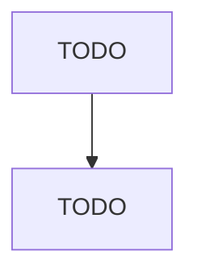

# Other Support Activities for Water Transportation

> TODO: Business-as-Code definition

## Overview

This industry comprises establishments primarily engaged in providing services to water transportation (except port and harbor operations; marine cargo handling services; and navigational services to shipping). Illustrative Examples: Floating drydocks (i.e., routine repair and maintenance of ships) Ship scaling services Marine cargo checkers and surveyors Cross-References. Establishments primarily engaged in--

## Actors

| Actor | Description |
|-------|-------------|
| TODO | TODO |

## Roles

| Role | Description |
|------|-------------|
| TODO | TODO |

## Entities

| Entity | Description |
|--------|-------------|
| TODO | TODO |

## Actions

| Action | Description |
|--------|-------------|
| TODO | TODO |

## Events

| Event | Description |
|-------|-------------|
| TODO | TODO |

## Searches

| Search | Description |
|--------|-------------|
| TODO | TODO |

## Workflow

## Actor Relationships

