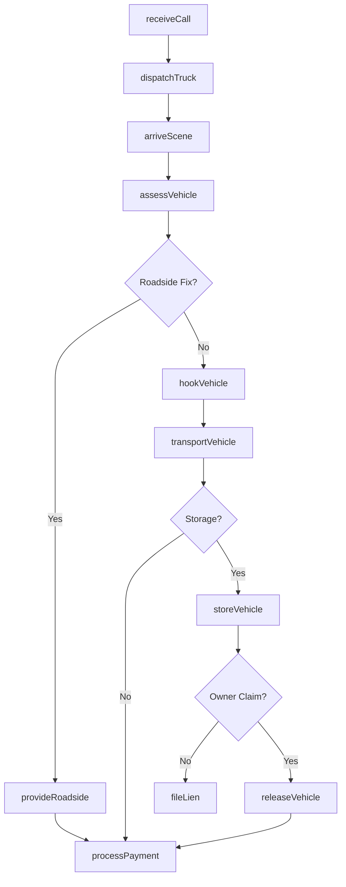
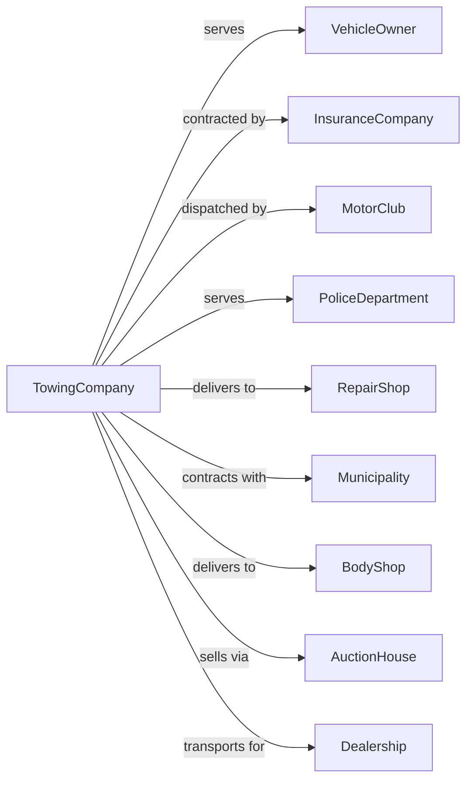

# Motor Vehicle Towing

> Business-as-Code definition for motor vehicle towing operations. Models the complete towing service lifecycle from dispatch through vehicle recovery, transport, storage, and release for light and heavy-duty towing services.

## Overview

Motor vehicle towing involves towing light or heavy motor vehicles locally and long-distance. Services include roadside assistance, accident recovery, impound towing, and vehicle transport. Incidental services such as storage and emergency road repair are included. This definition exposes actions for managing dispatch, towing operations, vehicle storage, and customer billing.

## Actors

| Actor | Description |
|-------|-------------|
| VehicleOwner | Person requiring towing service |
| InsuranceCompany | Provides roadside assistance coverage |
| MotorClub | AAA or similar membership service |
| PoliceDepartment | Requests impound or accident tows |
| RepairShop | Destination for disabled vehicles |
| Municipality | Contracts for impound and tow-away |
| BodyShop | Receives accident-damaged vehicles |
| AuctionHouse | Handles abandoned vehicle sales |
| Dealership | Requests vehicle transport services |

## Roles

| Role | Description |
|------|-------------|
| TowOperator | Drives tow truck and recovers vehicles |
| Dispatcher | Coordinates service calls and routing |
| LotAttendant | Manages storage yard |
| BillingClerk | Processes invoices and payments |
| HeavyDutyOp | Operates large-capacity equipment |
| RecoverySpec | Handles difficult extractions |
| CustomerService | Handles calls and inquiries |
| FleetManager | Maintains tow truck fleet |

## Entities

| Entity | Description |
|--------|-------------|
| TowTruck | Flatbed, wheel-lift, or wrecker vehicle |
| Vehicle | Car, truck, or motorcycle being towed |
| ServiceCall | Request for towing service |
| StorageLot | Secure impound or storage facility |
| Invoice | Bill for towing and storage |
| WorkOrder | Tow job assignment |
| Release | Vehicle pickup authorization |
| LienNotice | Legal notice for abandoned vehicle |
| Impound | Vehicle held for legal reasons |
| RoadsideAssist | Emergency service call |

## Actions

| Action | Description |
|--------|-------------|
| receiveCall | Accept service request |
| dispatchTruck | Assign tow operator to job |
| arriveScene | Reach vehicle location |
| assessVehicle | Determine towing requirements |
| hookVehicle | Secure vehicle to tow truck |
| transportVehicle | Move vehicle to destination |
| storeVehicle | Place in storage lot |
| releaseVehicle | Return vehicle to owner |
| processPayment | Collect fees for service |
| fileLien | Initiate abandoned vehicle process |
| provideRoadside | Deliver emergency assistance |
| recoveryVehicle | Extract from difficult situation |

## Events

| Event | Description |
|-------|-------------|
| callReceived | Service request accepted |
| truckDispatched | Operator assigned |
| sceneArrived | Location reached |
| vehicleAssessed | Requirements determined |
| vehicleHooked | Secured for transport |
| vehicleTransported | Moved to destination |
| vehicleStored | Placed in lot |
| vehicleReleased | Returned to owner |
| paymentProcessed | Fees collected |
| lienFiled | Legal process started |
| roadsideProvided | Emergency help delivered |
| vehicleRecovered | Extraction completed |

## Searches

| Search | Description |
|--------|-------------|
| getActiveCalls | List pending service requests |
| getTruckStatus | Check operator availability |
| getStoredVehicles | List vehicles in storage |
| getInvoices | Review billing history |
| getImpounds | List police-hold vehicles |
| getCallHistory | Review past service calls |
| getLotCapacity | Check storage availability |
| getAbandonedVehicles | List vehicles for lien processing |

## Workflow



## Actor Relationships



## Usage

### Calling Actions

```typescript
import { supportVehicleTowing } from '@headlessly/support-vehicle-towing'

const towing = supportVehicleTowing()

// Request tow service
const call = await towing.receiveCall({
  caller: { name: 'John Smith', phone: '555-0100' },
  vehicleLocation: '1234 Main St, Anytown',
  vehicleInfo: { make: 'Toyota', model: 'Camry', year: 2020, color: 'blue' },
  issue: 'flat-tire-no-spare',
  destination: 'Ace Auto Repair, 500 Mechanic Lane'
})

// Track tow truck
const truck = await towing.getTruckStatus({
  callId: call.id
})

// Get stored vehicles
const stored = await towing.getStoredVehicles({
  lot: 'main-yard',
  status: 'awaiting-release'
})
```

### Event-Driven Automation

```typescript
// Auto-notify customer of ETA
towing.truckDispatched(async ({ callId, operator, eta }) => {
  const call = await towing.getCallDetails({ callId })

  await sendSMS({
    to: call.caller.phone,
    message: `Your tow truck is on the way. Operator: ${operator.name}. ETA: ${eta} minutes.`
  })
})

// Auto-process insurance claims
towing.vehicleTransported(async ({ callId, destination, mileage }) => {
  const call = await towing.getCallDetails({ callId })

  if (call.insuranceCoverage) {
    await submitInsuranceClaim({
      policy: call.insuranceCoverage,
      service: 'tow',
      mileage,
      charges: calculateCharges(mileage)
    })
  }
})

// Auto-file liens for abandoned vehicles
towing.vehicleStored(async ({ vehicleId, storeDate }) => {
  await scheduleTask({
    runAt: addDays(storeDate, 30),
    action: async () => {
      const vehicle = await towing.getStoredVehicles({ id: vehicleId })

      if (vehicle.status === 'unclaimed') {
        await towing.fileLien({
          vehicleId,
          ownerInfo: vehicle.registeredOwner,
          storageCharges: calculateStorageCharges(storeDate)
        })
      }
    }
  })
})
```
