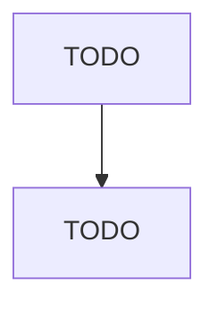

# Other Support Activities for Road Transportation

> TODO: Business-as-Code definition

## Overview

This industry comprises establishments primarily engaged in providing services (except motor vehicle towing) to road network users. Illustrative Examples: Bridge, tunnel, and highway operations Pilot car services (i.e., wide load warning services) Truck or weighing station operations Driving services, independent (e.g., automobile, truck delivery) Cross-References. Establishments primarily engaged in--

## Actors

| Actor | Description |
|-------|-------------|
| TODO | TODO |

## Roles

| Role | Description |
|------|-------------|
| TODO | TODO |

## Entities

| Entity | Description |
|--------|-------------|
| TODO | TODO |

## Actions

| Action | Description |
|--------|-------------|
| TODO | TODO |

## Events

| Event | Description |
|-------|-------------|
| TODO | TODO |

## Searches

| Search | Description |
|--------|-------------|
| TODO | TODO |

## Workflow

## Actor Relationships

