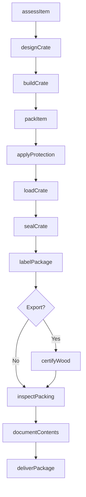
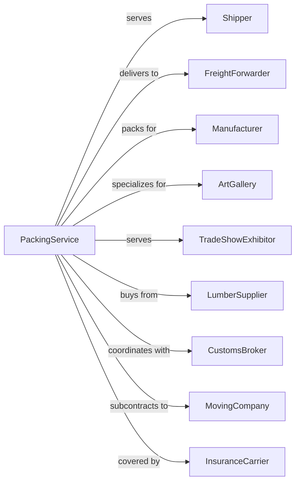

# Packing and Crating

> Business-as-Code definition for packing and crating service operations. Models the complete packaging lifecycle from assessment through custom crate construction, protective packing, and preparation for domestic and international shipment.

## Overview

Packing and crating involves preparing goods for transportation through protective packaging, custom crate building, and export packing. Services include crating machinery, packing fragile items, building custom containers, and preparing goods for international shipping with ISPM-15 compliance. This definition exposes actions for managing packaging orders, crate design, packing operations, and quality inspection.

## Actors

| Actor | Description |
|-------|-------------|
| Shipper | Company requiring packing services |
| FreightForwarder | Arranges shipping of packed goods |
| Manufacturer | Ships machinery and equipment |
| ArtGallery | Ships artwork and collectibles |
| TradeShowExhibitor | Requires exhibit packing |
| LumberSupplier | Provides crate materials |
| CustomsBroker | Handles export documentation |
| MovingCompany | Requires packing for relocations |
| InsuranceCarrier | Covers packed goods in transit |

## Roles

| Role | Description |
|------|-------------|
| PackagingEngineer | Designs custom crates and packaging |
| CrateBuilder | Constructs wooden crates |
| Packer | Wraps and packs goods |
| QualityInspector | Verifies packing standards |
| ProjectManager | Coordinates large packing jobs |
| Estimator | Provides quotes for services |
| WarehouseWorker | Handles goods and materials |
| DeliveryDriver | Transports packed goods |

## Entities

| Entity | Description |
|--------|-------------|
| Crate | Custom wooden shipping container |
| Package | Packed item ready for transport |
| Item | Good requiring packing service |
| PackingMaterial | Foam, wrap, and cushioning supplies |
| Blueprint | Crate design specification |
| ISPM15Stamp | International wood treatment certification |
| PackingSlip | Document listing package contents |
| WorkOrder | Packing job assignment |
| Pallet | Shipping platform for goods |
| Skid | Heavy-duty shipping base |

## Actions

| Action | Description |
|--------|-------------|
| assessItem | Evaluate packing requirements |
| designCrate | Create custom container blueprint |
| buildCrate | Construct wooden shipping crate |
| packItem | Wrap and secure goods |
| applyProtection | Add cushioning and barrier materials |
| labelPackage | Apply shipping and handling labels |
| inspectPacking | Verify quality standards met |
| loadCrate | Place items in completed crate |
| sealCrate | Close and secure container |
| documentContents | Create packing slip and inventory |
| certifyWood | Apply ISPM-15 treatment stamp |
| deliverPackage | Transport to shipping point |

## Events

| Event | Description |
|-------|-------------|
| itemAssessed | Requirements evaluated |
| crateDesigned | Blueprint created |
| crateBuilt | Container constructed |
| itemPacked | Goods wrapped and secured |
| protectionApplied | Cushioning added |
| packageLabeled | Markings applied |
| packingInspected | Quality verified |
| crateLoaded | Items placed in container |
| crateSealed | Container closed |
| contentsDocumented | Inventory created |
| woodCertified | ISPM-15 stamp applied |
| packageDelivered | Transported to shipper |

## Searches

| Search | Description |
|--------|-------------|
| getWorkOrders | List packing jobs |
| getMaterials | Check inventory of supplies |
| getBlueprints | Retrieve crate designs |
| getPackingStatus | Track job progress |
| getCertifications | Verify ISPM-15 compliance |
| getQuotes | Review cost estimates |
| getCapacity | Check production availability |
| getDeliverySchedule | List pending shipments |

## Workflow



## Actor Relationships



## Usage

### Calling Actions

```typescript
import { supportPackingCrating } from '@headlessly/support-packing-crating'

const packing = supportPackingCrating()

// Request quote for machinery crating
const quote = await packing.assessItem({
  description: 'CNC Milling Machine',
  dimensions: { length: 96, width: 72, height: 84 },
  weight: 8500,
  fragility: 'sensitive-equipment',
  destination: 'Germany',
  exportRequired: true
})

// Design custom crate
const blueprint = await packing.designCrate({
  itemId: quote.itemId,
  loadCapacity: 10000,
  stackable: false,
  forkliftAccess: 'four-way',
  ispm15Required: true
})

// Track packing progress
const status = await packing.getPackingStatus({
  workOrderId: 'WO-2024-1234'
})
```

### Event-Driven Automation

```typescript
// Auto-order materials for large jobs
packing.crateDesigned(async ({ blueprintId, materials }) => {
  const inventory = await packing.getMaterials()

  for (const material of materials) {
    if (inventory[material.type] < material.quantity) {
      await orderMaterials({
        type: material.type,
        quantity: material.quantity * 1.2, // Order extra
        urgency: 'standard'
      })
    }
  }
})

// Auto-schedule ISPM-15 treatment for exports
packing.crateBuilt(async ({ crateId, destination }) => {
  if (requiresISPM15(destination)) {
    await packing.scheduleWoodTreatment({
      crateId,
      treatmentType: 'heat-treatment',
      certificationRequired: true
    })
  }
})

// Auto-generate documentation on completion
packing.crateSealed(async ({ crateId, contents, destination }) => {
  await packing.documentContents({
    crateId,
    packingSlip: generatePackingSlip(contents),
    commercialInvoice: isExport(destination) ? generateInvoice(contents) : null,
    photos: await capturePackingPhotos(crateId)
  })
})
```
