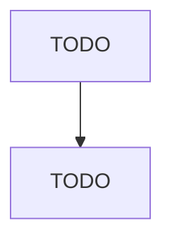

# All Other Support Activities for Transportation

> TODO: Business-as-Code definition

## Overview

This U.S. industry comprises establishments primarily engaged in providing support activities to transportation (except for air transportation; rail transportation; water transportation; road transportation; freight transportation arrangement; and packing and crating). Illustrative Examples: Arrangement of vanpools or car pools (except ridesharing arrangement services) Independent pipeline terminal facilities Stockyards (i.e., not for fattening or selling livestock) Cross-References. Establishme

## Actors

| Actor | Description |
|-------|-------------|
| TODO | TODO |

## Roles

| Role | Description |
|------|-------------|
| TODO | TODO |

## Entities

| Entity | Description |
|--------|-------------|
| TODO | TODO |

## Actions

| Action | Description |
|--------|-------------|
| TODO | TODO |

## Events

| Event | Description |
|-------|-------------|
| TODO | TODO |

## Searches

| Search | Description |
|--------|-------------|
| TODO | TODO |

## Workflow

## Actor Relationships

