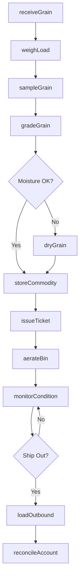
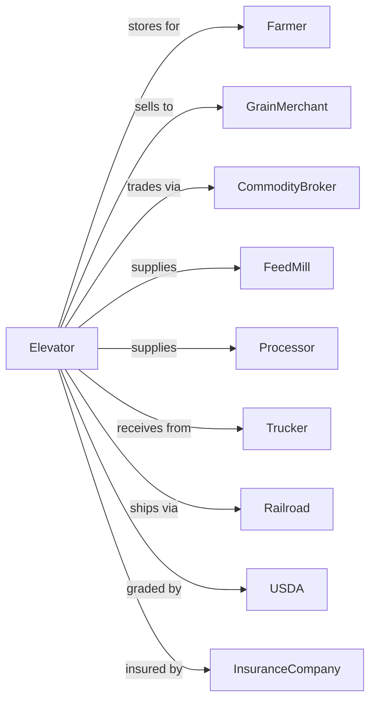

# Farm Product Warehousing and Storage

> Business-as-Code definition for bulk farm product warehousing operations. Models the complete grain storage lifecycle from receiving through conditioning, storage, inventory management, and outbound shipping at grain elevators and agricultural storage facilities.

## Overview

Farm product warehousing and storage comprises establishments operating bulk farm product warehousing and storage facilities except refrigerated. Grain elevators primarily engaged in storage are included. Services include receiving, weighing, grading, drying, conditioning, and storing grain and other agricultural commodities. This definition exposes actions for managing commodity intake, quality grading, inventory tracking, and customer storage accounts.

## Actors

| Actor | Description |
|-------|-------------|
| Farmer | Delivers grain for storage |
| GrainMerchant | Purchases stored commodities |
| CommodityBroker | Facilitates grain trading |
| FeedMill | Purchases grain for animal feed |
| Processor | Buys commodities for processing |
| Trucker | Transports grain to and from facility |
| Railroad | Moves bulk shipments via rail |
| USDA | Federal grain grading authority |
| InsuranceCompany | Provides storage loss coverage |

## Roles

| Role | Description |
|------|-------------|
| ElevatorManager | Oversees facility operations |
| WeighMaster | Operates scales and records weights |
| GrainGrader | Assesses commodity quality |
| BinOperator | Manages storage bins and aeration |
| LoadoutOperator | Handles outbound shipping |
| BookKeeper | Manages storage accounts |
| MaintenanceTech | Services equipment and facilities |
| SamplerTech | Collects and prepares grain samples |

## Entities

| Entity | Description |
|--------|-------------|
| StorageBin | Cylindrical or flat storage structure |
| GrainLot | Quantity of commodity from single delivery |
| StorageTicket | Receipt for deposited grain |
| WeightTicket | Certified scale measurement |
| GradeReport | Quality assessment document |
| WarehouseReceipt | Negotiable storage document |
| AerationSystem | Equipment for grain conditioning |
| Dryer | Equipment for moisture reduction |
| LoadoutFacility | Rail or truck shipping station |
| StorageAccount | Customer inventory ledger |

## Actions

| Action | Description |
|--------|-------------|
| receiveGrain | Accept delivery at facility |
| weighLoad | Measure inbound or outbound quantity |
| sampleGrain | Collect representative sample |
| gradeGrain | Assess quality factors |
| dryGrain | Reduce moisture content |
| storeCommodity | Place in designated bin |
| aerateBin | Circulate air for conditioning |
| monitorCondition | Check temperature and moisture |
| transferBin | Move grain between bins |
| loadOutbound | Ship grain to buyer |
| issueTicket | Generate storage documentation |
| reconcileAccount | Balance storage ledger |

## Events

| Event | Description |
|-------|-------------|
| grainReceived | Delivery accepted |
| loadWeighed | Weight recorded |
| grainSampled | Sample collected |
| grainGraded | Quality assessed |
| grainDried | Moisture reduced |
| commodityStored | Placed in bin |
| binAerated | Conditioning completed |
| conditionMonitored | Status checked |
| binTransferred | Grain moved |
| outboundLoaded | Shipment completed |
| ticketIssued | Documentation created |
| accountReconciled | Ledger balanced |

## Searches

| Search | Description |
|--------|-------------|
| getBinInventory | Check bin contents and levels |
| getStorageAccounts | List customer balances |
| getGradeReports | Retrieve quality records |
| getWeightTickets | List scale transactions |
| getBinConditions | Check temperature and moisture |
| getCapacity | Review available storage space |
| getDeliverySchedule | List expected arrivals |
| getShippingSchedule | List planned loadouts |

## Workflow



## Actor Relationships



## Usage

### Calling Actions

```typescript
import { storeFarmProduct } from '@headlessly/store-farm-product'

const elevator = storeFarmProduct()

// Receive grain delivery
const receipt = await elevator.receiveGrain({
  customer: 'Smith Farms',
  commodity: 'corn',
  estimatedBushels: 1200,
  truckId: 'TRK-4521',
  deliveryTime: '2024-10-15T08:30:00'
})

// Grade the grain
const grade = await elevator.gradeGrain({
  lotId: receipt.lotId,
  testWeight: 56.2,
  moisture: 15.8,
  damagedKernels: 2.1,
  foreignMaterial: 0.5
})

// Check bin inventory
const inventory = await elevator.getBinInventory({
  binId: 'BIN-12',
  includeMoisture: true
})
```

### Event-Driven Automation

```typescript
// Auto-assign bin based on grade
elevator.grainGraded(async ({ lotId, grade, moisture }) => {
  const availableBin = await elevator.findBinForGrade({
    grade,
    requiredCapacity: getLotSize(lotId)
  })

  await elevator.storeCommodity({
    lotId,
    binId: availableBin.id,
    requiresDrying: moisture > 14.0
  })
})

// Auto-alert for condition issues
elevator.conditionMonitored(async ({ binId, temperature, moisture }) => {
  if (temperature > 75 || moisture > 15) {
    await createAlert({
      type: 'bin-condition',
      binId,
      message: `Bin ${binId} requires attention: Temp ${temperature}F, Moisture ${moisture}%`,
      priority: 'high'
    })

    await elevator.aerateBin({
      binId,
      mode: 'cooling',
      duration: 4
    })
  }
})

// Auto-reconcile accounts on shipment
elevator.outboundLoaded(async ({ customerId, bushels, destination }) => {
  await elevator.reconcileAccount({
    customerId,
    adjustment: -bushels,
    reason: `Shipped to ${destination}`
  })

  await notifyCustomer({
    customerId,
    message: `${bushels} bushels shipped. New balance: ${await getBalance(customerId)} bushels.`
  })
})
```
