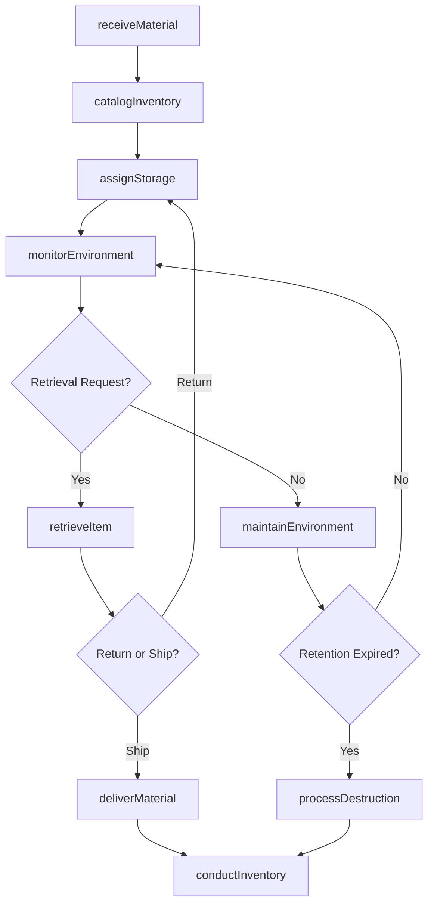
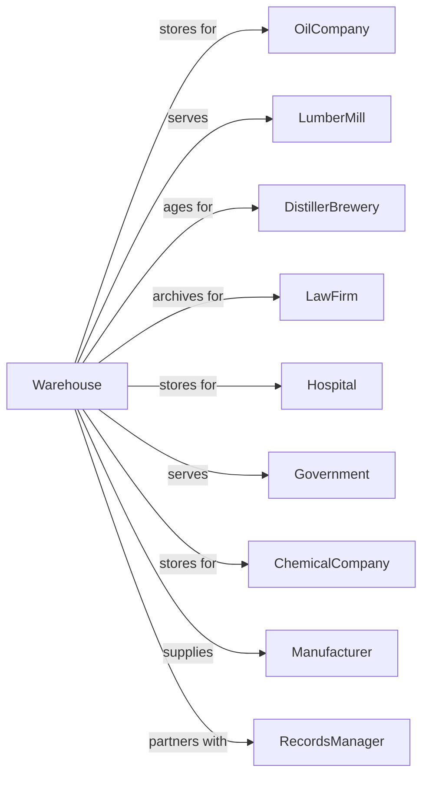

# Other Warehousing and Storage

> Business-as-Code definition for specialized warehousing and storage operations. Models the complete storage lifecycle for bulk petroleum, lumber terminals, document archives, whiskey aging, and other specialized commodities requiring controlled environments.

## Overview

Other warehousing and storage comprises establishments operating warehousing and storage facilities except general merchandise, refrigerated, and farm product warehousing. Services include bulk petroleum storage, lumber storage terminals, document storage and warehousing, whiskey warehousing, and other specialized storage. This definition exposes actions for managing specialized inventory, environmental controls, compliance documentation, and customer storage accounts.

## Actors

| Actor | Description |
|-------|-------------|
| OilCompany | Stores bulk petroleum products |
| LumberMill | Uses terminal storage for wood products |
| DistillerBrewery | Ages whiskey and spirits |
| LawFirm | Stores legal documents and records |
| Hospital | Archives medical records |
| Government | Stores classified documents |
| ChemicalCompany | Stores bulk chemicals |
| Manufacturer | Uses storage for raw materials |
| RecordsManager | Manages document lifecycle |

## Roles

| Role | Description |
|------|-------------|
| FacilityManager | Oversees warehouse operations |
| TankGauger | Measures bulk liquid inventory |
| ArchivesClerk | Processes document storage |
| SecurityOfficer | Protects stored materials |
| EnvironmentalTech | Monitors storage conditions |
| ReceivingClerk | Processes inbound shipments |
| ComplianceOfficer | Ensures regulatory adherence |
| InventorySpecialist | Tracks stored materials |

## Entities

| Entity | Description |
|--------|-------------|
| StorageTank | Bulk liquid container |
| LumberYard | Covered or open timber storage |
| ArchivesBox | Document storage container |
| BarrelRack | Aging whiskey storage |
| ControlledZone | Environmentally regulated area |
| StorageUnit | Customer-dedicated space |
| ManifestRecord | Inventory documentation |
| RetentionSchedule | Document lifecycle policy |
| EnvironmentalLog | Condition monitoring record |
| AccessLog | Entry and retrieval history |

## Actions

| Action | Description |
|--------|-------------|
| receiveMaterial | Accept goods for storage |
| catalogInventory | Record and classify items |
| assignStorage | Allocate appropriate space |
| monitorEnvironment | Track temperature and humidity |
| retrieveItem | Locate and pull from storage |
| deliverMaterial | Ship to customer |
| conductInventory | Physical count verification |
| maintainEnvironment | Adjust storage conditions |
| processDestruction | Securely dispose of materials |
| auditCompliance | Verify regulatory adherence |
| transferCustody | Change ownership records |
| generateReport | Create inventory documentation |

## Events

| Event | Description |
|-------|-------------|
| materialReceived | Goods accepted |
| inventoryCataloged | Items recorded |
| storageAssigned | Space allocated |
| environmentMonitored | Conditions checked |
| itemRetrieved | Material pulled |
| materialDelivered | Shipment completed |
| inventoryConducted | Count verified |
| environmentMaintained | Conditions adjusted |
| destructionProcessed | Materials disposed |
| complianceAudited | Regulations verified |
| custodyTransferred | Ownership changed |
| reportGenerated | Documentation created |

## Searches

| Search | Description |
|--------|-------------|
| getInventoryLevels | Check current stock |
| getStorageUtilization | Review space usage |
| getEnvironmentalData | Retrieve condition history |
| getAccessHistory | List entry and retrieval logs |
| getRetentionSchedule | Review destruction dates |
| getCustomerAccounts | List storage agreements |
| getComplianceStatus | Check regulatory standing |
| getTankGauges | Read bulk liquid levels |

## Workflow



## Actor Relationships



## Usage

### Calling Actions

```typescript
import { storeWarehousingStorage } from '@headlessly/store-warehousing-storage'

const warehouse = storeWarehousingStorage()

// Receive document archives
const receipt = await warehouse.receiveMaterial({
  customer: 'Acme Legal Partners',
  materialType: 'documents',
  containerCount: 50,
  retentionYears: 7,
  securityLevel: 'confidential'
})

// Check tank inventory
const tankLevels = await warehouse.getTankGauges({
  tankFarm: 'north-terminal',
  product: 'diesel'
})

// Retrieve archived documents
const retrieval = await warehouse.retrieveItem({
  boxId: 'DOC-2024-00123',
  requestedBy: 'Jane Smith',
  purpose: 'legal-review',
  deliveryMethod: 'scan-and-email'
})
```

### Event-Driven Automation

```typescript
// Auto-alert for environmental deviations
warehouse.environmentMonitored(async ({ zoneId, temperature, humidity, product }) => {
  const specs = getProductSpecs(product)

  if (temperature < specs.minTemp || temperature > specs.maxTemp ||
      humidity < specs.minHumidity || humidity > specs.maxHumidity) {
    await createAlert({
      type: 'environmental',
      zone: zoneId,
      message: `Zone ${zoneId} out of spec: Temp ${temperature}F, Humidity ${humidity}%`,
      priority: 'high'
    })

    await warehouse.maintainEnvironment({
      zoneId,
      targetTemp: specs.targetTemp,
      targetHumidity: specs.targetHumidity
    })
  }
})

// Auto-schedule destruction for expired records
warehouse.retentionExpired(async ({ boxIds, customer, expirationDate }) => {
  await notifyCustomer({
    customer,
    subject: 'Records Retention Expiration',
    message: `${boxIds.length} boxes reached retention expiration on ${expirationDate}. Destruction will proceed in 30 days unless extended.`
  })

  await scheduleTask({
    runAt: addDays(expirationDate, 30),
    action: async () => {
      const stillExpired = await warehouse.checkRetention({ boxIds })

      for (const boxId of stillExpired) {
        await warehouse.processDestruction({
          boxId,
          method: 'secure-shred',
          certificate: true
        })
      }
    }
  })
})

// Auto-reconcile bulk inventory
warehouse.materialDelivered(async ({ tankId, gallons, customer }) => {
  await warehouse.conductInventory({
    tankId,
    method: 'gauge-reading'
  })

  await updateCustomerAccount({
    customer,
    adjustment: -gallons,
    transaction: 'delivery'
  })
})
```
