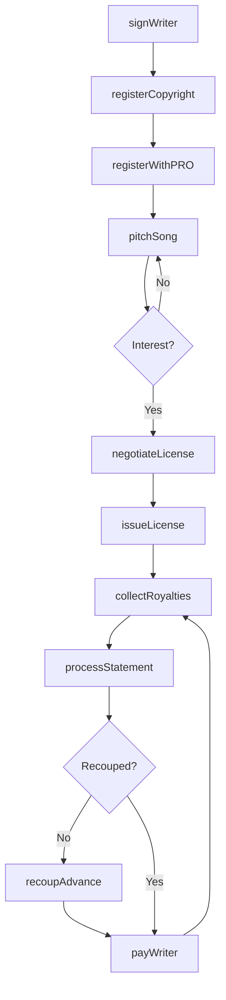
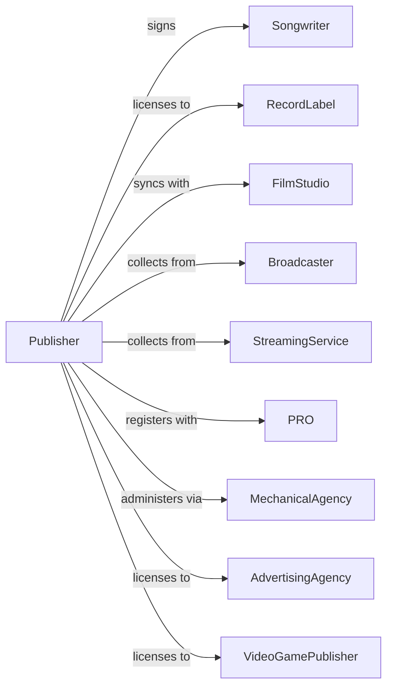

# Music Publishers

> Business-as-Code definition for music publishing operations. Models the complete rights management lifecycle from songwriter signing through royalty collection.

## Overview

Music publishers acquire, register, and administer copyrights for musical compositions, licensing songs for recordings, performances, and synchronization in media. This definition exposes actions for rights acquisition, licensing, and royalty administration, events for tracking deal flow and payments, and searches for catalog and income data.

## Actors

| Actor | Description |
|-------|-------------|
| Songwriter | Creates original musical compositions |
| RecordLabel | Licenses songs for recorded releases |
| FilmStudio | Licenses music for synchronization in films |
| Broadcaster | Pays performance royalties for airplay |
| StreamingService | Pays mechanical and performance royalties |
| PRO | Collects and distributes performance royalties |
| MechanicalAgency | Administers reproduction rights and payments |
| AdvertisingAgency | Licenses songs for commercial use |
| VideoGamePublisher | Licenses music for interactive media |

## Roles

| Role | Description |
|------|-------------|
| PublishingExecutive | Oversees catalog strategy and acquisitions |
| AandRManager | Signs and develops songwriter talent |
| SyncLicensor | Negotiates placements in film, TV, and ads |
| RoyaltyAdministrator | Processes income and payments to writers |
| CopyrightManager | Handles registrations and rights documentation |
| CreativeManager | Pitches songs and manages writer relationships |

## Entities

| Entity | Description |
|--------|-------------|
| Song | Musical composition with lyrics and melody |
| Catalog | Collection of owned or administered songs |
| Copyright | Legal ownership of composition rights |
| License | Permission to use song for specific purpose |
| Royalty | Payment for use of copyrighted material |
| SyncDeal | Agreement for music use in audiovisual media |
| Writer | Credited creator of musical composition |
| Split | Percentage ownership among writers and publishers |
| Registration | Official filing with copyright office or PRO |
| Statement | Periodic report of earnings and usage |
| Advance | Upfront payment against future royalties |

## Actions

| Action | Description |
|--------|-------------|
| signWriter | Contract songwriter to publishing agreement |
| registerCopyright | File composition with copyright office |
| registerWithPRO | Submit song data to performance rights organization |
| pitchSong | Present compositions to potential licensees |
| negotiateLicense | Agree terms for song usage |
| issueLicense | Execute licensing agreement |
| collectRoyalties | Receive payments from licensees and PROs |
| processStatement | Calculate and report writer earnings |
| payWriter | Distribute royalties to songwriter |
| recoupAdvance | Apply earnings against writer advance |
| renewCopyright | Extend copyright protection term |
| auditLicensee | Verify accurate royalty reporting |
| syncClear | Approve song for film or TV placement |

## Events

| Event | Description |
|-------|-------------|
| writerSigned | Songwriter contracted to publisher |
| copyrightRegistered | Composition filed with copyright office |
| proRegistered | Song registered with performance rights org |
| songPitched | Composition presented to potential user |
| licenseSigned | Usage agreement executed |
| syncPlaced | Song confirmed for film, TV, or ad use |
| royaltiesCollected | Payments received from sources |
| statementProcessed | Earnings calculated and reported |
| writerPaid | Royalty payment issued to songwriter |
| advanceRecouped | Writer advance fully earned back |
| copyrightRenewed | Protection term extended |
| auditCompleted | Licensee verification finished |

## Searches

| Search | Description |
|--------|-------------|
| searchCatalog | Find songs by title, writer, or genre |
| getWriters | List signed songwriters and deal terms |
| getLicenses | Retrieve active licensing agreements |
| getRoyalties | Access income by song, source, or period |
| getSyncOpportunities | Find pending placement requests |
| getStatements | View writer earnings reports |
| getRegistrations | Check copyright and PRO filing status |

## Workflow



## Actor Relationships



## Usage

### Calling Actions

```typescript
import { publishMusic } from '@headlessly/publish-music'

const publisher = publishMusic()

// Sign new songwriter
const writer = await publisher.signWriter({
  name: 'Sarah Mitchell',
  term: { years: 3 },
  territory: 'worldwide',
  advance: 150000,
  split: { writer: 75, publisher: 25 }
})

// Register new composition
await publisher.registerCopyright({
  title: 'Midnight Rain',
  writers: [{ id: writer.id, share: 100 }],
  iswc: 'T-123.456.789-0'
})

// Negotiate sync license for film
const license = await publisher.negotiateLicense({
  songId: 'song-456',
  licensee: 'paramount-pictures',
  usage: 'theatrical-worldwide',
  term: 'perpetuity',
  media: ['theatrical', 'streaming', 'home-video'],
  fee: 75000
})
```

### Event-Driven Automation

```typescript
// Auto-register with PRO when copyright filed
publisher.copyrightRegistered(async ({ songId, iswc }) => {
  await publisher.registerWithPRO({
    songId,
    iswc,
    pros: ['ascap', 'bmi', 'sesac']
  })
})

// Auto-process statements quarterly
publisher.royaltiesCollected(async ({ source, amount, period }) => {
  const songs = await publisher.getRoyalties({ source, period })

  for (const song of songs) {
    await publisher.processStatement({
      songId: song.id,
      period,
      gross: song.amount,
      deductions: calculateDeductions(song)
    })
  }
})
```
