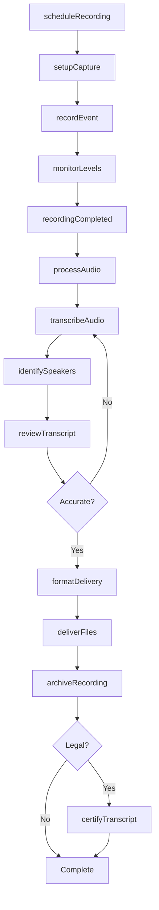
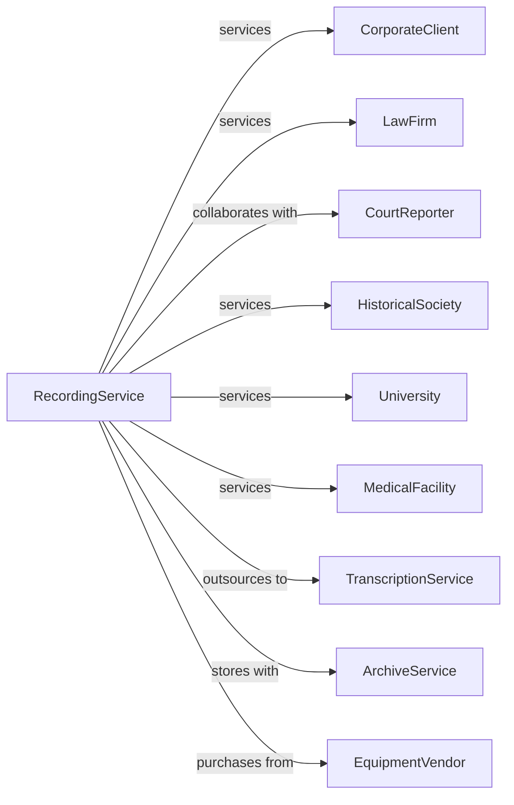

# Other Sound Recording Industries

> Business-as-Code definition for specialized audio recording services. Models operations for conference recording, transcription, and audio documentation.

## Overview

Other sound recording industries provide specialized audio capture services outside of music production, including conference and event recording, legal transcription, oral history documentation, and audio archiving. This definition exposes actions for capture, transcription, and delivery, events for tracking projects, and searches for recordings and transcripts.

## Actors

| Actor | Description |
|-------|-------------|
| CorporateClient | Commissions meeting and conference recordings |
| LawFirm | Requires legal proceedings transcription |
| CourtReporter | Provides real-time stenographic capture |
| HistoricalSociety | Commissions oral history recordings |
| University | Requires lecture and research recordings |
| MedicalFacility | Documents medical dictation and procedures |
| TranscriptionService | Converts audio to text documents |
| ArchiveService | Stores and preserves audio recordings |
| EquipmentVendor | Supplies recording and playback equipment |

## Roles

| Role | Description |
|------|-------------|
| RecordingTechnician | Operates capture equipment at events |
| Transcriptionist | Converts audio to written text |
| QualityReviewer | Verifies accuracy of transcriptions |
| ProjectManager | Coordinates recording assignments |
| ArchiveSpecialist | Manages long-term storage of recordings |
| FieldRecordist | Captures audio on location |

## Entities

| Entity | Description |
|--------|-------------|
| Recording | Captured audio from event or session |
| Transcript | Written text converted from audio |
| Event | Meeting, proceeding, or session being recorded |
| Equipment | Microphones, recorders, and playback devices |
| Project | Client engagement spanning multiple recordings |
| Timecode | Reference markers syncing audio to text |
| Speaker | Identified voice in recording |
| Archive | Long-term storage of completed recordings |
| Format | Audio file type and quality specification |
| Delivery | Final output provided to client |

## Actions

| Action | Description |
|--------|-------------|
| scheduleRecording | Book technician and equipment for event |
| setupCapture | Configure microphones and recording equipment |
| recordEvent | Capture audio during live event |
| monitorLevels | Ensure proper audio quality during capture |
| processAudio | Edit and clean captured recordings |
| transcribeAudio | Convert recording to written text |
| identifySpeakers | Label voices in transcript |
| reviewTranscript | Verify accuracy against audio |
| formatDelivery | Prepare outputs per client specifications |
| deliverFiles | Send completed recordings and transcripts |
| archiveRecording | Store audio for long-term preservation |
| certifyTranscript | Attest to accuracy for legal purposes |
| duplicateMedia | Create copies for distribution |

## Events

| Event | Description |
|-------|-------------|
| recordingScheduled | Capture session booked |
| captureSetup | Equipment configured at venue |
| recordingStarted | Audio capture commenced |
| recordingCompleted | Capture session concluded |
| audioProcessed | Recording edited and cleaned |
| transcriptionStarted | Text conversion begun |
| transcriptionCompleted | Full transcript produced |
| speakersIdentified | Voices labeled in transcript |
| transcriptReviewed | Accuracy verified |
| filesDelivered | Outputs sent to client |
| recordingArchived | Audio stored long-term |
| transcriptCertified | Legal attestation provided |

## Searches

| Search | Description |
|--------|-------------|
| getRecordings | List recordings by client, date, or type |
| getTranscripts | Retrieve transcripts by recording or keyword |
| getSchedule | View upcoming recording assignments |
| getProjects | Access client engagements and status |
| getSpeakers | Search transcripts by identified voice |
| getArchive | Browse stored recordings by date or subject |
| getEquipment | Check available gear and assignments |

## Workflow



## Actor Relationships



## Usage

### Calling Actions

```typescript
import { captureAudioRecording } from '@headlessly/capture-audio-recording'

const recordingService = captureAudioRecording()

// Schedule conference recording
const session = await recordingService.scheduleRecording({
  clientId: 'acme-corp',
  eventType: 'board-meeting',
  date: '2025-03-20',
  time: '09:00',
  duration: 4,
  location: 'conference-room-a',
  participants: 12,
  transcriptRequired: true
})

// Setup and capture
await recordingService.setupCapture({
  sessionId: session.id,
  equipment: ['boundary-mics', 'digital-recorder'],
  backupRecorder: true,
  format: 'wav-48khz-24bit'
})

await recordingService.recordEvent({
  sessionId: session.id,
  technicianId: 'tech-johnson',
  monitoringLevel: 'active'
})

// Process and transcribe
await recordingService.transcribeAudio({
  recordingId: session.recordingId,
  turnaround: '48-hours',
  speakerLabeling: true,
  timestamps: 'paragraph'
})
```

### Event-Driven Automation

```typescript
// Auto-transcribe when recording completes
recordingService.recordingCompleted(async ({ recordingId, clientId }) => {
  const client = await recordingService.getProjects({ clientId })

  if (client.transcriptRequired) {
    await recordingService.processAudio({ recordingId })

    await recordingService.transcribeAudio({
      recordingId,
      priority: client.turnaround,
      speakerLabeling: true
    })
  }
})

// Auto-archive after delivery
recordingService.filesDelivered(async ({ recordingId, projectId }) => {
  await recordingService.archiveRecording({
    recordingId,
    projectId,
    retention: '7-years',
    accessLevel: 'client-only'
  })
})
```
