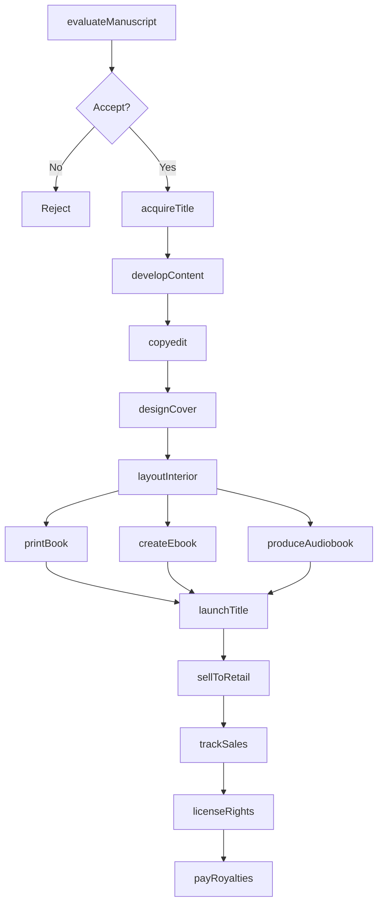
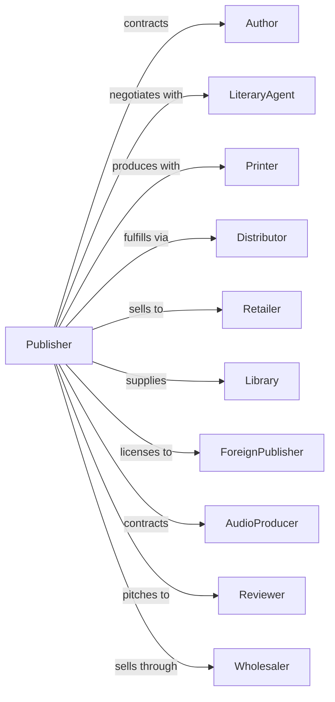

# Book Publishers

> Business-as-Code definition for book publishing operations. Models the complete publishing lifecycle from manuscript acquisition through retail distribution.

## Overview

Book publishers acquire, develop, produce, and distribute books in print, electronic, and audio formats. This definition exposes actions for editorial development, production, sales, and distribution, events for tracking publication milestones, and searches for catalog, sales, and rights data.

## Actors

| Actor | Description |
|-------|-------------|
| Author | Creates manuscript content for publication |
| LiteraryAgent | Represents authors and negotiates deals |
| Printer | Produces physical book copies |
| Distributor | Warehouses and fulfills orders to retailers |
| Retailer | Sells books to consumers |
| Library | Acquires books for lending collections |
| ForeignPublisher | Licenses rights for international markets |
| AudioProducer | Creates audiobook versions |
| Reviewer | Evaluates books for media coverage |
| Wholesaler | Supplies books to retailers in volume |

## Roles

| Role | Description |
|------|-------------|
| AcquisitionsEditor | Evaluates and acquires manuscripts |
| DevelopmentalEditor | Shapes content and structure |
| CopyEditor | Edits for grammar, style, and consistency |
| ProductionManager | Coordinates manufacturing and scheduling |
| MarketingManager | Plans and executes promotional campaigns |
| RightsManager | Licenses subsidiary and foreign rights |

## Entities

| Entity | Description |
|--------|-------------|
| Manuscript | Author submission for consideration |
| Title | Book being published |
| Contract | Agreement with author defining terms |
| ISBN | Unique identifier for published work |
| Catalog | Seasonal list of upcoming titles |
| Rights | Permissions for various uses and territories |
| Royalty | Payment to author based on sales |
| Format | Physical, ebook, or audio edition |
| Advance | Upfront payment against royalties |
| Inventory | Stock of printed books |
| Imprint | Brand or division within publisher |

## Actions

| Action | Description |
|--------|-------------|
| evaluateManuscript | Review submission for publication potential |
| acquireTitle | Negotiate and sign author contract |
| developContent | Edit and shape manuscript for publication |
| copyedit | Refine prose and verify facts |
| designCover | Create cover art and typography |
| layoutInterior | Format pages for printing |
| printBook | Produce physical copies |
| createEbook | Format and distribute electronic edition |
| produceAudiobook | Record and distribute audio version |
| launchTitle | Execute publication and marketing campaign |
| sellToRetail | Place orders with bookstores and chains |
| licenseRights | Sell foreign, film, or subsidiary rights |
| trackSales | Monitor sell-through and inventory |
| payRoyalties | Calculate and distribute author payments |

## Events

| Event | Description |
|-------|-------------|
| manuscriptReceived | Submission delivered for review |
| titleAcquired | Author contract signed |
| editingCompleted | Manuscript development finished |
| coverApproved | Design signed off |
| filesDelivered | Print-ready materials sent to printer |
| bookPrinted | Physical copies produced |
| ebookPublished | Electronic edition released |
| audiobookReleased | Audio version available |
| titleLaunched | Book officially published |
| ordersFilled | Retailer shipments completed |
| rightsLicensed | Subsidiary deal closed |
| salesReported | Retail and wholesale data received |
| royaltiesPaid | Author payment processed |

## Searches

| Search | Description |
|--------|-------------|
| searchCatalog | Find titles by author, genre, or date |
| getManuscripts | List submissions by status or genre |
| getSales | Access sell-through by title, channel, or period |
| getRights | Check availability by title and territory |
| getInventory | Monitor stock levels by title and warehouse |
| getRoyalties | View author earnings and statements |
| getSchedule | Check publication calendar |
| getReviews | Access media coverage by title |

## Workflow



## Actor Relationships



## Usage

### Calling Actions

```typescript
import { publishBook } from '@headlessly/publish-book'

const publisher = publishBook()

// Acquire new title
const title = await publisher.acquireTitle({
  author: 'author-martinez',
  agentId: 'agent-literary-001',
  title: 'The Silent Forest',
  genre: 'literary-fiction',
  advance: 75000,
  royalties: { hardcover: 15, paperback: 7.5, ebook: 25 },
  deliveryDate: '2025-06-01'
})

// Develop through production
await publisher.developContent({
  titleId: title.id,
  editorId: 'editor-chen',
  rounds: 2,
  targetCompletion: '2025-09-01'
})

await publisher.designCover({
  titleId: title.id,
  designer: 'designer-kim',
  concepts: 3,
  approvalBy: 'author'
})

// Publish across formats
await publisher.launchTitle({
  titleId: title.id,
  publicationDate: '2026-01-15',
  formats: ['hardcover', 'ebook', 'audiobook'],
  printRun: 25000,
  marketingBudget: 50000
})
```

### Event-Driven Automation

```typescript
// Auto-create ebook when files ready
publisher.filesDelivered(async ({ titleId, format }) => {
  if (format === 'print') {
    await publisher.createEbook({
      titleId,
      formats: ['epub', 'kindle'],
      releaseDate: 'same-as-print'
    })
  }
})

// Process royalties quarterly
publisher.salesReported(async ({ period }) => {
  const titles = await publisher.getSales({ period, hasEarnings: true })

  for (const title of titles) {
    await publisher.payRoyalties({
      titleId: title.id,
      period,
      grossSales: title.revenue,
      statement: generateStatement(title)
    })
  }
})
```
