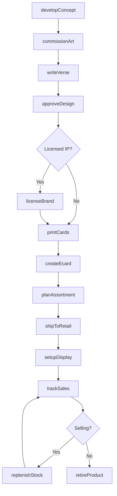
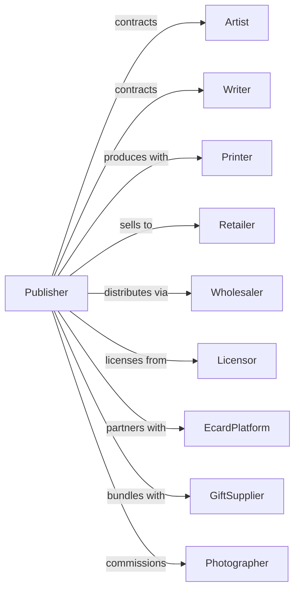

# Greeting Card Publishers

> Business-as-Code definition for greeting card publishing operations. Models the complete product lifecycle from creative development through retail distribution.

## Overview

Greeting card publishers design, produce, and distribute printed and electronic greeting cards for occasions including holidays, birthdays, and special events. This definition exposes actions for creative development, production, and retail distribution, events for tracking product lifecycle, and searches for catalog and sales data.

## Actors

| Actor | Description |
|-------|-------------|
| Artist | Creates illustrations and designs |
| Writer | Composes verses and sentiments |
| Printer | Produces physical card inventory |
| Retailer | Sells cards to consumers |
| Wholesaler | Distributes to retail chains |
| Licensor | Grants rights for character or brand use |
| EcardPlatform | Distributes electronic greeting cards |
| GiftSupplier | Provides complementary merchandise |
| Photographer | Provides images for card designs |

## Roles

| Role | Description |
|------|-------------|
| CreativeDirector | Sets artistic direction and approves designs |
| ProductManager | Oversees card line development |
| Copywriter | Creates card messages and verses |
| ProductionManager | Coordinates printing and fulfillment |
| MerchandiseManager | Plans retail assortments and displays |
| LicensingManager | Negotiates character and brand rights |

## Entities

| Entity | Description |
|--------|-------------|
| Card | Individual greeting card product |
| Line | Collection of cards with unified theme |
| Occasion | Event type card is designed for |
| Design | Visual artwork and layout |
| Verse | Written message inside card |
| SKU | Unique product identifier |
| Display | Retail fixture for card presentation |
| License | Permission to use third-party IP |
| Season | Time period for seasonal products |
| Inventory | Stock of printed cards |
| Ecard | Electronic greeting card product |

## Actions

| Action | Description |
|--------|-------------|
| developConcept | Create theme and direction for card line |
| commissionArt | Hire artist for design creation |
| writeVerse | Compose message for card interior |
| approveDesign | Sign off on final artwork |
| licenseBrand | Secure rights for character or property |
| printCards | Produce physical inventory |
| createEcard | Develop electronic card version |
| planAssortment | Select products for retail placement |
| shipToRetail | Deliver inventory to stores |
| setupDisplay | Install retail fixtures and stock |
| trackSales | Monitor sell-through by SKU |
| replenishStock | Reorder and restock selling cards |
| retireProduct | Discontinue underperforming cards |

## Events

| Event | Description |
|-------|-------------|
| conceptApproved | Card line direction confirmed |
| artCommissioned | Artist assigned to project |
| verseCompleted | Message copy approved |
| designApproved | Final artwork signed off |
| brandLicensed | IP rights secured |
| cardsPrinted | Physical inventory produced |
| ecardPublished | Electronic version released |
| assortmentPlanned | Retail selection finalized |
| inventoryShipped | Stock delivered to retailer |
| displayInstalled | Fixtures set up in store |
| salesReported | Retail data received |
| stockReplenished | Reorders fulfilled |
| productRetired | Card discontinued |

## Searches

| Search | Description |
|--------|-------------|
| searchCatalog | Find cards by occasion, theme, or line |
| getLines | List card collections by season or theme |
| getSales | Access sell-through by SKU or retailer |
| getInventory | Check stock levels by warehouse |
| getLicenses | Retrieve active brand agreements |
| getRetailers | List accounts and assortment details |
| getSeasonalCalendar | View upcoming occasion dates |
| getDesigns | Browse artwork by artist or style |

## Workflow



## Actor Relationships



## Usage

### Calling Actions

```typescript
import { publishGreetingCard } from '@headlessly/publish-greeting-card'

const cardPublisher = publishGreetingCard()

// Develop new birthday line
const line = await cardPublisher.developConcept({
  name: 'Whimsical Wishes',
  occasion: 'birthday',
  style: 'illustrated-humor',
  targetDemographic: 'millennials',
  cardCount: 24,
  launchSeason: 'spring-2025'
})

// Commission artwork
await cardPublisher.commissionArt({
  lineId: line.id,
  artistId: 'artist-johnson',
  designs: 24,
  deadline: '2024-10-01',
  rights: 'exclusive-perpetual',
  fee: 36000
})

// Write verses for all cards
for (const card of line.cards) {
  await cardPublisher.writeVerse({
    cardId: card.id,
    tone: 'warm-humor',
    maxLength: 50,
    writerId: 'writer-chen'
  })
}

// Print and distribute
await cardPublisher.printCards({
  lineId: line.id,
  quantity: { perDesign: 10000 },
  paperStock: 'premium-matte',
  embellishments: ['foil-accent']
})
```

### Event-Driven Automation

```typescript
// Auto-create ecard when design approved
cardPublisher.designApproved(async ({ cardId, designId }) => {
  await cardPublisher.createEcard({
    cardId,
    designId,
    animations: ['envelope-open'],
    musicOptions: true
  })
})

// Auto-replenish based on sales velocity
cardPublisher.salesReported(async ({ sku, sold, remaining }) => {
  const velocity = sold / 7 // weekly sales
  const weeksOfStock = remaining / velocity

  if (weeksOfStock < 4) {
    await cardPublisher.replenishStock({
      sku,
      quantity: velocity * 8,
      priority: weeksOfStock < 2 ? 'rush' : 'standard'
    })
  }
})
```
