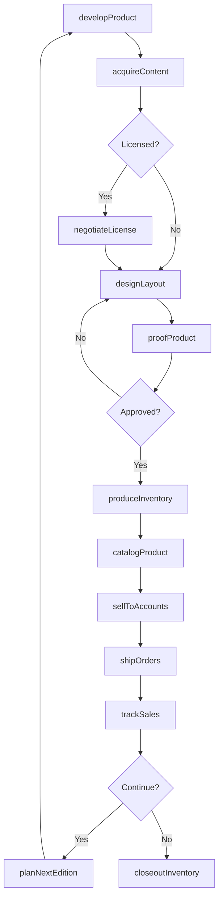
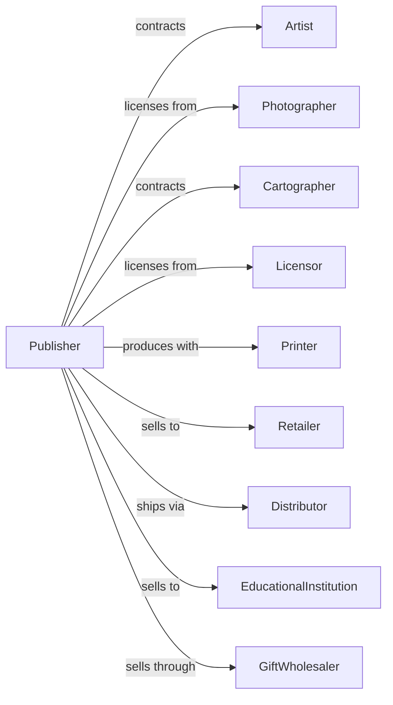

# All Other Publishers

> Business-as-Code definition for specialty publishing operations. Models the complete lifecycle for calendars, art prints, maps, and other specialty publications.

## Overview

All other publishers produce specialty print and digital products including calendars, art prints, posters, maps, atlases, and educational materials. This definition exposes actions for content development, licensing, production, and distribution, events for tracking product lifecycle, and searches for catalog and licensing data.

## Actors

| Actor | Description |
|-------|-------------|
| Artist | Creates original artwork for publication |
| Photographer | Provides images for calendars and prints |
| Cartographer | Develops maps and geographic data |
| Licensor | Grants rights for branded content |
| Printer | Produces physical products |
| Retailer | Sells products to consumers |
| Distributor | Warehouses and fulfills wholesale orders |
| EducationalInstitution | Purchases educational materials |
| GiftWholesaler | Distributes to gift and specialty stores |

## Roles

| Role | Description |
|------|-------------|
| ProductDeveloper | Creates concepts for new publications |
| ArtDirector | Curates and approves visual content |
| LicensingManager | Negotiates rights for branded content |
| ProductionCoordinator | Manages printing and manufacturing |
| SalesManager | Oversees retail and wholesale accounts |
| MarketingManager | Promotes products to target audiences |

## Entities

| Entity | Description |
|--------|-------------|
| Product | Published item for sale |
| Calendar | Dated publication with images |
| Print | Reproduced artwork for display |
| Map | Geographic or thematic visualization |
| Atlas | Collection of maps in book form |
| License | Permission to use copyrighted content |
| Artwork | Visual content for reproduction |
| Format | Size and binding specifications |
| Edition | Version with specific characteristics |
| Inventory | Stock of finished products |
| Season | Time period for seasonal releases |

## Actions

| Action | Description |
|--------|-------------|
| developProduct | Create concept and specifications |
| acquireContent | Secure images, artwork, or data |
| negotiateLicense | Obtain rights for branded content |
| designLayout | Arrange content for production |
| proofProduct | Review samples before production |
| produceInventory | Manufacture finished products |
| catalogProduct | Add to sales materials and systems |
| sellToAccounts | Place orders with retailers and distributors |
| shipOrders | Fulfill customer purchases |
| trackSales | Monitor sell-through performance |
| planNextEdition | Develop updated version for next cycle |
| closeoutInventory | Discount remaining stock |

## Events

| Event | Description |
|-------|-------------|
| productDeveloped | Concept finalized |
| contentAcquired | Images or data secured |
| licenseSigned | Rights agreement executed |
| layoutCompleted | Design approved |
| proofApproved | Sample signed off |
| inventoryProduced | Manufacturing completed |
| productCataloged | Added to sales systems |
| orderPlaced | Customer purchase received |
| orderShipped | Fulfillment completed |
| salesReported | Performance data received |
| editionPlanned | Next version development started |
| inventoryClosed | Remaining stock discounted |

## Searches

| Search | Description |
|--------|-------------|
| searchCatalog | Find products by type, theme, or date |
| getProducts | List items by category or format |
| getLicenses | Retrieve active rights agreements |
| getArtwork | Browse available images and content |
| getSales | Access performance by product or account |
| getInventory | Check stock levels by warehouse |
| getAccounts | List retail and wholesale customers |
| getProduction | View manufacturing schedule and status |

## Workflow



## Actor Relationships



## Usage

### Calling Actions

```typescript
import { publishSpecialtyContent } from '@headlessly/publish-specialty-content'

const publisher = publishSpecialtyContent()

// Develop 2026 wall calendar
const calendar = await publisher.developProduct({
  type: 'wall-calendar',
  theme: 'National Parks',
  year: 2026,
  format: '12x12',
  pages: 24,
  targetRetail: 15.99
})

// Acquire photography
await publisher.acquireContent({
  productId: calendar.id,
  type: 'photography',
  source: 'national-park-service',
  images: 13,
  rights: 'non-exclusive',
  fee: 5000
})

// Produce inventory
await publisher.produceInventory({
  productId: calendar.id,
  quantity: 50000,
  printer: 'quality-printing-co',
  paperStock: '100lb-gloss',
  binding: 'spiral',
  delivery: '2025-06-01'
})

// Distribute to retail
await publisher.sellToAccounts({
  productId: calendar.id,
  accounts: ['barnes-noble', 'target', 'amazon'],
  terms: { discount: 50, returnPolicy: 'full' }
})
```

### Event-Driven Automation

```typescript
// Auto-plan next edition when current sells well
publisher.salesReported(async ({ productId, soldPercent }) => {
  if (soldPercent > 70) {
    const product = await publisher.searchCatalog({ productId })

    await publisher.planNextEdition({
      baseProduct: productId,
      year: product.year + 1,
      modifications: ['fresh-content', 'updated-design'],
      quantityIncrease: 10
    })
  }
})

// Auto-closeout slow sellers
publisher.salesReported(async ({ productId, soldPercent, weeksRemaining }) => {
  if (soldPercent < 30 && weeksRemaining < 8) {
    await publisher.closeoutInventory({
      productId,
      discount: 50,
      channels: ['outlet', 'online-clearance']
    })
  }
})
```
