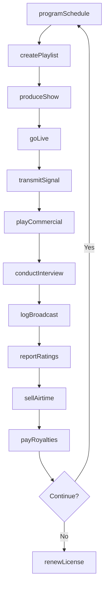
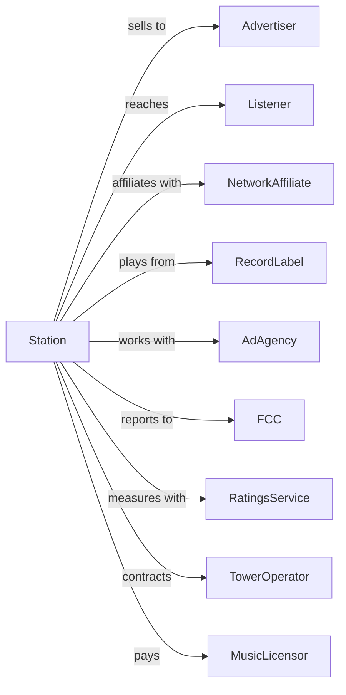

# Radio Broadcasting Stations

> Business-as-Code definition for radio broadcasting station operations. Models the complete broadcast cycle from programming through transmission and advertising.

## Overview

Radio broadcasting stations produce and transmit audio programming to listeners via AM, FM, and HD radio frequencies. This definition exposes actions for programming, production, advertising sales, and transmission, events for tracking broadcasts and ratings, and searches for schedule, audience, and revenue data.

## Actors

| Actor | Description |
|-------|-------------|
| Advertiser | Purchases airtime for commercials |
| Listener | Consumes broadcast programming |
| NetworkAffiliate | Provides syndicated programming |
| RecordLabel | Promotes music for airplay |
| AdAgency | Places advertising on behalf of clients |
| FCC | Regulates broadcast licensing and content |
| RatingsService | Measures audience size and demographics |
| TowerOperator | Maintains transmission infrastructure |
| MusicLicensor | Collects performance royalties (ASCAP, BMI) |

## Roles

| Role | Description |
|------|-------------|
| ProgramDirector | Selects and schedules programming content |
| OnAirHost | Presents live programming to audience |
| Producer | Creates shows and manages production |
| SalesManager | Oversees advertising revenue |
| Engineer | Maintains broadcast equipment and signal |
| TrafficCoordinator | Schedules commercials and programming |

## Entities

| Entity | Description |
|--------|-------------|
| Station | Licensed broadcast facility |
| Program | Show or segment for broadcast |
| Playlist | Scheduled sequence of music tracks |
| Commercial | Paid advertising spot |
| Daypart | Time segment for scheduling (morning drive, etc.) |
| Frequency | AM/FM dial position |
| Signal | Transmitted broadcast coverage |
| Ratings | Audience measurement data |
| Sponsorship | Advertiser association with program |
| License | FCC authorization to broadcast |
| Jingle | Station identification audio |

## Actions

| Action | Description |
|--------|-------------|
| programSchedule | Plan daily and weekly content lineup |
| createPlaylist | Select and sequence music for broadcast |
| produceShow | Record or prepare program content |
| goLive | Begin live broadcast transmission |
| playCommercial | Air paid advertising spot |
| conductInterview | Host guest conversation on air |
| reportRatings | Submit audience measurement data |
| sellAirtime | Negotiate commercial placements |
| transmitSignal | Broadcast programming to audience |
| logBroadcast | Record official transmission log |
| renewLicense | Maintain FCC broadcast authorization |
| payRoyalties | Submit performance royalty payments |

## Events

| Event | Description |
|-------|-------------|
| schedulePublished | Programming lineup confirmed |
| playlistCreated | Music sequence prepared |
| showProduced | Program content ready |
| broadcastStarted | Live transmission commenced |
| commercialAired | Advertising spot played |
| interviewCompleted | Guest segment concluded |
| ratingsReceived | Audience data delivered |
| airtimeSold | Commercial placement confirmed |
| signalTransmitted | Programming broadcast to coverage area |
| broadcastLogged | Official record created |
| licenseRenewed | FCC authorization continued |
| royaltiesPaid | Performance payments submitted |

## Searches

| Search | Description |
|--------|-------------|
| getSchedule | View programming by day and daypart |
| getPlaylists | Access music rotations and history |
| getRatings | Retrieve audience metrics by daypart |
| getCommercials | List advertising by client or timing |
| getRevenue | Access advertising income by period |
| getShows | Browse program catalog |
| getSignalCoverage | Check transmission reach and quality |
| getLogs | Access official broadcast records |

## Workflow



## Actor Relationships



## Usage

### Calling Actions

```typescript
import { broadcastRadio } from '@headlessly/broadcast-radio'

const station = broadcastRadio()

// Program daily schedule
const schedule = await station.programSchedule({
  date: '2025-03-15',
  dayparts: {
    morningDrive: { show: 'Wake Up Show', host: 'host-johnson' },
    midday: { show: 'Workday Mix', format: 'music' },
    afternoonDrive: { show: 'Drive Time', host: 'host-chen' },
    evening: { show: 'Night Vibes', format: 'specialty' }
  }
})

// Create music playlist
await station.createPlaylist({
  daypart: 'morning-drive',
  date: '2025-03-15',
  tracks: 45,
  rotation: { current: 60, recurrent: 30, gold: 10 },
  restrictions: ['no-explicit', 'upbeat-only']
})

// Sell advertising
await station.sellAirtime({
  advertiserId: 'local-auto-dealer',
  spots: 20,
  dayparts: ['morning-drive', 'afternoon-drive'],
  rate: 150,
  duration: '30-seconds',
  flightDates: { start: '2025-03-15', end: '2025-03-31' }
})
```

### Event-Driven Automation

```typescript
// Log broadcast automatically
station.commercialAired(async ({ commercialId, timestamp, daypart }) => {
  await station.logBroadcast({
    type: 'commercial',
    contentId: commercialId,
    timestamp,
    daypart,
    duration: 30
  })
})

// Pay royalties based on plays
station.broadcastLogged(async ({ date }) => {
  const plays = await station.getPlaylists({ date })

  await station.payRoyalties({
    date,
    tracks: plays.map(p => p.trackId),
    recipient: 'bmi',
    calculateFees: true
  })
})
```
