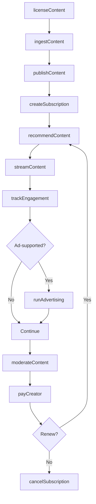
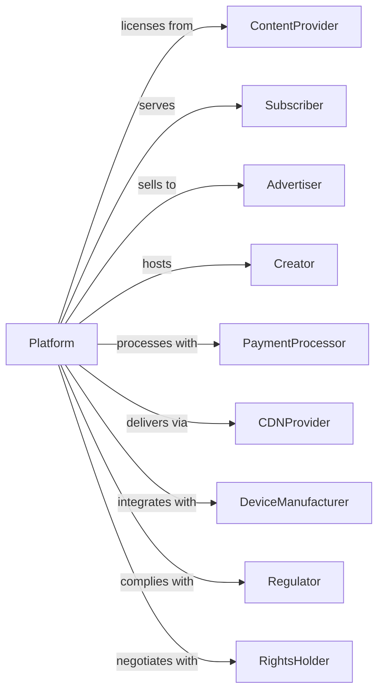

# Media Streaming Distribution Services, Social Networks, and Other Media Networks and Content Providers

> Business-as-Code definition for streaming and social media platform operations. Models the complete content delivery lifecycle from acquisition through subscriber engagement.

## Overview

Media streaming services and social networks distribute video, audio, and user-generated content to subscribers and users via internet platforms. This definition exposes actions for content acquisition, platform management, and subscriber engagement, events for tracking usage and performance, and searches for content, user, and revenue data.

## Actors

| Actor | Description |
|-------|-------------|
| ContentProvider | Licenses films, shows, and music |
| Subscriber | Pays for streaming access |
| Advertiser | Purchases advertising inventory |
| Creator | Produces user-generated content |
| PaymentProcessor | Handles subscription transactions |
| CDNProvider | Delivers content globally |
| DeviceManufacturer | Builds streaming-capable devices |
| Regulator | Oversees content and data practices |
| RightsHolder | Owns intellectual property for licensing |

## Roles

| Role | Description |
|------|-------------|
| ContentAcquisition | Licenses and sources programming |
| ProductManager | Oversees platform features and experience |
| RecommendationEngineer | Builds discovery and personalization |
| TrustSafetyManager | Moderates content and enforces policies |
| GrowthManager | Drives subscriber acquisition and retention |
| PartnerManager | Manages content creator relationships |

## Entities

| Entity | Description |
|--------|-------------|
| Content | Video, audio, or media for streaming |
| Catalog | Library of available content |
| Subscriber | User with paid access |
| Subscription | Recurring access plan |
| Stream | Active content playback session |
| Recommendation | Personalized content suggestion |
| Playlist | User or algorithmic content collection |
| Creator | User-generated content producer |
| Advertisement | Paid promotional placement |
| License | Rights to distribute content |
| Engagement | User interaction metrics |

## Actions

| Action | Description |
|--------|-------------|
| licenseContent | Acquire rights to distribute media |
| ingestContent | Process and encode media for streaming |
| publishContent | Make media available in catalog |
| createSubscription | Enroll user in paid plan |
| streamContent | Deliver media to user device |
| recommendContent | Suggest personalized media |
| moderateContent | Review and enforce content policies |
| runAdvertising | Display ads to users |
| trackEngagement | Monitor viewing and interaction |
| cancelSubscription | End user access |
| payCreator | Distribute revenue to content creators |
| optimizeDelivery | Improve streaming quality and efficiency |

## Events

| Event | Description |
|-------|-------------|
| contentLicensed | Rights acquired for distribution |
| contentIngested | Media processed and encoded |
| contentPublished | Media available in catalog |
| subscriptionCreated | User enrolled in plan |
| streamStarted | Playback session began |
| streamCompleted | Playback session ended |
| contentRecommended | Suggestion delivered to user |
| contentModerated | Policy review completed |
| adDisplayed | Advertisement shown to user |
| engagementTracked | Metrics recorded |
| subscriptionCanceled | User access ended |
| creatorPaid | Revenue distributed |

## Searches

| Search | Description |
|--------|-------------|
| searchCatalog | Find content by title, genre, or creator |
| getSubscribers | Access user accounts and status |
| getEngagement | Retrieve viewing metrics by content or user |
| getRecommendations | Access personalization data |
| getRevenue | View subscription and advertising income |
| getCreators | List content creators and earnings |
| getLicenses | Check content rights and expirations |
| getStreams | Monitor active playback sessions |

## Workflow



## Actor Relationships



## Usage

### Calling Actions

```typescript
import { streamMediaContent } from '@headlessly/stream-media-content'

const platform = streamMediaContent()

// License new content
const license = await platform.licenseContent({
  contentId: 'series-breaking-point',
  provider: 'studio-paramount',
  rights: ['streaming', 'download'],
  territories: ['north-america'],
  term: { years: 3 },
  fee: 5000000
})

// Ingest and publish
await platform.ingestContent({
  licenseId: license.id,
  source: 's3://content-vault/breaking-point/',
  profiles: ['4k-hdr', '1080p', '720p', '480p'],
  subtitles: ['en', 'es', 'fr'],
  audioTracks: ['en-5.1', 'es-stereo']
})

await platform.publishContent({
  contentId: 'series-breaking-point',
  launchDate: '2025-04-01',
  featured: true,
  categories: ['drama', 'thriller']
})

// Create subscriber
const subscription = await platform.createSubscription({
  userId: 'user-12345',
  plan: 'premium',
  billing: 'monthly',
  price: 15.99,
  features: ['4k', 'downloads', 'no-ads']
})
```

### Event-Driven Automation

```typescript
// Recommend when stream completes
platform.streamCompleted(async ({ userId, contentId }) => {
  const similar = await platform.searchCatalog({
    similarTo: contentId,
    limit: 10
  })

  await platform.recommendContent({
    userId,
    recommendations: similar.map(c => c.id),
    context: 'post-watch'
  })
})

// Pay creators monthly
platform.engagementTracked(async ({ period }) => {
  if (period === 'month-end') {
    const creators = await platform.getCreators({ hasEarnings: true })

    for (const creator of creators) {
      const earnings = await platform.getEngagement({
        creatorId: creator.id,
        period
      })

      await platform.payCreator({
        creatorId: creator.id,
        period,
        amount: calculatePayout(earnings),
        method: creator.paymentMethod
      })
    }
  }
})
```
