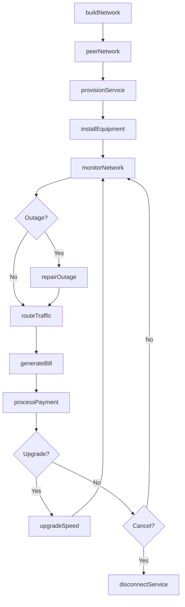
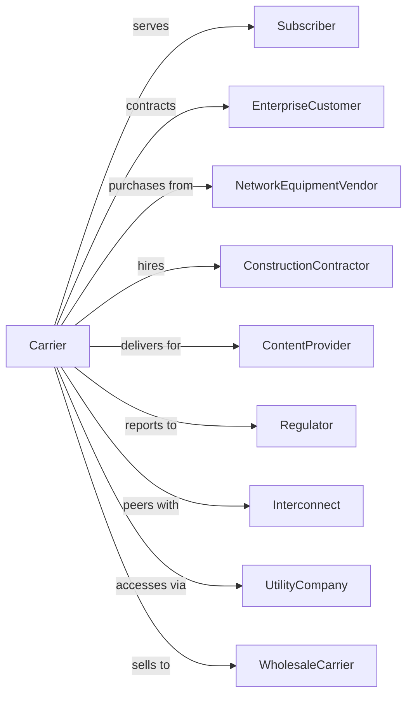

# Wired Telecommunications Carriers

> Business-as-Code definition for wired telecommunications carrier operations. Models the complete service lifecycle from network infrastructure through customer service delivery.

## Overview

Wired telecommunications carriers operate fixed-line networks transmitting voice, data, and video over fiber optic, copper, and coaxial infrastructure. This definition exposes actions for network operations, customer provisioning, and service management, events for tracking network status and customer lifecycle, and searches for network, customer, and usage data.

## Actors

| Actor | Description |
|-------|-------------|
| Subscriber | Purchases telecommunications services |
| EnterpriseCustomer | Contracts for business-grade services |
| NetworkEquipmentVendor | Supplies routers, switches, and fiber |
| ConstructionContractor | Builds and maintains physical infrastructure |
| ContentProvider | Delivers video and internet content |
| Regulator | Oversees rates, access, and service quality |
| Interconnect | Peer networks exchanging traffic |
| UtilityCompany | Provides pole access and conduit |
| WholesaleCarrier | Purchases capacity for resale |

## Roles

| Role | Description |
|------|-------------|
| NetworkEngineer | Designs and maintains network infrastructure |
| FieldTechnician | Installs and repairs service connections |
| CustomerServiceRep | Assists subscribers with service issues |
| SalesRepresentative | Sells services to customers |
| NOCOperator | Monitors network health and incidents |
| BillingAnalyst | Processes invoices and payment |

## Entities

| Entity | Description |
|--------|-------------|
| Network | Physical telecommunications infrastructure |
| Circuit | Dedicated connection between points |
| Subscriber | Customer account receiving service |
| ServiceOrder | Request for new or changed service |
| Bandwidth | Capacity of connection measured in Mbps/Gbps |
| Outage | Service disruption event |
| Bill | Invoice for services rendered |
| Equipment | Customer premises hardware (modem, router) |
| ServiceLevel | Quality guarantees (SLA) |
| Trunk | High-capacity line connecting exchanges |
| PON | Passive optical network serving premises |

## Actions

| Action | Description |
|--------|-------------|
| buildNetwork | Construct physical infrastructure |
| provisionService | Activate customer connection |
| installEquipment | Deploy customer premises hardware |
| monitorNetwork | Track performance and detect issues |
| routeTraffic | Direct data across network paths |
| repairOutage | Restore service after disruption |
| upgradeSpeed | Increase customer bandwidth tier |
| generateBill | Create invoice for services |
| processPayment | Accept and apply customer payment |
| disconnectService | Terminate customer connection |
| peerNetwork | Establish interconnection agreement |
| expandCapacity | Increase network throughput |

## Events

| Event | Description |
|-------|-------------|
| networkBuilt | Infrastructure construction completed |
| serviceProvisioned | Customer connection activated |
| equipmentInstalled | CPE deployed at premises |
| outageDetected | Service disruption identified |
| outageResolved | Service restored |
| trafficRouted | Data successfully delivered |
| speedUpgraded | Bandwidth tier increased |
| billGenerated | Invoice created |
| paymentReceived | Customer payment processed |
| serviceDisconnected | Customer connection terminated |
| peerEstablished | Interconnection agreement active |
| capacityExpanded | Network throughput increased |

## Searches

| Search | Description |
|--------|-------------|
| getSubscribers | List customer accounts and status |
| getNetwork | Access infrastructure topology and status |
| getCircuits | Retrieve connections by location or customer |
| getOutages | List active and historical disruptions |
| getUsage | Access bandwidth consumption by customer |
| getBilling | View invoices and payment status |
| getServiceOrders | Check provisioning queue and status |
| getCapacity | Monitor network utilization |

## Workflow



## Actor Relationships



## Usage

### Calling Actions

```typescript
import { connectWiredNetwork } from '@headlessly/connect-wired-network'

const carrier = connectWiredNetwork()

// Provision new residential service
const service = await carrier.provisionService({
  customerId: 'cust-12345',
  address: '123 Main Street',
  serviceType: 'fiber',
  speed: { download: 1000, upload: 1000 },
  includesVoice: true,
  includesTV: false
})

// Install customer equipment
await carrier.installEquipment({
  serviceId: service.id,
  equipment: ['ont', 'router'],
  appointmentDate: '2025-03-20',
  timeWindow: '10:00-14:00',
  technicianId: 'tech-johnson'
})

// Upgrade speed tier
await carrier.upgradeSpeed({
  serviceId: service.id,
  newSpeed: { download: 2000, upload: 2000 },
  effectiveDate: '2025-04-01',
  prorate: true
})
```

### Event-Driven Automation

```typescript
// Auto-dispatch on outage
carrier.outageDetected(async ({ outageId, affectedCircuits }) => {
  await carrier.repairOutage({
    outageId,
    priority: affectedCircuits.length > 100 ? 'critical' : 'standard',
    dispatchTechnician: true
  })
})

// Auto-bill monthly
carrier.serviceProvisioned(async ({ serviceId, customerId }) => {
  schedule('monthly', async () => {
    const usage = await carrier.getUsage({ serviceId })

    await carrier.generateBill({
      customerId,
      serviceId,
      period: getCurrentMonth(),
      usage
    })
  })
})
```
