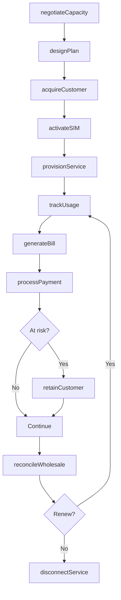
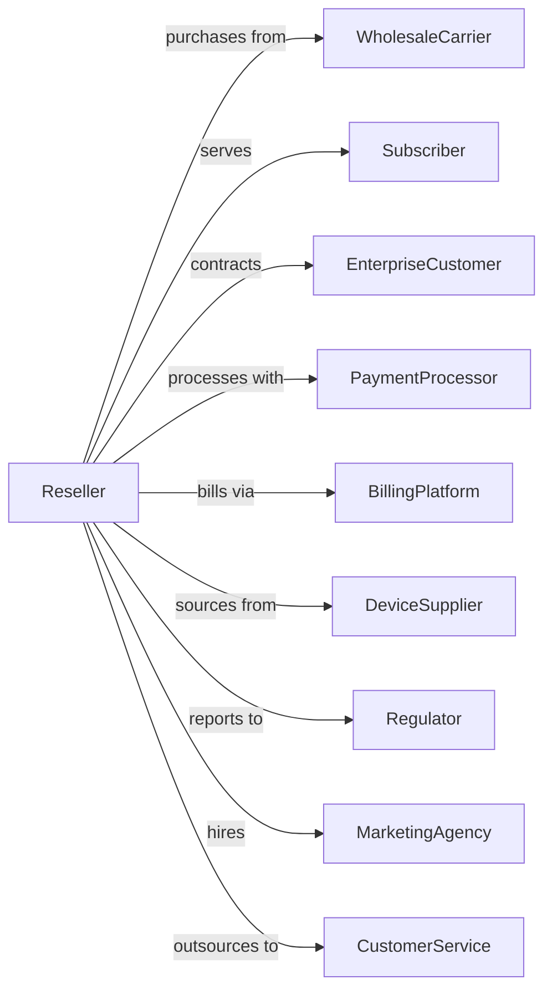

# Telecommunications Resellers

> Business-as-Code definition for telecommunications reseller operations. Models the complete MVNO and wholesale resale business from capacity purchase through customer service.

## Overview

Telecommunications resellers purchase network capacity from carriers and resell voice, data, and messaging services under their own brand. This definition exposes actions for wholesale procurement, customer management, and service delivery, events for tracking capacity and customer lifecycle, and searches for supplier, customer, and financial data.

## Actors

| Actor | Description |
|-------|-------------|
| WholesaleCarrier | Provides network capacity for resale |
| Subscriber | Purchases resold services |
| EnterpriseCustomer | Contracts for business services |
| PaymentProcessor | Handles subscription transactions |
| BillingPlatform | Processes invoices and payments |
| DeviceSupplier | Provides phones for bundle sales |
| Regulator | Oversees reseller practices |
| MarketingAgency | Promotes services to target markets |
| CustomerService | Provides outsourced support |

## Roles

| Role | Description |
|------|-------------|
| WholesaleManager | Negotiates capacity agreements |
| ProductManager | Designs service plans and pricing |
| SalesRepresentative | Acquires new customers |
| CustomerCareAgent | Assists subscribers with issues |
| BillingAdministrator | Manages invoicing and collections |
| MarketingManager | Drives customer acquisition |

## Entities

| Entity | Description |
|--------|-------------|
| CapacityAgreement | Contract with wholesale carrier |
| Subscriber | Customer purchasing resold service |
| Plan | Service package with features and pricing |
| Usage | Voice, data, and messaging consumption |
| Margin | Difference between wholesale and retail price |
| SIM | Subscriber identity module |
| Bill | Invoice for services rendered |
| Brand | Reseller identity and marketing |
| Activation | New customer enrollment |
| Churn | Customer cancellation rate |
| MRR | Monthly recurring revenue |

## Actions

| Action | Description |
|--------|-------------|
| negotiateCapacity | Secure wholesale agreement with carrier |
| designPlan | Create service packages and pricing |
| acquireCustomer | Enroll new subscriber |
| activateSIM | Enable service on network |
| provisionService | Assign plan to subscriber |
| trackUsage | Monitor consumption against plan |
| generateBill | Create invoice for services |
| processPayment | Accept and apply customer payment |
| retainCustomer | Prevent at-risk subscriber from leaving |
| handleSupport | Resolve customer service issues |
| reconcileWholesale | Match usage to carrier invoices |
| disconnectService | Terminate subscriber account |

## Events

| Event | Description |
|-------|-------------|
| capacityNegotiated | Wholesale agreement signed |
| planDesigned | Service package created |
| customerAcquired | New subscriber enrolled |
| simActivated | Service enabled on network |
| serviceProvisioned | Plan assigned to subscriber |
| usageTracked | Consumption recorded |
| billGenerated | Invoice created |
| paymentReceived | Customer payment processed |
| customerRetained | At-risk subscriber saved |
| supportResolved | Service issue fixed |
| wholesaleReconciled | Carrier invoice matched |
| serviceDisconnected | Account terminated |

## Searches

| Search | Description |
|--------|-------------|
| getSubscribers | List customer accounts and plans |
| getCapacity | Check wholesale agreements and usage |
| getUsage | Retrieve consumption by subscriber |
| getBilling | View invoices and payment status |
| getMargin | Calculate profitability by plan or segment |
| getChurn | Identify at-risk subscribers |
| getMRR | Access monthly recurring revenue |
| getWholesale | View carrier invoices and charges |

## Workflow



## Actor Relationships



## Usage

### Calling Actions

```typescript
import { resellTelecommunications } from '@headlessly/resell-telecommunications'

const mvno = resellTelecommunications()

// Negotiate wholesale capacity
const capacity = await mvno.negotiateCapacity({
  carrierId: 'carrier-tmobile',
  type: 'mvno-full',
  commitment: { months: 24 },
  rates: {
    voice: 0.005, // per minute
    data: 0.003,  // per MB
    sms: 0.002    // per message
  },
  minimumVolume: 100000
})

// Design retail plan
const plan = await mvno.designPlan({
  name: 'Value Unlimited',
  price: 35.00,
  features: {
    voice: 'unlimited',
    data: '15gb-highspeed',
    sms: 'unlimited',
    hotspot: '5gb'
  },
  targetMargin: 40
})

// Acquire and activate customer
const customer = await mvno.acquireCustomer({
  name: 'John Smith',
  email: 'john@example.com',
  planId: plan.id,
  deviceId: 'device-iphone-12'
})

await mvno.activateSIM({
  customerId: customer.id,
  simId: 'sim-xyz789',
  portNumber: '555-987-6543'
})
```

### Event-Driven Automation

```typescript
// Auto-reconcile wholesale monthly
mvno.billGenerated(async ({ period }) => {
  const usage = await mvno.getUsage({ period })
  const wholesale = await mvno.getWholesale({ period })

  await mvno.reconcileWholesale({
    period,
    retailUsage: usage.total,
    wholesaleInvoice: wholesale.amount,
    variance: usage.total * rates - wholesale.amount
  })
})

// Proactive churn intervention
mvno.usageTracked(async ({ subscriberId, usage }) => {
  if (usage.trend === 'declining') {
    const churn = await mvno.getChurn({ subscriberId })

    if (churn.risk > 0.6) {
      await mvno.retainCustomer({
        subscriberId,
        strategy: 'win-back-offer',
        discount: 20
      })
    }
  }
})
```
