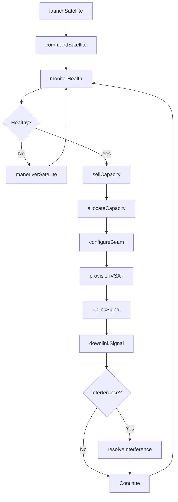
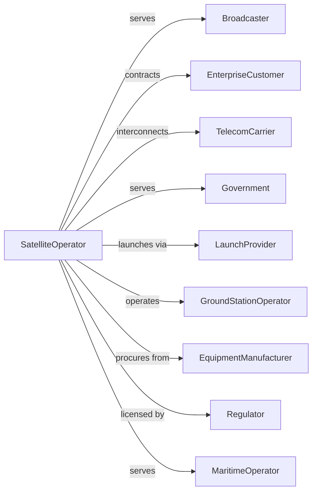

# Satellite Telecommunications

> Business-as-Code definition for satellite telecommunications operations. Models the complete service lifecycle from spacecraft operations through customer connectivity.

## Overview

Satellite telecommunications providers operate spacecraft systems forwarding and receiving communications signals for voice, data, video, and broadband services. This definition exposes actions for satellite operations, capacity sales, and signal management, events for tracking spacecraft health and service delivery, and searches for coverage, capacity, and customer data.

## Actors

| Actor | Description |
|-------|-------------|
| Broadcaster | Leases capacity for video distribution |
| EnterpriseCustomer | Contracts for private network services |
| TelecomCarrier | Purchases backhaul and interconnection |
| Government | Contracts for secure communications |
| LaunchProvider | Delivers satellites to orbit |
| GroundStationOperator | Maintains earth station infrastructure |
| EquipmentManufacturer | Builds satellites and ground equipment |
| Regulator | Licenses spectrum and orbital slots |
| MaritimeOperator | Uses satellite for ship communications |

## Roles

| Role | Description |
|------|-------------|
| SpacecraftController | Manages satellite health and positioning |
| NetworkEngineer | Designs and optimizes signal paths |
| SalesManager | Sells capacity to customers |
| GroundTechnician | Maintains earth station equipment |
| SpectrumManager | Coordinates frequency assignments |
| CustomerEngineer | Supports customer integration |

## Entities

| Entity | Description |
|--------|-------------|
| Satellite | Spacecraft in orbit providing service |
| Transponder | Satellite component carrying signals |
| Footprint | Geographic coverage area |
| GroundStation | Earth-based antenna and equipment |
| Capacity | Bandwidth available for lease |
| Beam | Directed signal coverage area |
| Orbital Slot | Licensed position in geostationary arc |
| VSAT | Very small aperture terminal |
| Uplink | Signal transmission to satellite |
| Downlink | Signal reception from satellite |
| Lease | Capacity rental agreement |

## Actions

| Action | Description |
|--------|-------------|
| launchSatellite | Deploy spacecraft to orbit |
| commandSatellite | Send instructions to spacecraft |
| monitorHealth | Track satellite systems and status |
| maneuverSatellite | Adjust orbital position |
| allocateCapacity | Assign transponder bandwidth |
| uplinkSignal | Transmit signal to satellite |
| downlinkSignal | Receive signal from satellite |
| configureBeam | Shape coverage pattern |
| provisionVSAT | Enable customer terminal |
| sellCapacity | Contract transponder lease |
| resolveInterference | Address signal conflicts |
| decommissionSatellite | End spacecraft operations |

## Events

| Event | Description |
|-------|-------------|
| satelliteLaunched | Spacecraft reached orbit |
| satelliteOperational | Service commenced |
| commandExecuted | Spacecraft instruction completed |
| healthReported | Telemetry received |
| maneuverCompleted | Orbital adjustment finished |
| capacityAllocated | Bandwidth assigned |
| signalUplinked | Transmission to satellite confirmed |
| signalDownlinked | Reception from satellite confirmed |
| beamConfigured | Coverage pattern adjusted |
| vsatProvisioned | Customer terminal activated |
| capacitySold | Lease agreement signed |
| interferenceResolved | Signal conflict cleared |
| satelliteDecommissioned | Operations ended |

## Searches

| Search | Description |
|--------|-------------|
| getSatellites | List spacecraft and status |
| getCapacity | Check available bandwidth by beam |
| getCoverage | View footprint maps by satellite |
| getGroundStations | Access earth station locations |
| getLeases | Retrieve active capacity contracts |
| getHealth | Monitor satellite telemetry |
| getInterference | Check frequency conflicts |
| getVSATs | List provisioned customer terminals |

## Workflow



## Actor Relationships



## Usage

### Calling Actions

```typescript
import { beamSatelliteSignal } from '@headlessly/beam-satellite-signal'

const satop = beamSatelliteSignal()

// Monitor satellite health
const health = await satop.monitorHealth({
  satelliteId: 'sat-galaxy-19',
  subsystems: ['power', 'thermal', 'attitude', 'transponders']
})

// Sell capacity to broadcaster
const lease = await satop.sellCapacity({
  customerId: 'espn-networks',
  satelliteId: 'sat-galaxy-19',
  transponders: [5, 6, 7],
  bandwidth: '72mhz',
  term: { years: 5 },
  monthlyRate: 125000
})

// Provision customer terminal
await satop.provisionVSAT({
  leaseId: lease.id,
  terminalId: 'vsat-corp-hq-001',
  location: { lat: 40.7128, lon: -74.0060 },
  antennaSize: '2.4m',
  services: ['data', 'voice']
})
```

### Event-Driven Automation

```typescript
// Auto-respond to health issues
satop.healthReported(async ({ satelliteId, anomaly }) => {
  if (anomaly) {
    await satop.commandSatellite({
      satelliteId,
      command: 'safe-mode',
      notifyEngineers: true
    })
  }
})

// Auto-resolve interference
satop.interferenceResolved(async ({ satelliteId, beam, source }) => {
  await satop.configureBeam({
    satelliteId,
    beamId: beam,
    adjustment: 'null-steering',
    avoidDirection: source
  })
})
```
