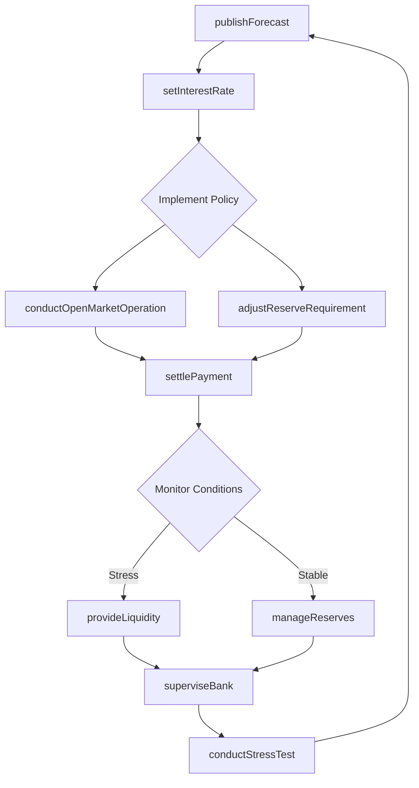
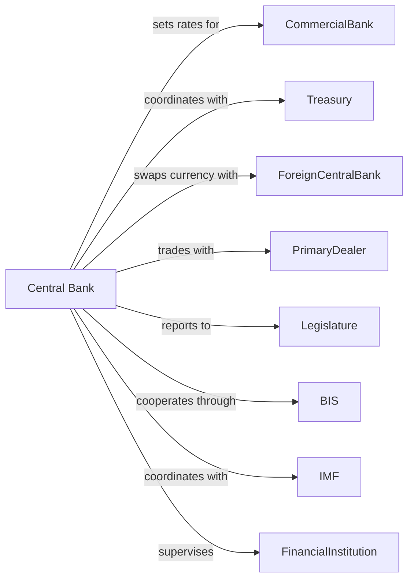

# Monetary Authorities-Central Bank

> Business-as-Code definition for central banking operations. Models monetary policy implementation, currency management, and financial system oversight from policy formulation through execution.

## Overview

Central banks serve as the monetary authority for nations, managing currency issuance, setting interest rates, and maintaining financial stability. This definition exposes actions for monetary policy operations, reserve management, and systemic risk oversight, enabling programmatic interaction with core banking functions.

## Actors

| Actor | Description |
|-------|-------------|
| Treasury | Government department coordinating fiscal policy and debt issuance |
| CommercialBank | Depository institutions holding reserves and accessing discount window |
| ForeignCentralBank | International monetary authorities for currency swaps and coordination |
| PrimaryDealer | Authorized institutions participating in open market operations |
| IMF | International Monetary Fund providing global financial stability oversight |
| BIS | Bank for International Settlements facilitating central bank cooperation |
| FinancialInstitution | Banks and non-banks subject to regulatory oversight |
| Legislature | Government body providing statutory mandate and oversight |

## Roles

| Role | Description |
|------|-------------|
| Governor | Chief executive responsible for monetary policy decisions |
| MonetaryPolicyCommitteeMember | Board member voting on interest rate and policy decisions |
| ChiefEconomist | Lead analyst directing economic research and forecasting |
| ReserveManager | Officer managing foreign exchange reserves and gold holdings |
| BankSupervisor | Examiner overseeing depository institution compliance |
| MarketOperationsTrader | Specialist executing open market transactions |

## Entities

| Entity | Description |
|--------|-------------|
| MonetaryPolicy | Framework of interest rate targets and quantitative measures |
| ReserveRequirement | Mandated deposit ratios for commercial banks |
| DiscountWindow | Lending facility for liquidity-stressed institutions |
| OpenMarketOperation | Securities purchases and sales to adjust money supply |
| ForeignReserve | Holdings of foreign currencies and gold |
| InterestRate | Policy rate and corridor bounds for overnight lending |
| CurrencyNote | Physical banknotes issued as legal tender |
| PaymentSystem | Infrastructure for clearing and settling transactions |
| StressTest | Scenario analysis evaluating financial system resilience |
| InflationTarget | Published price stability objective |

## Actions

| Action | Description |
|--------|-------------|
| setInterestRate | Establish target policy rate for overnight lending |
| conductOpenMarketOperation | Buy or sell securities to adjust reserve balances |
| adjustReserveRequirement | Modify mandatory deposit ratios for banks |
| provideLiquidity | Extend discount window loans to eligible institutions |
| issueCurrency | Authorize printing and distribution of banknotes |
| manageReserves | Allocate foreign currency and gold holdings |
| superviseBank | Examine and rate financial institution soundness |
| publishForecast | Release economic projections and policy guidance |
| executeSwap | Arrange currency exchange agreements with foreign central banks |
| settlePayment | Clear interbank transactions through payment systems |
| conductStressTest | Evaluate institution resilience under adverse scenarios |
| interveneFX | Buy or sell currency to stabilize exchange rates |

## Events

| Event | Description |
|-------|-------------|
| interestRateSet | Policy rate decision announced and effective |
| openMarketOperationCompleted | Securities transaction settled |
| reserveRequirementAdjusted | New deposit ratios published |
| liquidityProvided | Discount window loan disbursed |
| currencyIssued | New banknotes entered circulation |
| reservesReallocated | Foreign reserve portfolio rebalanced |
| bankExamined | Supervisory rating assigned to institution |
| forecastPublished | Economic outlook released to public |
| swapExecuted | Currency exchange line activated |
| paymentSettled | Interbank transaction cleared |
| stressTestCompleted | Scenario results delivered to institution |
| fxInterventionExecuted | Currency market action completed |

## Searches

| Search | Description |
|--------|-------------|
| getMonetaryPolicyDecisions | Retrieve history of rate decisions and policy statements |
| findBankReserves | List reserve balances by depository institution |
| getInflationData | Retrieve price index trends and forecasts |
| findOpenMarketOperations | List recent securities transactions and volumes |
| getExchangeRates | Retrieve current and historical currency rates |
| findSupervisoryActions | List enforcement actions and examination results |
| getPaymentVolumes | Retrieve transaction statistics by payment system |

## Workflow



## Actor Relationships



## Usage

### Calling Actions

```typescript
import { regulateCurrency } from '@headlessly/regulate-currency'

const centralBank = regulateCurrency()

// Set policy interest rate
const decision = await centralBank.setInterestRate({
  targetRate: 5.25,
  effectiveDate: '2024-03-15',
  guidance: 'restrictive',
  statement: 'Committee judges further increases may be appropriate'
})

// Conduct open market operations
await centralBank.conductOpenMarketOperation({
  direction: 'purchase',
  securityType: 'treasuryBond',
  amount: 50_000_000_000,
  settlementDate: '2024-03-16'
})

// Provide emergency liquidity
await centralBank.provideLiquidity({
  institutionId: 'bank-001',
  facility: 'discountWindow',
  amount: 10_000_000_000,
  collateral: ['treasuryBills', 'mortgageBackedSecurities'],
  term: '28-days'
})
```

### Event-Driven Automation

```typescript
// Auto-respond to liquidity stress
centralBank.liquidityProvided(async ({ institutionId, amount }) => {
  await centralBank.superviseBank({
    institutionId,
    examType: 'targeted',
    focusAreas: ['liquidity', 'capitalAdequacy']
  })
})

// Publish guidance after rate decision
centralBank.interestRateSet(async ({ targetRate, guidance }) => {
  await centralBank.publishForecast({
    horizon: 'quarterly',
    includeProjections: ['gdp', 'inflation', 'unemployment'],
    forwardGuidance: guidance
  })
})
```
