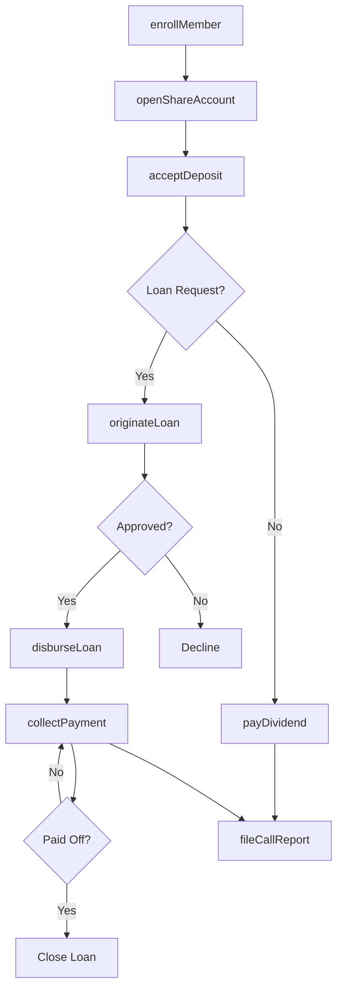
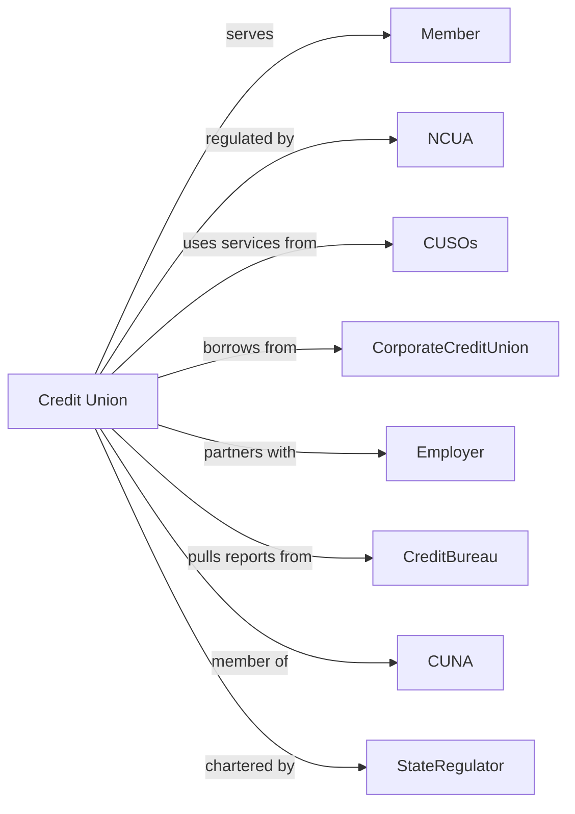

# Credit Unions

> Business-as-Code definition for credit union operations. Models member-owned cooperative banking from share account management through consumer lending and member services.

## Overview

Credit unions are member-owned cooperatives accepting share deposits and providing consumer loans to their members at competitive rates. This definition exposes actions for member enrollment, share account management, and loan origination, enabling programmatic access to cooperative financial services.

## Actors

| Actor | Description |
|-------|-------------|
| Member | Individual with common bond eligible for membership |
| NCUA | National Credit Union Administration providing oversight and insurance |
| CUSOs | Credit Union Service Organizations providing shared services |
| CorporateCreditUnion | Wholesale credit union providing liquidity and investments |
| Employer | Sponsoring organization defining common bond for membership |
| CreditBureau | Agency providing consumer credit reports |
| CUNA | Credit Union National Association providing advocacy and services |
| StateRegulator | State authority for state-chartered credit unions |

## Roles

| Role | Description |
|------|-------------|
| BoardMember | Elected volunteer overseeing credit union governance |
| CEO | Chief executive managing daily operations |
| LoanOfficer | Staff member originating and processing member loans |
| MemberServiceRep | Front-line staff assisting members with accounts |
| ComplianceOfficer | Specialist ensuring regulatory and BSA compliance |
| SupervisoryCommitteeMember | Volunteer auditing operations and financial records |

## Entities

| Entity | Description |
|--------|-------------|
| ShareAccount | Member savings account representing ownership stake |
| ShareDraft | Checking account with dividend earnings |
| ShareCertificate | Time deposit with fixed term and dividend rate |
| PersonalLoan | Unsecured consumer loan for member needs |
| AutoLoan | Vehicle-secured loan for car purchase |
| HELOC | Home equity line of credit for homeowner members |
| Membership | Active enrollment status with voting rights |
| Dividend | Earnings distributed to member share accounts |
| FieldOfMembership | Common bond criteria defining eligible members |
| LoanParticipation | Shared loan ownership with other credit unions |

## Actions

| Action | Description |
|--------|-------------|
| enrollMember | Verify eligibility and establish membership |
| openShareAccount | Create new savings or checking account for member |
| acceptDeposit | Credit funds to member share account |
| processWithdrawal | Debit share account and disburse to member |
| originateLoan | Underwrite and approve member loan application |
| disburseLoan | Fund approved loan to member account |
| collectPayment | Receive and apply loan payments |
| payDividend | Calculate and credit earnings to share accounts |
| participateLoan | Share loan with other credit unions |
| conductAnnualMeeting | Hold member voting and board elections |
| fileCallReport | Submit 5300 report to NCUA |
| processPayroll | Handle direct deposit for employer groups |

## Events

| Event | Description |
|-------|-------------|
| memberEnrolled | New member verified and account established |
| shareAccountOpened | New savings or checking account created |
| depositAccepted | Funds credited to share account |
| withdrawalProcessed | Funds disbursed to member |
| loanOriginated | Member loan approved and documented |
| loanDisbursed | Loan funds transferred to member |
| paymentReceived | Loan payment applied to balance |
| dividendPaid | Earnings posted to share accounts |
| loanParticipated | Loan share sold to partner credit union |
| annualMeetingHeld | Members voted and board elected |
| callReportFiled | Regulatory filing submitted |
| payrollProcessed | Direct deposits completed for employer |

## Searches

| Search | Description |
|--------|-------------|
| findMembers | List members by status, branch, or join date |
| getShareBalances | Retrieve aggregate share deposits by product |
| getLoanPortfolio | List loans by type, status, or delinquency |
| findEligibleApplicants | Identify potential members by field of membership |
| getDividendHistory | Retrieve dividend rates and payments by period |
| getDelinquentLoans | List past-due loans requiring collection |
| getMemberActivity | Retrieve transaction history for member accounts |

## Workflow



## Actor Relationships



## Usage

### Calling Actions

```typescript
import { bankMembers } from '@headlessly/bank-members'

const creditUnion = bankMembers()

// Enroll new member
const member = await creditUnion.enrollMember({
  applicantId: 'app-12345',
  eligibility: 'employerSponsored',
  employerId: 'emp-67890',
  initialDeposit: 25
})

// Open share certificate
const certificate = await creditUnion.openShareAccount({
  memberId: member.id,
  type: 'shareCertificate',
  term: 12,
  amount: 10000,
  dividendRate: 4.5
})

// Originate auto loan
const loan = await creditUnion.originateLoan({
  memberId: member.id,
  type: 'autoLoan',
  amount: 25000,
  term: 60,
  collateral: {
    type: 'vehicle',
    vin: '1HGBH41JXMN109186',
    year: 2024
  }
})
```

### Event-Driven Automation

```typescript
// Pay dividends on deposit
creditUnion.depositAccepted(async ({ memberId, accountId, amount }) => {
  const account = await creditUnion.getShareBalances({ accountId })
  if (account.type === 'shareCertificate') {
    await creditUnion.payDividend({
      accountId,
      rate: account.dividendRate,
      frequency: 'monthly'
    })
  }
})

// Auto-participate large loans
creditUnion.loanOriginated(async ({ loanId, amount }) => {
  if (amount > 100000) {
    await creditUnion.participateLoan({
      loanId,
      partnerCreditUnions: ['cu-partner-1', 'cu-partner-2'],
      retainedPercentage: 50
    })
  }
})
```
