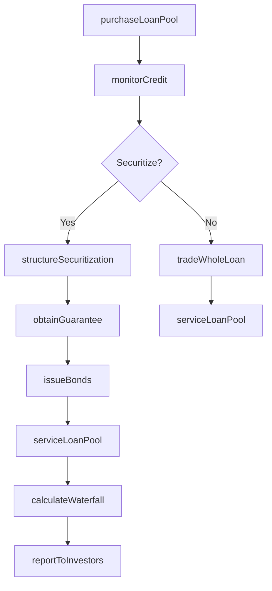
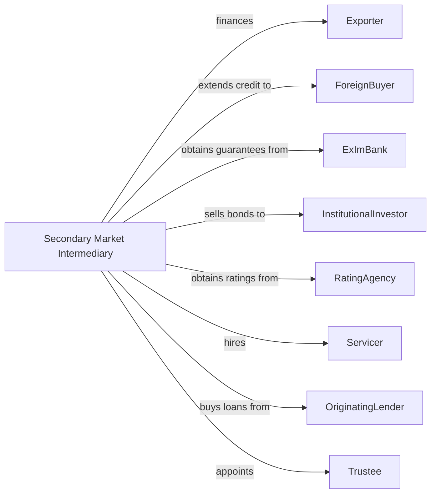

# International, Secondary Market, and All Other Nondepository Credit Intermediation

> Business-as-Code definition for specialized credit intermediation. Models trade finance, secondary market loan trading, and niche lending from origination through securitization and portfolio management.

## Overview

This industry encompasses trade finance providers supporting international commerce, secondary market participants buying and repackaging loans, and specialized lenders serving niche markets. This definition exposes actions for export financing, loan pool assembly, securitization structuring, and portfolio trading, enabling programmatic access to wholesale credit operations.

## Actors

| Actor | Description |
|-------|-------------|
| Exporter | U.S. company selling goods to foreign buyers |
| ForeignBuyer | International purchaser of U.S. goods |
| ExImBank | Export-Import Bank providing guarantees and financing |
| InstitutionalInvestor | Pension fund, insurance company, or asset manager |
| RatingAgency | Firm evaluating credit quality of loan pools |
| Servicer | Entity collecting payments on purchased loans |
| OriginatingLender | Bank or finance company selling loans |
| Trustee | Fiduciary overseeing securitization structures |

## Roles

| Role | Description |
|------|-------------|
| TradeFinanceOfficer | Specialist structuring export and import transactions |
| SecuritizationAnalyst | Professional structuring loan pool transactions |
| PortfolioTrader | Specialist buying and selling loan positions |
| CreditAnalyst | Staff evaluating loan pool credit quality |
| StructuringDirector | Executive designing securitization tranches |
| ComplianceOfficer | Specialist ensuring regulatory adherence |

## Entities

| Entity | Description |
|--------|-------------|
| TradeFinanceFacility | Credit supporting international trade transactions |
| LetterOfCredit | Bank guarantee of payment to exporter |
| LoanPool | Aggregated group of loans for sale or securitization |
| Securitization | Special purpose vehicle issuing bonds backed by loans |
| Tranche | Layer of securitization with specific risk and return |
| WholeLoantrade | Purchase or sale of individual loan |
| ExportCredit | Financing extended to foreign buyer of U.S. goods |
| WorkingCapitalFacility | Short-term credit for exporter operations |
| CollateralizedLoanObligation | Securitization of leveraged loans |
| CreditEnhancement | Guarantee or reserve improving credit quality |

## Actions

| Action | Description |
|--------|-------------|
| issueLetterOfCredit | Create bank guarantee for international trade |
| financeExport | Provide credit to foreign buyer of U.S. goods |
| purchaseLoanPool | Acquire aggregated loans from originating lenders |
| structureSecuritization | Design tranches and waterfall for loan pool |
| issueBonds | Sell securities backed by loan cash flows |
| tradeWholeLoan | Buy or sell individual loan positions |
| serviceLoanPool | Collect payments and manage delinquencies |
| monitorCredit | Track credit performance of loan portfolios |
| provideWorkingCapital | Extend short-term credit to exporters |
| obtainGuarantee | Secure ExImBank or private credit enhancement |
| calculateWaterfall | Allocate cash flows to securitization tranches |
| reportToInvestors | Distribute performance data to bondholders |

## Events

| Event | Description |
|-------|-------------|
| letterOfCreditIssued | Bank guarantee created for trade |
| exportFinanced | Credit extended to foreign buyer |
| loanPoolPurchased | Aggregated loans acquired |
| securitizationStructured | Tranches and terms finalized |
| bondsIssued | Securities sold to investors |
| wholeLoanTraded | Individual loan position transferred |
| poolServiced | Payment collection completed |
| creditMonitored | Performance report generated |
| workingCapitalProvided | Short-term funds extended |
| guaranteeObtained | Credit enhancement secured |
| waterfallCalculated | Cash flows allocated to tranches |
| investorsReported | Performance distributed to bondholders |

## Searches

| Search | Description |
|--------|-------------|
| findLoanPools | List available pools by asset class and vintage |
| getSecuritizationPerformance | Retrieve payment and delinquency data by deal |
| findTradeOpportunities | Identify whole loans available for purchase |
| getExportFinanceVolume | Retrieve trade finance origination by country |
| getTrancheRatings | List current ratings for securitization tranches |
| findDelinquentPools | Identify pools with elevated credit losses |
| getGuaranteeCapacity | Retrieve available ExImBank guarantee limits |

## Workflow



## Actor Relationships



## Usage

### Calling Actions

```typescript
import { lendLoans } from '@headlessly/lend-loans'

const intermediary = lendLoans()

// Purchase loan pool from originator
const pool = await intermediary.purchaseLoanPool({
  originatorId: 'bank-12345',
  assetClass: 'consumerInstallment',
  unpaidPrincipal: 250_000_000,
  weightedAverageCoupon: 8.5,
  vintageRange: ['2023-Q3', '2024-Q1']
})

// Structure securitization
const deal = await intermediary.structureSecuritization({
  poolId: pool.id,
  tranches: [
    { name: 'A', rating: 'AAA', subordination: 15, coupon: 5.5 },
    { name: 'B', rating: 'A', subordination: 8, coupon: 7.0 },
    { name: 'C', rating: 'BBB', subordination: 3, coupon: 9.5 }
  ],
  servicer: 'servicer-67890'
})

// Issue bonds to investors
await intermediary.issueBonds({
  dealId: deal.id,
  settlementDate: '2024-04-01',
  placement: 'private144A'
})
```

### Event-Driven Automation

```typescript
// Monitor credit and report to investors
intermediary.poolServiced(async ({ dealId, collections, losses }) => {
  await intermediary.calculateWaterfall({
    dealId,
    periodCollections: collections,
    periodLosses: losses
  })
  await intermediary.reportToInvestors({
    dealId,
    reportType: 'monthly',
    includeDelinquencyRolls: true
  })
})

// Auto-obtain guarantees for export finance
intermediary.exportFinanced(async ({ transactionId, amount, country }) => {
  if (amount > 10_000_000) {
    await intermediary.obtainGuarantee({
      transactionId,
      guarantor: 'exImBank',
      coveragePercent: 90,
      country
    })
  }
})
```
