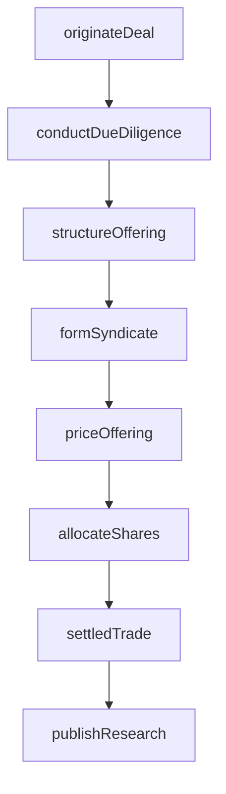
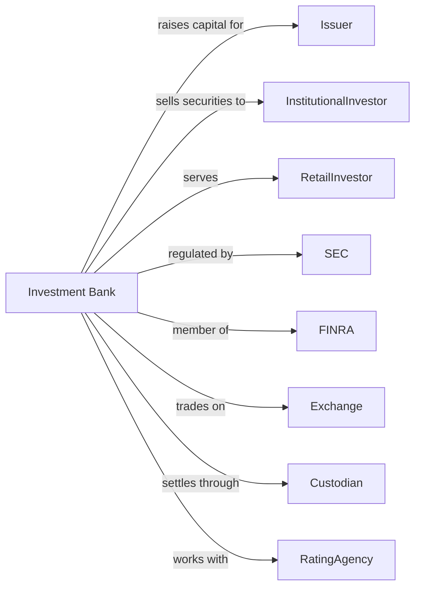

# Investment Banking and Securities Intermediation

> Business-as-Code definition for investment banking operations. Models securities underwriting, trading, and advisory services from deal origination through execution and settlement.

## Overview

Investment banks underwrite securities offerings, maintain markets in financial instruments, and act as brokers between buyers and sellers on commission. This definition exposes actions for capital raising, securities trading, M&A advisory, and market making, enabling programmatic access to wholesale financial services.

## Actors

| Actor | Description |
|-------|-------------|
| Issuer | Corporation or government raising capital through securities |
| InstitutionalInvestor | Pension fund, mutual fund, or hedge fund trading securities |
| RetailInvestor | Individual buying and selling securities |
| SEC | Securities and Exchange Commission regulating markets |
| FINRA | Self-regulatory organization overseeing broker-dealers |
| Exchange | NYSE, NASDAQ, or other trading venue |
| Custodian | Bank holding securities on behalf of investors |
| RatingAgency | Firm assessing creditworthiness of debt securities |

## Roles

| Role | Description |
|------|-------------|
| ManagingDirector | Senior banker leading client relationships and deals |
| Analyst | Junior professional conducting financial analysis |
| Trader | Specialist executing securities transactions |
| SalesRepresentative | Professional marketing securities to investors |
| ComplianceOfficer | Specialist ensuring regulatory adherence |
| ResearchAnalyst | Professional providing investment recommendations |

## Entities

| Entity | Description |
|--------|-------------|
| SecurityOffering | New issuance of stocks or bonds |
| Underwriting | Commitment to purchase securities for resale |
| TradeOrder | Instruction to buy or sell securities |
| Position | Holdings in specific securities |
| Syndicate | Group of underwriters sharing offering risk |
| Prospectus | Disclosure document for securities offering |
| CommitmentLetter | Agreement to provide underwriting services |
| SettlementInstruction | Directions for trade clearing and custody |
| ResearchReport | Analysis and recommendation on securities |
| Spread | Difference between bid and ask prices |

## Actions

| Action | Description |
|--------|-------------|
| originateDeal | Identify and structure capital raising opportunity |
| conductDueDiligence | Investigate issuer financials and business |
| structureOffering | Design terms, pricing, and distribution strategy |
| formSyndicate | Assemble underwriting group to share risk |
| priceOffering | Determine final offering price based on demand |
| allocateShares | Distribute securities among participating investors |
| executeOrder | Process buy or sell instruction in market |
| makeMarket | Provide continuous bid and ask quotes |
| settledTrade | Complete transfer of securities and funds |
| publishResearch | Release investment analysis and recommendations |
| adviseOnMA | Provide strategic guidance on mergers and acquisitions |
| manageRisk | Monitor and hedge position exposures |

## Events

| Event | Description |
|-------|-------------|
| dealOriginated | New transaction opportunity identified |
| dueDiligenceCompleted | Investigation concluded |
| offeringStructured | Terms and strategy finalized |
| syndicateFormed | Underwriting group assembled |
| offeringPriced | Final price determined |
| sharesAllocated | Securities distributed to investors |
| orderExecuted | Trade completed in market |
| marketMade | Continuous quotes provided |
| tradeSettled | Securities and funds transferred |
| researchPublished | Analysis released |
| maAdvised | Strategic recommendation delivered |
| riskManaged | Exposures hedged |

## Searches

| Search | Description |
|--------|-------------|
| findDeals | List active transactions by stage and type |
| getPositions | Retrieve current securities holdings |
| getOrderBook | List pending buy and sell orders |
| getTradeHistory | Retrieve executed trades by security and date |
| findIssuers | List potential capital raising clients |
| getMarketData | Retrieve prices, volumes, and quotes |
| getResearchCoverage | List securities with active analyst coverage |

## Workflow



## Actor Relationships



## Usage

### Calling Actions

```typescript
import { tradeSecurities } from '@headlessly/trade-securities'

const bank = tradeSecurities()

// Originate IPO deal
const deal = await bank.originateDeal({
  issuerId: 'issuer-12345',
  dealType: 'IPO',
  targetSize: 500_000_000,
  securityType: 'commonStock'
})

// Structure and price offering
await bank.structureOffering({
  dealId: deal.id,
  shareCount: 25_000_000,
  priceRange: { low: 18, high: 22 },
  lockupPeriod: 180
})

const pricing = await bank.priceOffering({
  dealId: deal.id,
  bookBuildingResults: { totalDemand: 3.5, priceIndication: 21 }
})

// Execute secondary market trade
const order = await bank.executeOrder({
  security: 'AAPL',
  side: 'buy',
  quantity: 10000,
  orderType: 'limit',
  limitPrice: 175.50,
  clientId: 'client-67890'
})
```

### Event-Driven Automation

```typescript
// Auto-allocate shares after pricing
bank.offeringPriced(async ({ dealId, finalPrice, totalShares }) => {
  await bank.allocateShares({
    dealId,
    allocations: computeAllocations(dealId, totalShares),
    price: finalPrice
  })
})

// Settle trades automatically
bank.orderExecuted(async ({ orderId, security, quantity, price }) => {
  await bank.settledTrade({
    orderId,
    settlementDate: addBusinessDays(2),
    custodianInstructions: { security, quantity, price }
  })
})
```
