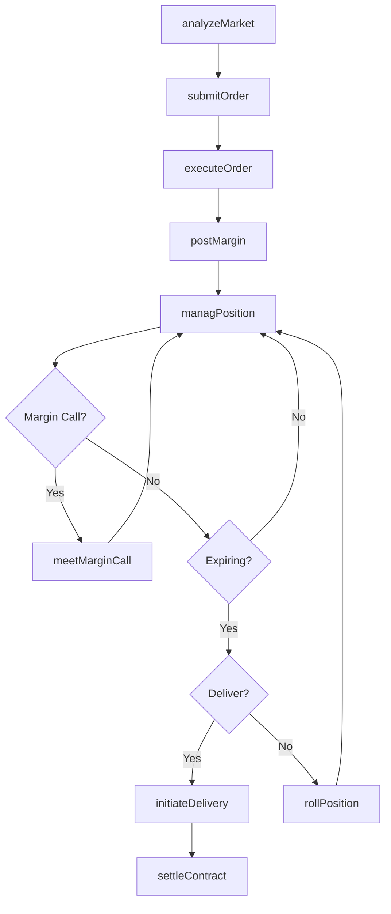
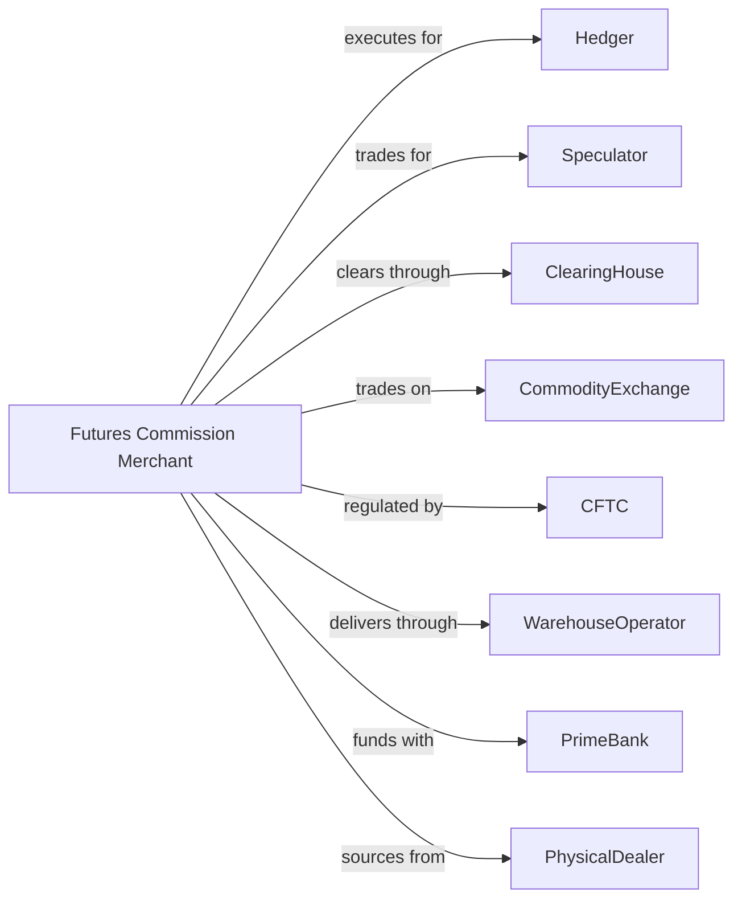

# Commodity Contracts Intermediation

> Business-as-Code definition for commodity trading operations. Models futures, options, and spot trading from order entry through execution, margin management, and settlement.

## Overview

Commodity dealers and brokers trade spot and futures contracts in agricultural products, precious metals, energy, and foreign currency. This definition exposes actions for order execution, position management, margin monitoring, and physical delivery coordination, enabling programmatic access to commodity market operations.

## Actors

| Actor | Description |
|-------|-------------|
| Hedger | Producer or consumer hedging price risk |
| Speculator | Trader seeking profit from price movements |
| CommodityExchange | CME, ICE, or other futures trading venue |
| CFTC | Commodity Futures Trading Commission regulating markets |
| ClearingHouse | Central counterparty guaranteeing contract performance |
| WarehouseOperator | Facility storing physical commodities for delivery |
| PrimeBank | Institution providing credit and margin services |
| PhysicalDealer | Firm trading actual commodities |

## Roles

| Role | Description |
|------|-------------|
| FloorBroker | Specialist executing orders on exchange floor |
| Trader | Professional managing proprietary positions |
| RiskManager | Analyst monitoring margin and exposure limits |
| ResearchAnalyst | Specialist analyzing commodity fundamentals |
| OperationsManager | Staff handling trade processing and settlement |
| ComplianceOfficer | Specialist ensuring CFTC and exchange rule adherence |

## Entities

| Entity | Description |
|--------|-------------|
| FuturesContract | Standardized agreement for future delivery |
| OptionContract | Right to buy or sell futures at specified price |
| SpotContract | Agreement for immediate delivery |
| Position | Open long or short holdings in contracts |
| MarginAccount | Collateral deposited to support positions |
| DeliveryNotice | Notification of intent to make or take delivery |
| VariationMargin | Daily settlement of gains and losses |
| InitialMargin | Collateral required to open position |
| ContractSpecs | Exchange-defined terms for futures contracts |
| Spread | Simultaneous long and short positions across contracts |

## Actions

| Action | Description |
|--------|-------------|
| submitOrder | Send buy or sell instruction to exchange |
| executeOrder | Match order against counterparty |
| managPosition | Monitor and adjust open holdings |
| postMargin | Deposit collateral to support positions |
| meetMarginCall | Add funds when account falls below requirement |
| rollPosition | Close expiring contract and open deferred month |
| initiateDelivery | Start physical settlement process |
| hedgeExposure | Offset price risk with offsetting positions |
| calculatePnL | Compute profit and loss on positions |
| analyzeMarket | Research supply, demand, and price drivers |
| clearTrade | Process transaction through clearing house |
| settleContract | Complete final exchange of funds or goods |

## Events

| Event | Description |
|-------|-------------|
| orderSubmitted | Trade instruction sent to exchange |
| orderExecuted | Trade matched and confirmed |
| positionOpened | New long or short holding established |
| marginPosted | Collateral deposited to account |
| marginCallIssued | Requirement to add funds |
| positionRolled | Contract month switched |
| deliveryInitiated | Physical settlement started |
| exposureHedged | Risk offset with new position |
| pnlCalculated | Profit and loss determined |
| marketAnalyzed | Research completed |
| tradeCleared | Transaction processed by clearing house |
| contractSettled | Final settlement completed |

## Searches

| Search | Description |
|--------|-------------|
| getPositions | List open contracts by commodity and expiration |
| getMarginStatus | Retrieve account equity and requirements |
| getOrderHistory | List executed and pending orders |
| getMarketPrices | Retrieve current futures and spot prices |
| findDeliveryNotices | Identify contracts approaching delivery |
| getPnLReport | Calculate realized and unrealized gains |
| getExposureSummary | Retrieve net position by commodity |

## Workflow



## Actor Relationships



## Usage

### Calling Actions

```typescript
import { tradeCommodities } from '@headlessly/trade-commodities'

const fcm = tradeCommodities()

// Submit futures order
const order = await fcm.submitOrder({
  clientId: 'client-12345',
  commodity: 'CL', // Crude Oil
  contractMonth: '2024-06',
  side: 'buy',
  quantity: 10,
  orderType: 'limit',
  limitPrice: 75.50
})

// Post initial margin
await fcm.postMargin({
  clientId: 'client-12345',
  amount: 85000,
  fundingSource: 'wire'
})

// Roll position before expiration
await fcm.rollPosition({
  clientId: 'client-12345',
  fromContract: 'CLM24',
  toContract: 'CLN24',
  quantity: 10
})
```

### Event-Driven Automation

```typescript
// Auto-meet margin calls
fcm.marginCallIssued(async ({ clientId, shortfall }) => {
  const clientFunds = await getAvailableFunds(clientId)
  if (clientFunds >= shortfall) {
    await fcm.meetMarginCall({
      clientId,
      amount: shortfall,
      fundingSource: 'accountBalance'
    })
  }
})

// Calculate P&L after each trade
fcm.orderExecuted(async ({ clientId, commodity, quantity, price }) => {
  await fcm.calculatePnL({
    clientId,
    includeUnrealized: true,
    markToMarket: true
  })
})
```
