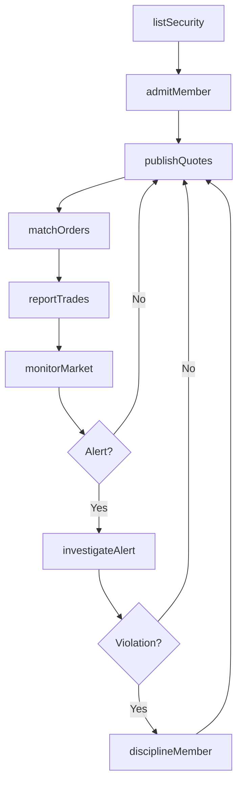
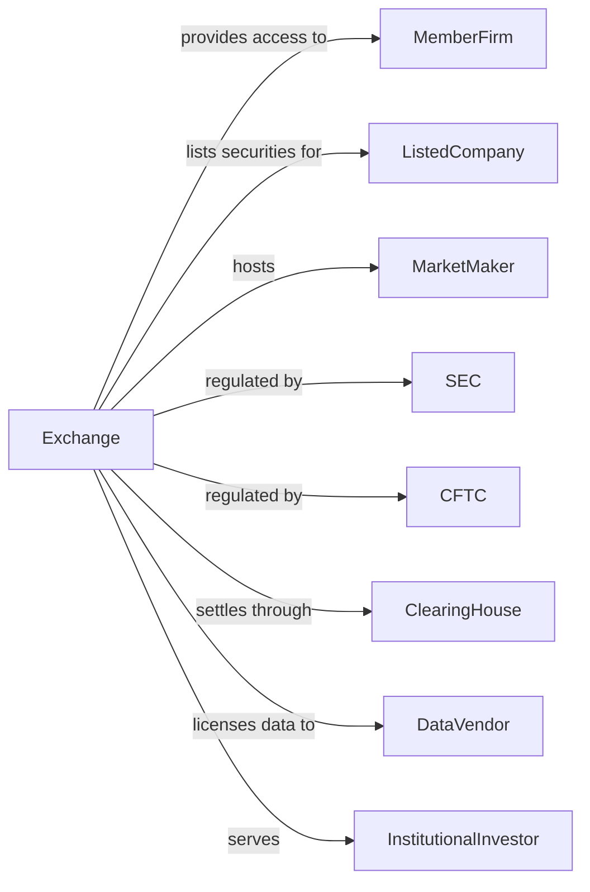

# Securities and Commodity Exchanges

> Business-as-Code definition for exchange operations. Models marketplace infrastructure from order matching through trade reporting, surveillance, and regulatory compliance.

## Overview

Securities and commodity exchanges provide physical and electronic marketplaces for trading stocks, bonds, options, and futures. This definition exposes actions for order matching, price discovery, market surveillance, and member regulation, enabling programmatic access to exchange operations.

## Actors

| Actor | Description |
|-------|-------------|
| MemberFirm | Broker-dealer or FCM with trading privileges |
| ListedCompany | Corporation with securities traded on exchange |
| MarketMaker | Firm providing continuous quotes and liquidity |
| SEC | Securities and Exchange Commission regulating securities exchanges |
| CFTC | Commodity Futures Trading Commission regulating futures exchanges |
| ClearingHouse | Central counterparty settling exchange trades |
| DataVendor | Firm redistributing market data |
| InstitutionalInvestor | Large trader accessing exchange markets |

## Roles

| Role | Description |
|------|-------------|
| MarketOperator | Staff managing trading system operations |
| SurveillanceAnalyst | Specialist detecting market manipulation |
| ListingOfficer | Professional evaluating listing applications |
| RegulatoryExaminer | Staff auditing member firm compliance |
| TechnologyEngineer | Professional maintaining matching engine |
| MarketDataAnalyst | Specialist managing quote and trade dissemination |

## Entities

| Entity | Description |
|--------|-------------|
| Order | Buy or sell instruction entered into matching engine |
| Trade | Executed transaction between counterparties |
| Quote | Bid and ask prices from market makers |
| ListingStandard | Requirements for securities to trade on exchange |
| MarketDataFeed | Real-time stream of quotes and trades |
| CircuitBreaker | Mechanism halting trading during volatility |
| TradingHalt | Suspension of trading in specific security |
| MembershipAgreement | Contract defining trading privileges and obligations |
| SurveillanceAlert | Notification of potential market manipulation |
| SettlementCycle | Timeframe for trade clearing and settlement |

## Actions

| Action | Description |
|--------|-------------|
| matchOrders | Pair buy and sell orders for execution |
| publishQuotes | Disseminate bid and ask prices |
| reportTrades | Transmit executed transactions to data feeds |
| haltTrading | Suspend trading due to news or volatility |
| resumeTrading | Restore normal trading after halt |
| listSecurity | Approve new instrument for trading |
| delistSecurity | Remove instrument from trading |
| monitorMarket | Surveil for manipulation and rule violations |
| investigateAlert | Review flagged trading activity |
| admitMember | Grant trading privileges to new firm |
| disciplineMember | Sanction firm for rule violations |
| calculateIndex | Compute benchmark values from constituent prices |

## Events

| Event | Description |
|-------|-------------|
| ordersMatched | Buy and sell paired for execution |
| quotesPublished | Bid and ask disseminated |
| tradesReported | Executions transmitted to feeds |
| tradingHalted | Trading suspended |
| tradingResumed | Normal trading restored |
| securityListed | New instrument approved for trading |
| securityDelisted | Instrument removed from trading |
| marketMonitored | Surveillance scan completed |
| alertInvestigated | Flagged activity reviewed |
| memberAdmitted | New firm granted privileges |
| memberDisciplined | Sanction imposed |
| indexCalculated | Benchmark value computed |

## Searches

| Search | Description |
|--------|-------------|
| getOrderBook | Retrieve current bids and offers by security |
| getTradeHistory | List executed trades by security and time |
| getListedSecurities | Retrieve all instruments traded on exchange |
| findHaltedSecurities | List securities with trading suspended |
| getMemberFirms | Retrieve registered member organizations |
| getSurveillanceAlerts | List flagged trading activities |
| getMarketStatistics | Retrieve volume, value, and trade counts |

## Workflow



## Actor Relationships



## Usage

### Calling Actions

```typescript
import { tradeMarkets } from '@headlessly/trade-markets'

const exchange = tradeMarkets()

// List new security
const listing = await exchange.listSecurity({
  issuerId: 'issuer-12345',
  symbol: 'NEWCO',
  securityType: 'commonStock',
  sharesOutstanding: 100_000_000,
  initialPrice: 25.00
})

// Match incoming orders
const trade = await exchange.matchOrders({
  buyOrder: { id: 'order-001', price: 25.10, quantity: 1000 },
  sellOrder: { id: 'order-002', price: 25.00, quantity: 1000 }
})

// Halt trading for news
await exchange.haltTrading({
  symbol: 'NEWCO',
  reason: 'pendingNews',
  duration: 'untilResume'
})
```

### Event-Driven Automation

```typescript
// Auto-report trades to data feeds
exchange.ordersMatched(async ({ tradeId, symbol, price, quantity, timestamp }) => {
  await exchange.reportTrades({
    trades: [{ tradeId, symbol, price, quantity, timestamp }],
    feed: 'consolidatedTape'
  })
})

// Monitor for circuit breaker triggers
exchange.tradesReported(async ({ symbol, price }) => {
  const referencePrice = await getReferencePrice(symbol)
  const movePercent = Math.abs((price - referencePrice) / referencePrice)
  if (movePercent > 0.07) {
    await exchange.haltTrading({
      symbol,
      reason: 'circuitBreaker',
      duration: '15-minutes'
    })
  }
})
```
