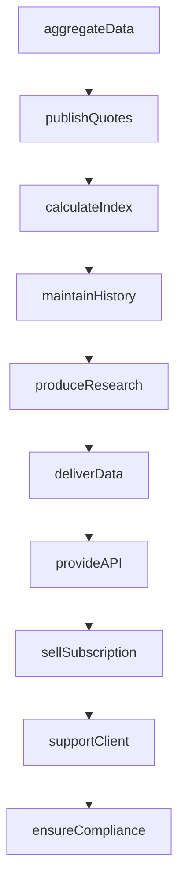
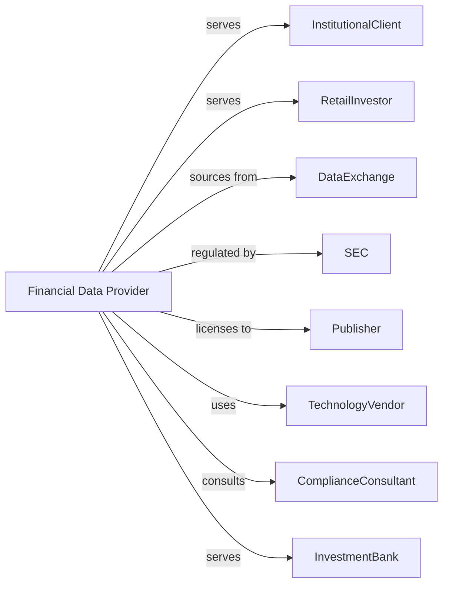

# Miscellaneous Financial Investment Activities

> Business-as-Code definition for specialized financial services. Models financial data provision, investment research, and specialized brokerage from data collection through analysis and client delivery.

## Overview

This industry encompasses stock quotation services, financial data providers, investment research firms, and specialized financial brokers operating on commission. This definition exposes actions for data aggregation, research publication, and brokerage services, enabling programmatic access to financial information and advisory operations.

## Actors

| Actor | Description |
|-------|-------------|
| InstitutionalClient | Asset manager, hedge fund, or bank subscribing to services |
| RetailInvestor | Individual using financial data and research |
| DataExchange | Stock exchange or data aggregator providing raw feeds |
| SEC | Securities and Exchange Commission regulating research and brokers |
| Publisher | Media outlet licensing financial content |
| TechnologyVendor | Provider of data infrastructure and analytics tools |
| ComplianceConsultant | Advisor on research independence and disclosure |
| InvestmentBank | Client for research and data services |

## Roles

| Role | Description |
|------|-------------|
| ResearchAnalyst | Professional producing investment research |
| DataEngineer | Specialist managing data pipelines and quality |
| ProductManager | Executive designing data and research products |
| SalesRepresentative | Professional marketing services to clients |
| ComplianceOfficer | Specialist ensuring research independence |
| QuantAnalyst | Professional developing analytics and models |

## Entities

| Entity | Description |
|--------|-------------|
| MarketDataFeed | Real-time stream of prices and quotes |
| ResearchReport | Analysis and recommendation on securities |
| StockQuote | Current bid, ask, and last trade price |
| FinancialIndex | Benchmark tracking market or sector performance |
| AnalyticsModel | Quantitative tool for investment analysis |
| Subscription | Client agreement for data or research access |
| APIAccess | Programmatic interface to data services |
| HistoricalData | Time series of prices and fundamentals |
| FundamentalData | Financial statements and company metrics |
| AlternativeData | Non-traditional data sources for investment signals |

## Actions

| Action | Description |
|--------|-------------|
| aggregateData | Collect and normalize data from multiple sources |
| publishQuotes | Disseminate real-time price information |
| calculateIndex | Compute benchmark values from constituent data |
| produceResearch | Create investment analysis and recommendations |
| deliverData | Transmit feeds and files to subscribers |
| provideAPI | Enable programmatic access to data services |
| maintainHistory | Store and update historical time series |
| analyzeAlternative | Process non-traditional data for insights |
| sellSubscription | Enroll client in data or research service |
| brokerTransaction | Facilitate financial contract on commission |
| ensureCompliance | Verify research independence and disclosures |
| supportClient | Assist subscribers with data and tools |

## Events

| Event | Description |
|-------|-------------|
| dataAggregated | Information collected from sources |
| quotesPublished | Prices disseminated to subscribers |
| indexCalculated | Benchmark value computed |
| researchProduced | Analysis completed |
| dataDelivered | Feeds transmitted to client |
| apiProvided | Programmatic access enabled |
| historyMaintained | Time series updated |
| alternativeAnalyzed | Non-traditional data processed |
| subscriptionSold | Client enrolled in service |
| transactionBrokered | Financial contract facilitated |
| complianceEnsured | Independence verified |
| clientSupported | Subscriber assistance provided |

## Searches

| Search | Description |
|--------|-------------|
| getQuotes | Retrieve current prices for securities |
| getHistoricalPrices | Retrieve time series for analysis |
| findResearch | List reports by security, sector, or analyst |
| getIndexConstituents | Retrieve components of benchmark |
| getSubscribers | List clients by product and tier |
| getAPIUsage | Retrieve programmatic access metrics |
| getAlternativeDatasets | List available non-traditional sources |

## Workflow



## Actor Relationships



## Usage

### Calling Actions

```typescript
import { investInvestments } from '@headlessly/invest-investments'

const dataProvider = investInvestments()

// Aggregate market data
await dataProvider.aggregateData({
  sources: ['nyse', 'nasdaq', 'cboe'],
  assetClasses: ['equity', 'options'],
  frequency: 'realtime'
})

// Publish quotes to subscribers
await dataProvider.publishQuotes({
  symbols: ['AAPL', 'MSFT', 'GOOGL'],
  fields: ['bid', 'ask', 'last', 'volume'],
  format: 'streaming'
})

// Produce research report
const report = await dataProvider.produceResearch({
  security: 'AAPL',
  type: 'initiatingCoverage',
  recommendation: 'buy',
  targetPrice: 200,
  analyst: 'analyst-12345'
})
```

### Event-Driven Automation

```typescript
// Auto-calculate index after market close
dataProvider.quotesPublished(async ({ timestamp }) => {
  if (isMarketClose(timestamp)) {
    await dataProvider.calculateIndex({
      indices: ['SP500', 'NASDAQ100', 'DJIA'],
      asOfDate: timestamp
    })
  }
})

// Deliver data to subscribers
dataProvider.dataAggregated(async ({ datasetId, records }) => {
  const subscribers = await dataProvider.getSubscribers({ datasetId })
  for (const subscriber of subscribers) {
    await dataProvider.deliverData({
      subscriberId: subscriber.id,
      datasetId,
      format: subscriber.preferredFormat
    })
  }
})
```
