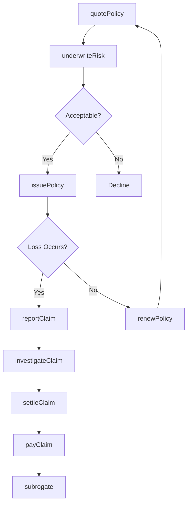
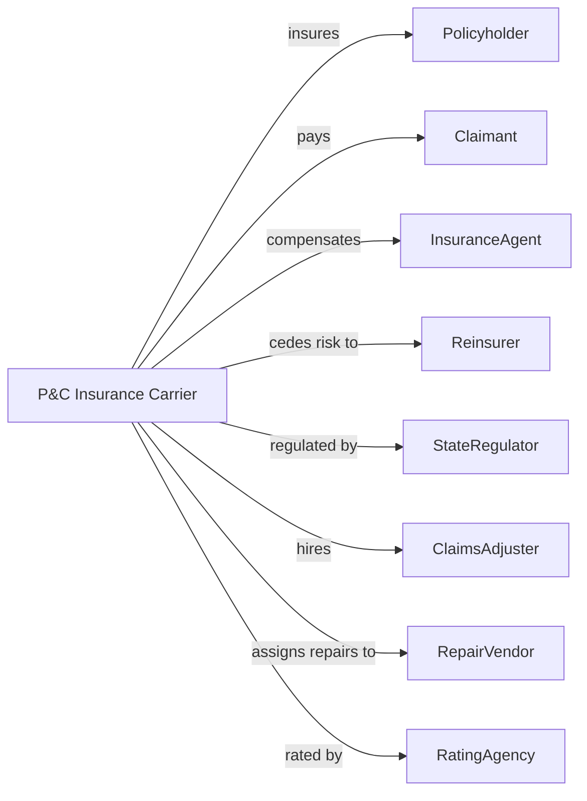

# Direct Property and Casualty Insurance Carriers

> Business-as-Code definition for property and casualty insurance operations. Models coverage underwriting from quote through policy issuance, claims handling, and renewal.

## Overview

Property and casualty insurers underwrite policies protecting against property damage and liability losses including auto, homeowners, commercial, and specialty lines. This definition exposes actions for risk assessment, policy issuance, claims management, and loss control, enabling programmatic access to P&C insurance operations.

## Actors

| Actor | Description |
|-------|-------------|
| Policyholder | Individual or business purchasing coverage |
| Claimant | Party filing insurance claim for loss |
| InsuranceAgent | Licensed professional selling policies |
| Reinsurer | Carrier assuming catastrophic risk |
| StateRegulator | Insurance commissioner overseeing operations |
| ClaimsAdjuster | Professional investigating and settling claims |
| RepairVendor | Contractor performing covered repairs |
| RatingAgency | Firm evaluating carrier financial strength |

## Roles

| Role | Description |
|------|-------------|
| Underwriter | Specialist evaluating risk and setting premiums |
| ClaimsHandler | Staff managing loss claims through settlement |
| Actuary | Professional calculating loss reserves and pricing |
| LossControlEngineer | Specialist assessing and mitigating risks |
| PolicyServicesRep | Staff handling policy changes and inquiries |
| SIUInvestigator | Special investigator detecting fraud |

## Entities

| Entity | Description |
|--------|-------------|
| Policy | Contract providing property or liability coverage |
| Claim | Request for payment following covered loss |
| Premium | Payment required to maintain coverage |
| Deductible | Amount policyholder pays before coverage |
| CoverageLimit | Maximum amount payable for loss |
| Endorsement | Modification to standard policy terms |
| LossReserve | Funds set aside for pending claims |
| CatastropheModel | Tool estimating exposure to large-scale events |
| SubrogationRecovery | Amount recovered from responsible third party |
| RiskSurvey | Assessment of insured property or operation |

## Actions

| Action | Description |
|--------|-------------|
| quotePolicy | Provide premium estimate for requested coverage |
| underwriteRisk | Evaluate exposure and determine terms |
| issuePolicy | Create and deliver insurance contract |
| endorsePolicy | Modify coverage during policy term |
| reportClaim | Receive notice of loss from policyholder |
| investigateClaim | Determine facts and coverage applicability |
| settleClaim | Agree on payment amount with claimant |
| payClaim | Disburse settlement to claimant or vendor |
| subrogate | Pursue recovery from responsible party |
| renewPolicy | Process coverage continuation |
| cancelPolicy | Terminate coverage before expiration |
| conductLossControl | Assess and recommend risk mitigation |

## Events

| Event | Description |
|-------|-------------|
| policyQuoted | Premium estimate provided |
| riskUnderwritten | Exposure evaluated and terms set |
| policyIssued | Contract delivered |
| policyEndorsed | Coverage modified |
| claimReported | Loss notice received |
| claimInvestigated | Facts determined |
| claimSettled | Payment amount agreed |
| claimPaid | Settlement disbursed |
| subrogationRecovered | Third party payment received |
| policyRenewed | Coverage continued |
| policyCanceled | Coverage terminated |
| lossControlConducted | Risk assessment completed |

## Searches

| Search | Description |
|--------|-------------|
| findPolicies | List policies by line, agent, or status |
| getClaimsPipeline | Retrieve open claims by status |
| getPremiumVolume | Calculate written premium by product |
| getLossRatio | Compute losses to premium ratio |
| findSubrogationOpportunities | Identify claims with recovery potential |
| getCatastropheExposure | Calculate aggregate exposure by region |
| getRenewalQueue | List policies approaching expiration |

## Workflow



## Actor Relationships



## Usage

### Calling Actions

```typescript
import { insureProperty } from '@headlessly/insure-property'

const carrier = insureProperty()

// Quote homeowners policy
const quote = await carrier.quotePolicy({
  lineOfBusiness: 'homeowners',
  propertyAddress: '123 Main St, Anytown, ST 12345',
  dwellingCoverage: 350000,
  liabilityCoverage: 300000,
  deductible: 1000,
  constructionYear: 1995
})

// Issue approved policy
const policy = await carrier.issuePolicy({
  quoteId: quote.id,
  effectiveDate: '2024-04-01',
  paymentPlan: 'annual'
})

// Report and process claim
const claim = await carrier.reportClaim({
  policyId: policy.id,
  dateOfLoss: '2024-06-15',
  causeOfLoss: 'windstorm',
  description: 'Tree fell on roof causing damage',
  estimatedLoss: 15000
})
```

### Event-Driven Automation

```typescript
// Auto-assign adjuster on claim report
carrier.claimReported(async ({ claimId, causeOfLoss, estimatedLoss }) => {
  const adjuster = assignAdjuster(causeOfLoss, estimatedLoss)
  await carrier.investigateClaim({
    claimId,
    adjusterId: adjuster.id,
    investigationType: estimatedLoss > 50000 ? 'field' : 'desk'
  })
})

// Pursue subrogation on liable third party
carrier.claimPaid(async ({ claimId, causeOfLoss, paidAmount }) => {
  if (causeOfLoss === 'collision' && paidAmount > 5000) {
    await carrier.subrogate({
      claimId,
      targetAmount: paidAmount,
      assignVendor: 'subrogation-firm-1'
    })
  }
})
```
