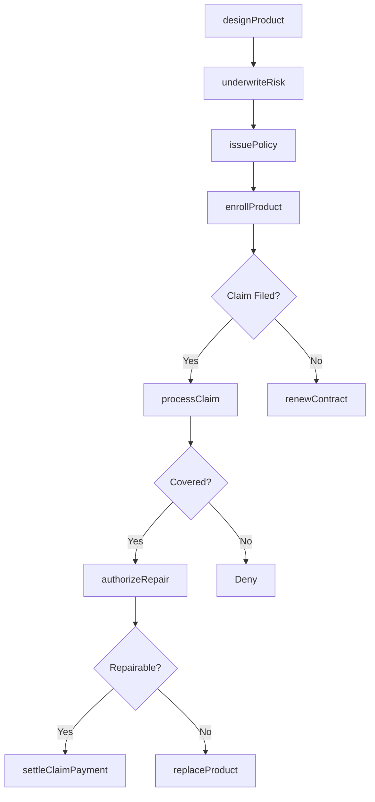
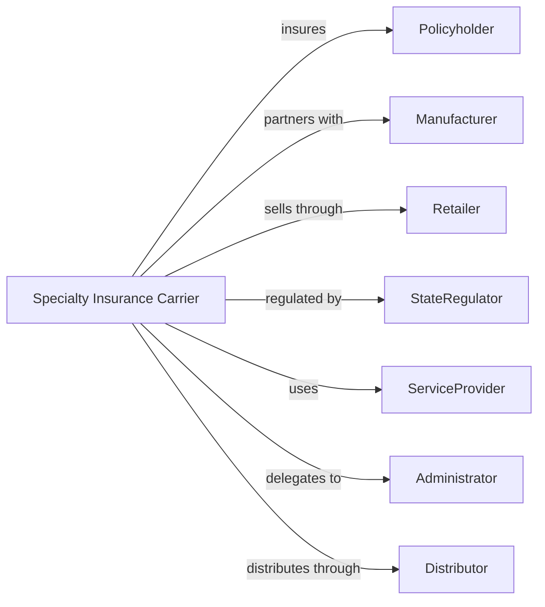

# Other Direct Insurance (except Life, Health, and Medical) Carriers

> Business-as-Code definition for specialty insurance operations. Models warranty, deposit, and other specialty coverage from product design through claims administration.

## Overview

Specialty insurers underwrite coverage not classified elsewhere including product warranties, bank deposit insurance, pet insurance, and travel insurance. This definition exposes actions for specialty product development, risk assessment, and claims handling, enabling programmatic access to niche insurance operations.

## Actors

| Actor | Description |
|-------|-------------|
| Policyholder | Individual or business purchasing specialty coverage |
| Manufacturer | Producer bundling warranty coverage with products |
| Retailer | Merchant selling extended service contracts |
| FDIC | Federal Deposit Insurance Corporation insuring bank deposits |
| StateRegulator | Insurance commissioner overseeing operations |
| ServiceProvider | Firm performing warranty repairs or services |
| Administrator | Third party managing program administration |
| Distributor | Channel partner selling insurance products |

## Roles

| Role | Description |
|------|-------------|
| ProductManager | Executive designing specialty insurance programs |
| Underwriter | Specialist evaluating specialty risks |
| ClaimsProcessor | Staff handling warranty and specialty claims |
| ActuaryAnalyst | Professional pricing specialty products |
| PartnerManager | Staff managing distributor relationships |
| ComplianceOfficer | Specialist ensuring regulatory adherence |

## Entities

| Entity | Description |
|--------|-------------|
| WarrantyPolicy | Extended service contract for products |
| DepositInsurance | Coverage protecting bank depositors |
| PetInsurance | Coverage for veterinary expenses |
| TravelInsurance | Coverage for trip cancellation and emergencies |
| ServiceContract | Agreement for repair or replacement services |
| Claim | Request for benefit under specialty policy |
| Premium | Payment required for specialty coverage |
| CoveredProduct | Item protected by warranty or service contract |
| Deductible | Amount policyholder pays before coverage |
| ExclusionList | Items or events not covered |

## Actions

| Action | Description |
|--------|-------------|
| designProduct | Create new specialty insurance program |
| underwriteRisk | Evaluate and price specialty exposure |
| issuePolicy | Deliver specialty coverage to policyholder |
| enrollProduct | Register covered item under warranty |
| processClaim | Adjudicate request for warranty service |
| authorizeRepair | Approve service provider to perform work |
| settleClaimPayment | Disburse payment for covered loss |
| replaceProduct | Provide replacement for unrepairable item |
| managePartner | Oversee distributor and administrator relationships |
| calculateReserves | Determine funds needed for future claims |
| cancelCoverage | Terminate policy and refund unearned premium |
| renewContract | Process coverage continuation |

## Events

| Event | Description |
|-------|-------------|
| productDesigned | New program created |
| riskUnderwritten | Exposure evaluated and priced |
| policyIssued | Coverage delivered |
| productEnrolled | Item registered for coverage |
| claimProcessed | Request adjudicated |
| repairAuthorized | Service approved |
| claimPaymentSettled | Payment disbursed |
| productReplaced | Replacement provided |
| partnerManaged | Relationship reviewed |
| reservesCalculated | Future claim funds determined |
| coverageCanceled | Policy terminated |
| contractRenewed | Coverage continued |

## Searches

| Search | Description |
|--------|-------------|
| findPolicies | List specialty policies by product type |
| getClaimsPipeline | Retrieve open claims by status |
| getEnrolledProducts | List covered items by category |
| getPremiumVolume | Calculate premium by product line |
| getServiceProviders | List approved repair vendors |
| getPartnerPerformance | Retrieve distributor metrics |
| getReserveAdequacy | Assess claim reserve sufficiency |

## Workflow



## Actor Relationships



## Usage

### Calling Actions

```typescript
import { insureRisks } from '@headlessly/insure-risks'

const specialty = insureRisks()

// Design new warranty product
const product = await specialty.designProduct({
  productType: 'extendedWarranty',
  coveredCategory: 'electronics',
  termOptions: [12, 24, 36],
  coverageLimit: 2000,
  deductible: 50
})

// Issue warranty policy
const policy = await specialty.issuePolicy({
  productId: product.id,
  customerId: 'cust-12345',
  coveredItem: {
    type: 'laptop',
    serialNumber: 'ABC123456',
    purchaseDate: '2024-03-01',
    purchasePrice: 1500
  },
  term: 24
})

// Process warranty claim
const claim = await specialty.processClaim({
  policyId: policy.id,
  claimType: 'mechanicalFailure',
  description: 'Screen not functioning',
  preferredServiceOption: 'repair'
})
```

### Event-Driven Automation

```typescript
// Auto-authorize standard repairs
specialty.claimProcessed(async ({ claimId, claimType, estimatedCost }) => {
  if (estimatedCost < 500) {
    await specialty.authorizeRepair({
      claimId,
      serviceProvider: 'preferred-vendor-1',
      maxAuthorization: estimatedCost * 1.1
    })
  }
})

// Replace unrepairable products
specialty.repairAuthorized(async ({ claimId, repairOutcome }) => {
  if (repairOutcome === 'unrepairable') {
    await specialty.replaceProduct({
      claimId,
      replacementType: 'equivalent',
      shippingMethod: 'standard'
    })
  }
})
```
