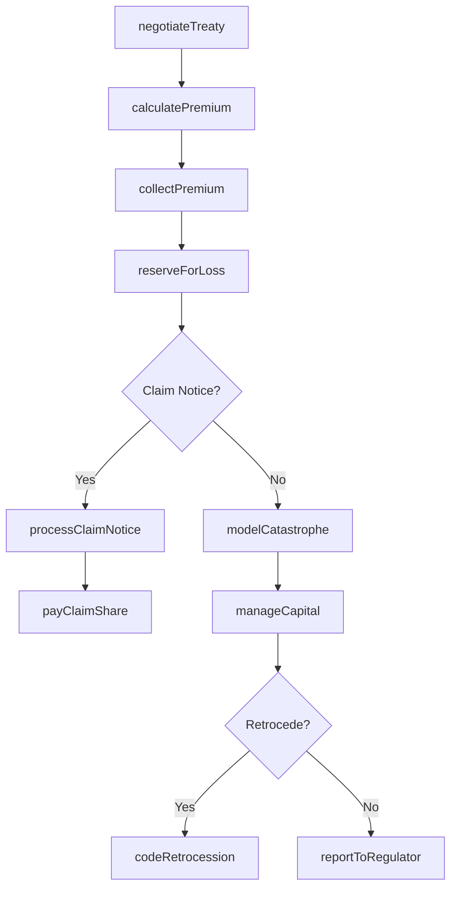
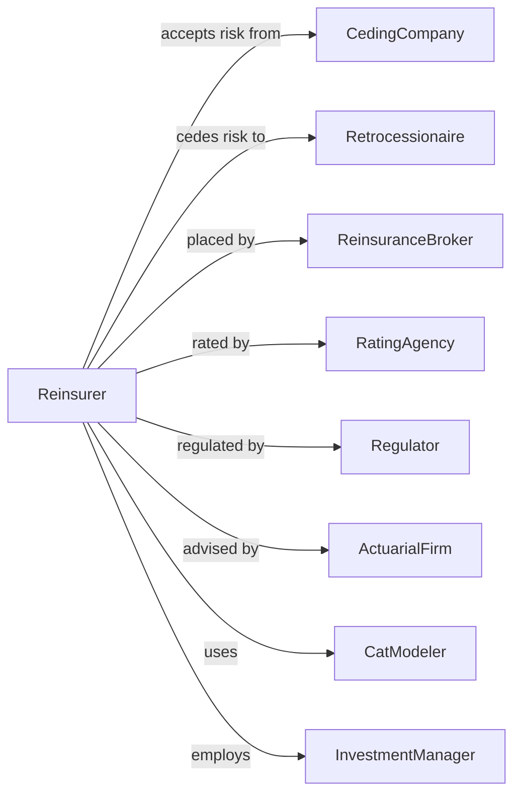

# Reinsurance Carriers

> Business-as-Code definition for reinsurance operations. Models risk assumption from treaty negotiation through premium accounting, claims participation, and retrocession.

## Overview

Reinsurers assume all or part of risks originally underwritten by primary insurance carriers, providing capacity and catastrophe protection. This definition exposes actions for treaty structuring, premium calculation, claims sharing, and capital management, enabling programmatic access to reinsurance operations.

## Actors

| Actor | Description |
|-------|-------------|
| CedingCompany | Primary insurer transferring risk |
| Retrocessionaire | Reinsurer accepting risk from another reinsurer |
| ReinsuranceBroker | Intermediary placing reinsurance business |
| RatingAgency | Firm evaluating reinsurer financial strength |
| Regulator | Authority overseeing reinsurance operations |
| ActuarialFirm | Consultant analyzing loss reserves and pricing |
| CatModeler | Specialist estimating catastrophe exposures |
| InvestmentManager | Professional managing reinsurer portfolio |

## Roles

| Role | Description |
|------|-------------|
| Underwriter | Specialist evaluating and pricing assumed risks |
| TreatyManager | Executive overseeing ongoing treaty relationships |
| ClaimsAnalyst | Staff processing cedant claim notices |
| Actuary | Professional calculating reserves and pricing |
| CapitalManager | Executive optimizing risk capital allocation |
| ComplianceOfficer | Specialist ensuring regulatory adherence |

## Entities

| Entity | Description |
|--------|-------------|
| Treaty | Ongoing agreement to accept specified classes of risk |
| FacultativeCertificate | Individual risk placement outside treaty |
| Premium | Payment from cedant for assumed risk |
| CedingCommission | Amount returned to cedant for expenses |
| LossReserve | Funds set aside for assumed claims |
| RetentionLimit | Maximum risk cedant keeps before cession |
| ExcessOfLoss | Coverage triggered above retention threshold |
| QuotaShare | Proportional sharing of premiums and losses |
| CatastropheBond | Capital markets instrument transferring cat risk |
| Retrocession | Risk ceded by reinsurer to another reinsurer |

## Actions

| Action | Description |
|--------|-------------|
| negotiateTreaty | Structure terms for ongoing risk assumption |
| bindFacultative | Accept individual risk placement |
| calculatePremium | Determine amount due for assumed risk |
| collectPremium | Receive payment from ceding company |
| reserveForLoss | Set aside funds for anticipated claims |
| processClaimNotice | Receive and evaluate cedant loss report |
| payClaimShare | Disburse reinsurer portion of loss |
| codeRetrocession | Transfer portion of assumed risk |
| modelCatastrophe | Estimate exposure to large-scale events |
| manageCapital | Allocate risk capital across portfolio |
| commuteTreaty | Settle and terminate ongoing agreement |
| reportToRegulator | Submit required financial filings |

## Events

| Event | Description |
|-------|-------------|
| treatyNegotiated | Terms structured and agreed |
| facultativeBound | Individual risk accepted |
| premiumCalculated | Amount determined |
| premiumCollected | Payment received |
| lossReserved | Funds set aside |
| claimNoticeProcessed | Loss report evaluated |
| claimSharePaid | Reinsurer portion disbursed |
| retrocessionCeded | Risk transferred to retrocessionaire |
| catastropheModeled | Exposure estimated |
| capitalManaged | Risk capital allocated |
| treatyCommuted | Agreement terminated |
| regulatorReported | Filings submitted |

## Searches

| Search | Description |
|--------|-------------|
| findTreaties | List treaties by cedant, line, or expiration |
| getFacultativeBook | Retrieve individual risk placements |
| getPremiumVolume | Calculate assumed premium by line |
| getLossExperience | Retrieve claims history by treaty |
| getCatastropheExposure | Calculate aggregate cat exposure |
| getRetrocessionProgram | List outward retrocession placements |
| getCapitalUtilization | Assess risk capital deployment |

## Workflow



## Actor Relationships



## Usage

### Calling Actions

```typescript
import { insurePolicies } from '@headlessly/insure-policies'

const reinsurer = insurePolicies()

// Negotiate quota share treaty
const treaty = await reinsurer.negotiateTreaty({
  cedantId: 'cedant-12345',
  lineOfBusiness: 'propertyExcessOfLoss',
  treatyType: 'quotaShare',
  quotaPercent: 25,
  retention: 500000,
  limit: 10_000_000,
  effectiveDate: '2024-01-01'
})

// Process claim notice from cedant
const claim = await reinsurer.processClaimNotice({
  treatyId: treaty.id,
  cedantClaimId: 'claim-67890',
  dateOfLoss: '2024-06-15',
  causeOfLoss: 'hurricane',
  grossLoss: 5_000_000,
  cedantRetention: 500000
})

// Pay reinsurer share of loss
await reinsurer.payClaimShare({
  claimId: claim.id,
  reinsurerShare: claim.grossLoss * 0.25,
  paymentType: 'partial'
})
```

### Event-Driven Automation

```typescript
// Auto-cede large exposures to retrocessionaires
reinsurer.treatyNegotiated(async ({ treatyId, exposureEstimate }) => {
  if (exposureEstimate > 50_000_000) {
    await reinsurer.codeRetrocession({
      treatyId,
      retrocessionaires: ['retro-001', 'retro-002'],
      cedePercent: 40
    })
  }
})

// Model catastrophe after significant claims
reinsurer.claimSharePaid(async ({ treatyId, causeOfLoss, paidAmount }) => {
  if (causeOfLoss === 'hurricane' && paidAmount > 10_000_000) {
    await reinsurer.modelCatastrophe({
      eventType: 'hurricane',
      affectedTreaties: [treatyId],
      updateReserves: true
    })
  }
})
```
