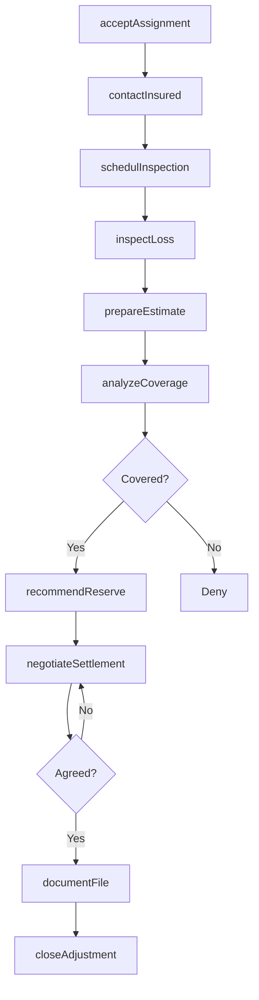
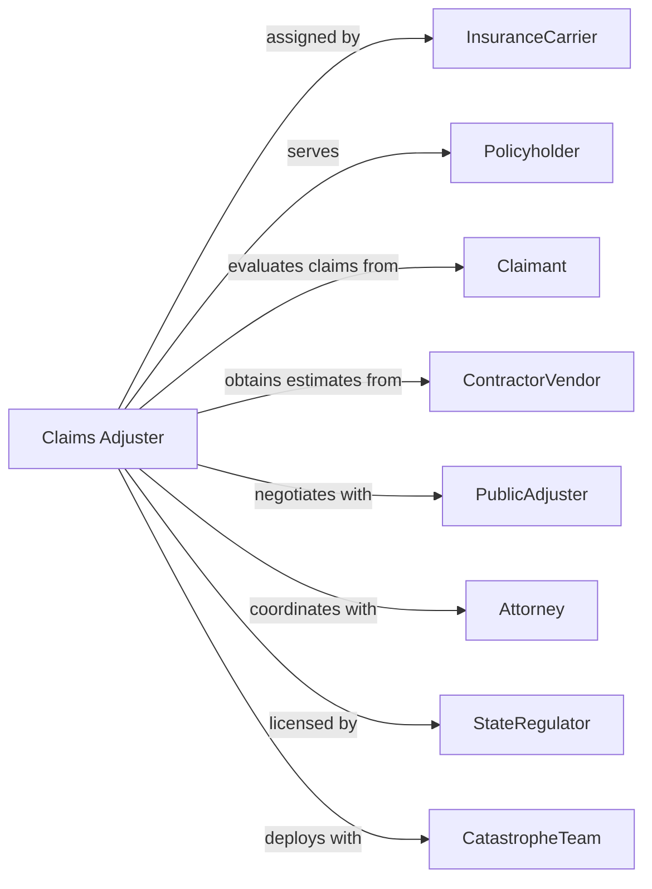

# Claims Adjusting

> Business-as-Code definition for claims adjusting operations. Models loss investigation from assignment through damage assessment, coverage determination, and settlement negotiation.

## Overview

Claims adjusters investigate insurance claims, appraise damage, and negotiate settlements on behalf of insurance carriers or policyholders. This definition exposes actions for claim investigation, damage estimation, coverage analysis, and settlement documentation, enabling programmatic access to claims handling operations.

## Actors

| Actor | Description |
|-------|-------------|
| InsuranceCarrier | Company assigning claims for adjustment |
| Policyholder | Insured party with covered loss |
| Claimant | Third party making claim against policy |
| ContractorVendor | Repair firm providing damage estimates |
| PublicAdjuster | Representative advocating for policyholder |
| Attorney | Legal counsel involved in disputed claims |
| StateRegulator | Authority licensing adjusters |
| CatastropheTeam | Specialized team deployed for large events |

## Roles

| Role | Description |
|------|-------------|
| FieldAdjuster | Professional inspecting losses on-site |
| DeskAdjuster | Staff handling claims remotely |
| SeniorExaminer | Experienced adjuster handling complex claims |
| Appraiser | Specialist estimating property damage |
| SIUInvestigator | Special investigator detecting fraud |
| QualityReviewer | Staff auditing adjustment work product |

## Entities

| Entity | Description |
|--------|-------------|
| Claim | Insurance loss requiring investigation |
| Assignment | Work order from carrier to adjuster |
| Inspection | On-site examination of loss |
| Estimate | Detailed calculation of damage costs |
| CoverageAnalysis | Determination of policy applicability |
| ReserveRecommendation | Suggested funds for anticipated payment |
| SettlementOffer | Proposed payment to resolve claim |
| ProofOfLoss | Sworn statement of loss from insured |
| Subrogation | Right to pursue recovery from third party |
| ClaimFile | Complete documentation of adjustment |

## Actions

| Action | Description |
|--------|-------------|
| acceptAssignment | Receive claim for investigation |
| contactInsured | Initiate communication with policyholder |
| schedulInspection | Arrange on-site loss examination |
| inspectLoss | Examine and document damage |
| prepareEstimate | Calculate repair or replacement costs |
| analyzeCoverage | Determine policy terms applicability |
| recommendReserve | Suggest appropriate claim reserve |
| negotiateSettlement | Work toward agreed payment amount |
| documentFile | Compile complete claim record |
| identifySubrogation | Recognize recovery potential |
| detectFraud | Investigate suspicious claim indicators |
| closeAdjustment | Finalize and submit claim file |

## Events

| Event | Description |
|-------|-------------|
| assignmentAccepted | Claim received for investigation |
| insuredContacted | Communication initiated |
| inspectionScheduled | Site visit arranged |
| lossInspected | Damage examined and documented |
| estimatePrepared | Costs calculated |
| coverageAnalyzed | Policy terms evaluated |
| reserveRecommended | Suggested reserve submitted |
| settlementNegotiated | Payment agreed |
| fileDocumented | Record compiled |
| subrogationIdentified | Recovery potential recognized |
| fraudDetected | Suspicious indicators found |
| adjustmentClosed | File finalized |

## Searches

| Search | Description |
|--------|-------------|
| findAssignments | List claims by carrier, status, or adjuster |
| getInspectionSchedule | Retrieve upcoming site visits |
| getPendingEstimates | List claims awaiting cost calculation |
| getOpenNegotiations | Identify claims in settlement discussion |
| getProductionMetrics | Calculate adjuster throughput and cycle time |
| findFraudIndicators | List claims with suspicious patterns |
| getCatastropheVolume | Retrieve claims by catastrophe event |

## Workflow



## Actor Relationships



## Usage

### Calling Actions

```typescript
import { brokerClaims } from '@headlessly/broker-claims'

const adjuster = brokerClaims()

// Accept new assignment
const assignment = await adjuster.acceptAssignment({
  carrierId: 'carrier-12345',
  claimNumber: 'CLM-67890',
  policyType: 'homeowners',
  lossType: 'waterDamage',
  reserveEstimate: 15000
})

// Schedule and conduct inspection
await adjuster.schedulInspection({
  assignmentId: assignment.id,
  preferredDate: '2024-04-05',
  inspectionType: 'interior'
})

const inspection = await adjuster.inspectLoss({
  assignmentId: assignment.id,
  findings: {
    affectedRooms: ['kitchen', 'basement'],
    damageExtent: 'moderate',
    photos: ['photo-001', 'photo-002']
  }
})

// Prepare estimate and settle
const estimate = await adjuster.prepareEstimate({
  assignmentId: assignment.id,
  lineItems: [
    { description: 'Water extraction', amount: 1500 },
    { description: 'Drywall replacement', amount: 4500 },
    { description: 'Flooring', amount: 8000 }
  ]
})
```

### Event-Driven Automation

```typescript
// Auto-recommend reserve after estimate
adjuster.estimatePrepared(async ({ assignmentId, totalEstimate }) => {
  await adjuster.recommendReserve({
    assignmentId,
    reserveAmount: totalEstimate * 1.1,
    basis: 'estimatePlusContingency'
  })
})

// Identify subrogation potential
adjuster.coverageAnalyzed(async ({ assignmentId, causeOfLoss }) => {
  if (['thirdPartyNegligence', 'productDefect'].includes(causeOfLoss)) {
    await adjuster.identifySubrogation({
      assignmentId,
      responsibleParty: 'tbd',
      recoveryPotential: 'high'
    })
  }
})
```
