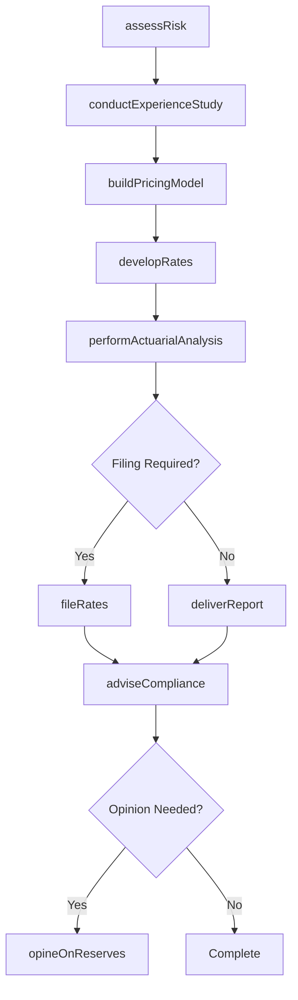
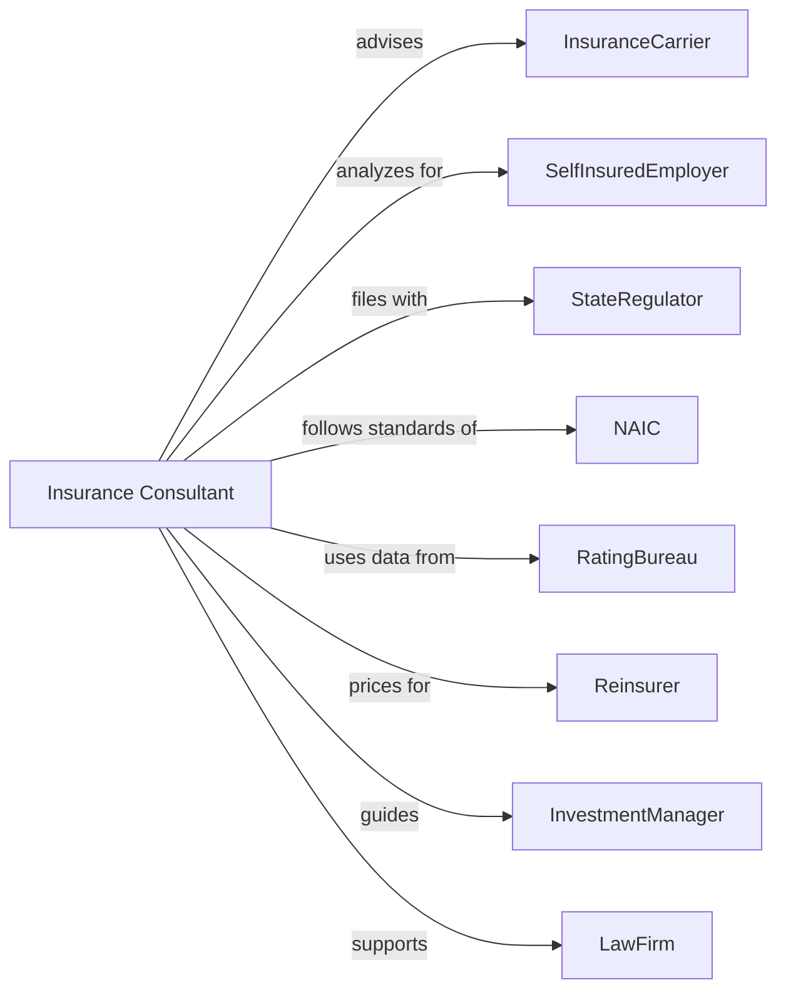

# All Other Insurance Related Activities

> Business-as-Code definition for insurance support services. Models actuarial, advisory, and ratemaking services from engagement through analysis delivery and regulatory filing.

## Overview

Insurance service providers offer advisory, actuarial, and ratemaking services to carriers and self-insured entities on a contract or fee basis. This definition exposes actions for actuarial analysis, rate development, and regulatory compliance support, enabling programmatic access to insurance consulting operations.

## Actors

| Actor | Description |
|-------|-------------|
| InsuranceCarrier | Company purchasing actuarial and advisory services |
| SelfInsuredEmployer | Entity needing loss reserve and funding analysis |
| StateRegulator | Authority requiring rate filings and actuarial opinions |
| NAIC | National Association of Insurance Commissioners setting standards |
| RatingBureau | Organization developing industry loss data and rates |
| Reinsurer | Carrier requiring cession pricing analysis |
| InvestmentManager | Professional seeking insurance asset guidance |
| LawFirm | Counsel needing expert witness services |

## Roles

| Role | Description |
|------|-------------|
| Actuary | Credentialed professional performing actuarial analysis |
| RiskConsultant | Advisor developing risk management strategies |
| RateAnalyst | Specialist calculating insurance pricing |
| ComplianceAdvisor | Professional ensuring regulatory adherence |
| ExpertWitness | Professional providing litigation testimony |
| DataScientist | Specialist analyzing insurance data patterns |

## Entities

| Entity | Description |
|--------|-------------|
| ActuarialReport | Professional opinion on reserves or rates |
| RateFiling | Submission of pricing to regulatory authority |
| LossReserve | Estimated liability for incurred claims |
| RiskAssessment | Evaluation of potential exposures |
| StatementOfActuarialOpinion | Required filing attesting to reserve adequacy |
| ExperienceStudy | Analysis of historical loss patterns |
| PricingModel | Tool calculating insurance premiums |
| CapitalModel | Analysis of required risk-based capital |
| BenchmarkData | Industry comparison statistics |
| RegulatoryFiling | Required submission to state authority |

## Actions

| Action | Description |
|--------|-------------|
| performActuarialAnalysis | Conduct reserve, rate, or capital study |
| developRates | Calculate insurance pricing recommendations |
| fileRates | Submit pricing to regulatory authority |
| opineOnReserves | Provide professional opinion on liabilities |
| assessRisk | Evaluate potential loss exposures |
| conductExperienceStudy | Analyze historical loss patterns |
| buildPricingModel | Create premium calculation tool |
| modelCapital | Analyze risk-based capital requirements |
| provideBenchmark | Supply industry comparison data |
| adviseCompliance | Guide regulatory requirement adherence |
| testifyAsExpert | Provide litigation support and testimony |
| auditActuarial | Review work product for quality |

## Events

| Event | Description |
|-------|-------------|
| actuarialAnalysisPerformed | Study completed |
| ratesDeveloped | Pricing calculated |
| ratesFiled | Submission delivered to regulator |
| reservesOpined | Professional opinion issued |
| riskAssessed | Exposures evaluated |
| experienceStudyConducted | Historical analysis completed |
| pricingModelBuilt | Calculation tool created |
| capitalModeled | Requirements analyzed |
| benchmarkProvided | Comparison data delivered |
| complianceAdvised | Guidance provided |
| expertTestified | Litigation support delivered |
| actuarialAudited | Work product reviewed |

## Searches

| Search | Description |
|--------|-------------|
| findEngagements | List projects by client or type |
| getActuarialReports | Retrieve completed analyses |
| getRateFilings | List regulatory submissions by state |
| getBenchmarkData | Retrieve industry comparison statistics |
| findPendingOpinions | Identify reports awaiting completion |
| getExpertCases | List litigation support engagements |
| getComplianceDeadlines | Retrieve upcoming regulatory due dates |

## Workflow



## Actor Relationships



## Usage

### Calling Actions

```typescript
import { brokerInsurance } from '@headlessly/broker-insurance'

const consultant = brokerInsurance()

// Perform reserve analysis
const reserveStudy = await consultant.performActuarialAnalysis({
  clientId: 'carrier-12345',
  analysisType: 'lossReserve',
  lineOfBusiness: 'workersComp',
  valuationDate: '2024-12-31',
  methods: ['chainLadder', 'bornhuetterFerguson']
})

// Develop and file rates
const rates = await consultant.developRates({
  clientId: 'carrier-12345',
  lineOfBusiness: 'autoPersonal',
  territory: 'CA',
  effectiveDate: '2025-01-01',
  requestedChange: 0.08
})

await consultant.fileRates({
  clientId: 'carrier-12345',
  state: 'CA',
  rateStudyId: rates.id,
  supportingActuarial: reserveStudy.id
})
```

### Event-Driven Automation

```typescript
// Auto-issue opinion after reserve analysis
consultant.actuarialAnalysisPerformed(async ({ studyId, analysisType }) => {
  if (analysisType === 'lossReserve') {
    await consultant.opineOnReserves({
      studyId,
      opinionType: 'statutoryAnnual',
      qualifications: []
    })
  }
})

// Advise on compliance after rate filing
consultant.ratesFiled(async ({ filingId, state }) => {
  await consultant.adviseCompliance({
    filingId,
    regulatoryRequirements: getStateRequirements(state),
    deadlines: getFilingDeadlines(state)
  })
})
```
