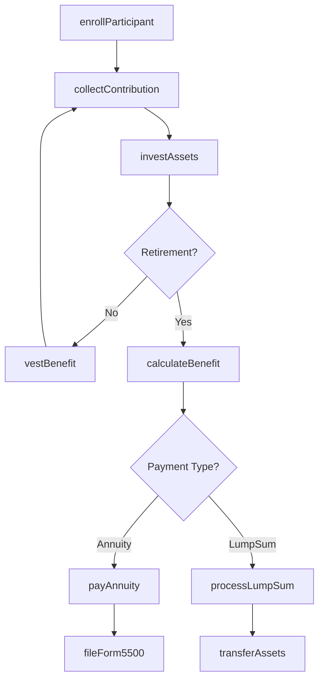
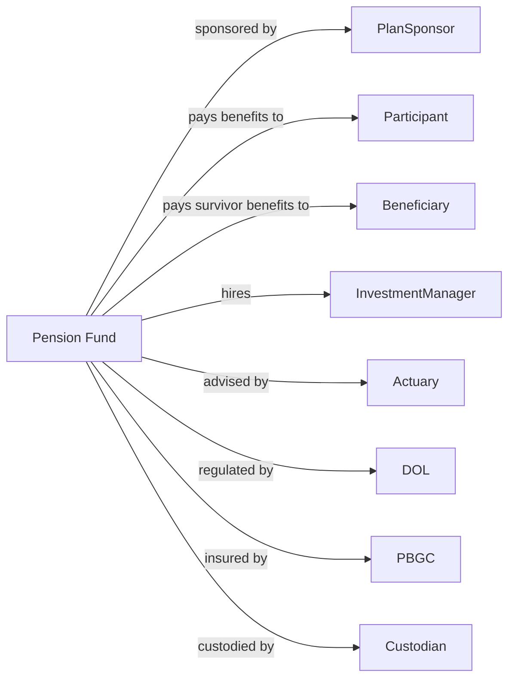

# Pension Funds

> Business-as-Code definition for pension fund operations. Models retirement plan administration from contribution collection through investment management, benefit calculation, and distribution.

## Overview

Pension funds are legal entities organized to provide retirement income exclusively for sponsor employees or members through defined benefit or defined contribution plans. This definition exposes actions for contribution processing, investment management, and benefit payment, enabling programmatic access to retirement fund operations.

## Actors

| Actor | Description |
|-------|-------------|
| PlanSponsor | Employer or union establishing retirement plan |
| Participant | Employee or member earning retirement benefits |
| Beneficiary | Designated recipient of survivor benefits |
| InvestmentManager | Professional managing fund portfolio |
| Actuary | Professional calculating funding and benefits |
| DOL | Department of Labor enforcing ERISA |
| PBGC | Pension Benefit Guaranty Corporation insuring benefits |
| Custodian | Bank safekeeping plan assets |

## Roles

| Role | Description |
|------|-------------|
| PlanAdministrator | Fiduciary overseeing plan operations |
| TrustOfficer | Professional managing fund investments |
| BenefitsSpecialist | Staff calculating and processing benefits |
| ComplianceOfficer | Specialist ensuring ERISA adherence |
| RecordKeeper | Staff maintaining participant accounts |
| ActuaryConsultant | Professional valuing plan liabilities |

## Entities

| Entity | Description |
|--------|-------------|
| PensionPlan | Document defining benefit formula and terms |
| ParticipantAccount | Record of individual contributions and earnings |
| Contribution | Payment into plan by sponsor or participant |
| VestedBenefit | Nonforfeitable retirement benefit |
| Annuity | Periodic benefit payment during retirement |
| LumpSum | Single distribution of accumulated benefit |
| FundingValuation | Actuarial assessment of plan liabilities |
| InvestmentPolicy | Document defining asset allocation strategy |
| Form5500 | Annual DOL filing for retirement plans |
| QualifiedStatus | IRS determination of tax-favored treatment |

## Actions

| Action | Description |
|--------|-------------|
| enrollParticipant | Add employee to pension plan |
| collectContribution | Receive sponsor and participant payments |
| investAssets | Allocate fund portfolio per policy |
| calculateBenefit | Determine retirement income amount |
| vestBenefit | Convert benefit to nonforfeitable status |
| processRetirement | Initiate benefit payments to retiree |
| payAnnuity | Disburse periodic retirement payment |
| processLumpSum | Pay single distribution |
| conductValuation | Perform actuarial funding assessment |
| fileForm5500 | Submit annual regulatory report |
| terminateParticipant | Handle employment separation |
| transferAssets | Move funds to rollover destination |

## Events

| Event | Description |
|-------|-------------|
| participantEnrolled | Employee added to plan |
| contributionCollected | Payment received |
| assetsInvested | Portfolio allocated |
| benefitCalculated | Retirement amount determined |
| benefitVested | Nonforfeitable status achieved |
| retirementProcessed | Benefit payments initiated |
| annuityPaid | Periodic payment disbursed |
| lumpSumProcessed | Single distribution paid |
| valuationConducted | Funding assessment completed |
| form5500Filed | Regulatory report submitted |
| participantTerminated | Separation processed |
| assetsTransferred | Rollover completed |

## Searches

| Search | Description |
|--------|-------------|
| findParticipants | List members by status, age, or service |
| getAccountBalances | Retrieve participant account values |
| getVestingStatus | Calculate vesting percentage by participant |
| getBenefitEstimates | Project retirement income amounts |
| getAssetAllocation | Retrieve current portfolio composition |
| getFundingStatus | Calculate plan funded percentage |
| getDistributions | List benefit payments by type |

## Workflow



## Actor Relationships



## Usage

### Calling Actions

```typescript
import { managePensions } from '@headlessly/manage-pensions'

const pensionFund = managePensions()

// Enroll new participant
const participant = await pensionFund.enrollParticipant({
  employeeId: 'emp-12345',
  hireDate: '2020-01-15',
  birthDate: '1985-06-20',
  salary: 75000,
  contributionRate: 0.06
})

// Process retirement benefit
const benefit = await pensionFund.calculateBenefit({
  participantId: participant.id,
  retirementDate: '2050-06-20',
  formula: 'finalAveragePay',
  yearsOfService: 30
})

// Begin annuity payments
await pensionFund.processRetirement({
  participantId: participant.id,
  benefitAmount: benefit.monthlyAmount,
  paymentForm: 'jointAndSurvivor',
  effectiveDate: '2050-07-01'
})
```

### Event-Driven Automation

```typescript
// Auto-invest contributions
pensionFund.contributionCollected(async ({ planId, amount }) => {
  await pensionFund.investAssets({
    planId,
    amount,
    allocationPolicy: 'targetDate',
    rebalance: true
  })
})

// Calculate vesting on service anniversary
pensionFund.participantEnrolled(async ({ participantId, hireDate }) => {
  scheduleAnnually(hireDate, async () => {
    await pensionFund.vestBenefit({
      participantId,
      vestingSchedule: 'sixYear'
    })
  })
})
```
