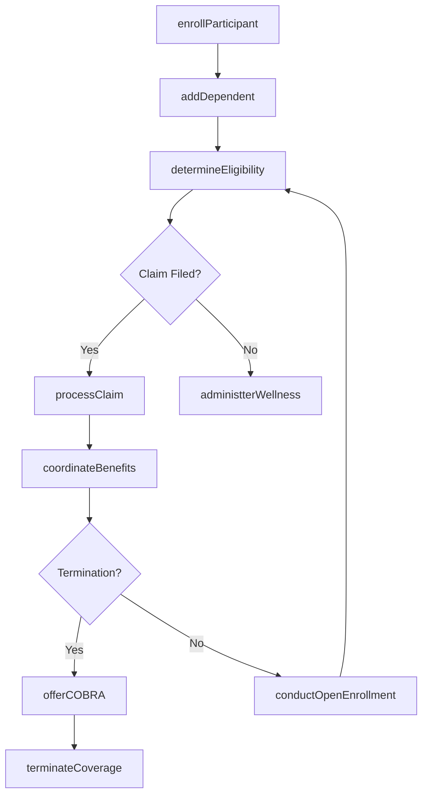
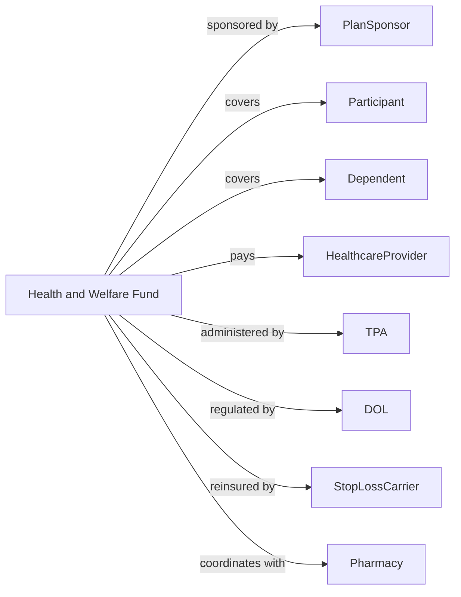

# Health and Welfare Funds

> Business-as-Code definition for health and welfare fund operations. Models employee benefit plan administration from enrollment through claims processing and benefit payment.

## Overview

Health and welfare funds are legal entities providing medical, surgical, hospital, vacation, training, and other health- and welfare-related benefits exclusively for sponsor employees or members. This definition exposes actions for eligibility management, claims processing, and benefit coordination, enabling programmatic access to employee benefit fund operations.

## Actors

| Actor | Description |
|-------|-------------|
| PlanSponsor | Employer or union establishing benefit plan |
| Participant | Employee or member receiving benefits |
| Dependent | Family member covered under participant plan |
| HealthcareProvider | Physician or facility delivering care |
| TPA | Third party administrator processing claims |
| DOL | Department of Labor enforcing ERISA |
| StopLossCarrier | Insurer covering catastrophic claims |
| Pharmacy | Dispensary filling prescription benefits |

## Roles

| Role | Description |
|------|-------------|
| PlanAdministrator | Fiduciary overseeing plan operations |
| BenefitsManager | Executive managing benefit programs |
| ClaimsProcessor | Staff adjudicating benefit claims |
| EligibilitySpecialist | Staff maintaining participant enrollment |
| ComplianceOfficer | Specialist ensuring ERISA and ACA adherence |
| WellnessCoordinator | Staff managing health promotion programs |

## Entities

| Entity | Description |
|--------|-------------|
| BenefitPlan | Document defining covered services and terms |
| Enrollment | Active coverage record for participant |
| Claim | Request for payment for covered services |
| Eligibility | Status determining benefit entitlement |
| COBRA | Continuation coverage for terminated participants |
| SummaryPlanDescription | Document explaining plan benefits |
| StopLossPolicy | Coverage for claims exceeding threshold |
| WellnessProgram | Health promotion initiative |
| OpenEnrollment | Annual period for coverage changes |
| QualifyingEvent | Life change triggering special enrollment |

## Actions

| Action | Description |
|--------|-------------|
| enrollParticipant | Add employee to benefit plan |
| addDependent | Include family member in coverage |
| processClaim | Adjudicate request for benefit payment |
| determineEligibility | Verify coverage entitlement |
| offerCOBRA | Provide continuation coverage election |
| coordinateBenefits | Determine payment when multiple coverage exists |
| administterWellness | Manage health promotion programs |
| conductOpenEnrollment | Process annual coverage elections |
| processQualifyingEvent | Handle mid-year coverage changes |
| fileForm5500 | Submit annual regulatory report |
| communicateBenefits | Distribute plan information to participants |
| terminateCoverage | End participant benefit eligibility |

## Events

| Event | Description |
|-------|-------------|
| participantEnrolled | Employee added to plan |
| dependentAdded | Family member included |
| claimProcessed | Payment determination made |
| eligibilityDetermined | Coverage entitlement verified |
| cobraOffered | Continuation election provided |
| benefitsCoordinated | Multiple coverage resolved |
| wellnessAdministered | Health program managed |
| openEnrollmentConducted | Annual elections processed |
| qualifyingEventProcessed | Mid-year change handled |
| form5500Filed | Regulatory report submitted |
| benefitsCommunicated | Information distributed |
| coverageTerminated | Eligibility ended |

## Searches

| Search | Description |
|--------|-------------|
| findParticipants | List members by coverage type or status |
| getEligibility | Retrieve coverage entitlement by participant |
| getClaimsHistory | List claims by participant or provider |
| getCOBRAParticipants | Identify members on continuation coverage |
| getOpenEnrollmentStatus | Track annual election completion |
| getWellnessParticipation | Measure health program engagement |
| getPlanCosts | Calculate benefit expenses by type |

## Workflow



## Actor Relationships



## Usage

### Calling Actions

```typescript
import { manageBenefits } from '@headlessly/manage-benefits'

const welfareFund = manageBenefits()

// Enroll participant with dependents
const enrollment = await welfareFund.enrollParticipant({
  employeeId: 'emp-12345',
  planId: 'medical-ppo',
  coverageTier: 'family',
  effectiveDate: '2024-01-01'
})

await welfareFund.addDependent({
  participantId: enrollment.participantId,
  relationship: 'spouse',
  name: 'Jane Doe',
  birthDate: '1987-03-15'
})

// Process medical claim
const claim = await welfareFund.processClaim({
  participantId: enrollment.participantId,
  providerId: 'prov-67890',
  serviceDate: '2024-03-15',
  procedureCode: '99213',
  billedAmount: 150.00
})
```

### Event-Driven Automation

```typescript
// Offer COBRA on termination
welfareFund.coverageTerminated(async ({ participantId, terminationDate }) => {
  await welfareFund.offerCOBRA({
    participantId,
    electionDeadline: addDays(terminationDate, 60),
    coverageOptions: ['medical', 'dental', 'vision']
  })
})

// Coordinate benefits automatically
welfareFund.claimProcessed(async ({ participantId, claimId }) => {
  const otherCoverage = await checkOtherCoverage(participantId)
  if (otherCoverage) {
    await welfareFund.coordinateBenefits({
      claimId,
      primaryPayer: otherCoverage.isPrimary ? 'other' : 'plan',
      otherCarrier: otherCoverage.carrierId
    })
  }
})
```
