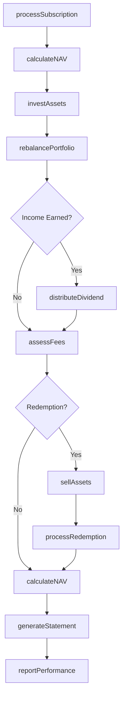
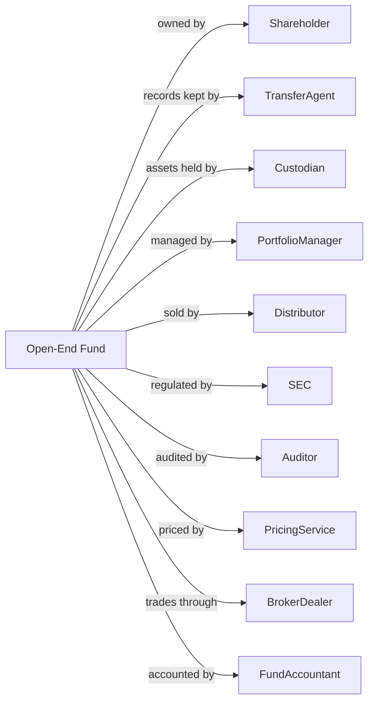

# Open-End Investment Funds

> Business-as-Code definition for mutual fund and open-end investment operations. Models share transactions from investor subscription through NAV calculation, portfolio management, and redemption processing.

## Overview

Open-end investment funds are legal entities organized to pool assets consisting of securities or other financial instruments. Shares are offered continuously and perpetually, with redemptions processed at a price determined by net asset value. This includes mutual funds, money market funds, and exchange-traded funds. This definition exposes actions for shareholder transactions, NAV computation, portfolio management, and regulatory compliance, enabling programmatic access to fund operations.

## Actors

| Actor | Description |
|-------|-------------|
| Shareholder | Investor owning fund shares |
| TransferAgent | Entity maintaining shareholder records |
| Custodian | Bank safekeeping fund assets |
| PortfolioManager | Professional selecting investments |
| Distributor | Firm marketing and selling fund shares |
| SEC | Securities and Exchange Commission regulating funds |
| Auditor | Firm verifying financial statements |
| PricingService | Vendor providing security valuations |
| BrokerDealer | Firm executing portfolio trades |
| FundAccountant | Provider calculating NAV and fund accounting |

## Roles

| Role | Description |
|------|-------------|
| ChiefInvestmentOfficer | Executive overseeing investment strategy |
| PortfolioManager | Professional managing fund holdings |
| Trader | Staff executing security transactions |
| ComplianceOfficer | Specialist ensuring regulatory adherence |
| ShareholderServicesRep | Staff handling investor inquiries |
| FundController | Executive managing fund accounting |

## Entities

| Entity | Description |
|--------|-------------|
| Share | Unit of ownership in the fund |
| NAV | Net asset value per share |
| Prospectus | Document describing fund objectives and risks |
| Portfolio | Collection of securities held by fund |
| Subscription | Purchase of fund shares |
| Redemption | Sale of fund shares back to fund |
| Dividend | Distribution of investment income |
| CapitalGain | Distribution of realized appreciation |
| ExpenseRatio | Annual fund operating costs as percentage |
| Benchmark | Index used to measure fund performance |

## Actions

| Action | Description |
|--------|-------------|
| processSubscription | Accept investor purchase of shares |
| processRedemption | Execute investor sale of shares |
| calculateNAV | Compute net asset value per share |
| investAssets | Purchase securities for portfolio |
| sellAssets | Liquidate portfolio holdings |
| rebalancePortfolio | Adjust holdings to target allocation |
| distributeDividend | Pay investment income to shareholders |
| distributeCapitalGain | Distribute realized gains to shareholders |
| fileProspectus | Submit offering document to SEC |
| generateStatement | Create shareholder account statement |
| assessFees | Calculate and accrue fund expenses |
| reportPerformance | Publish fund returns and analytics |

## Events

| Event | Description |
|-------|-------------|
| subscriptionProcessed | Share purchase completed |
| redemptionProcessed | Share sale completed |
| navCalculated | Daily net asset value computed |
| assetsInvested | Portfolio purchases executed |
| assetsSold | Portfolio sales executed |
| portfolioRebalanced | Holdings adjusted to targets |
| dividendDistributed | Income paid to shareholders |
| capitalGainDistributed | Gains distributed to shareholders |
| prospectusFiled | Offering document submitted |
| statementGenerated | Account statement created |
| feesAssessed | Expenses calculated and accrued |
| performanceReported | Returns published |

## Searches

| Search | Description |
|--------|-------------|
| findShareholders | List investors by account size or type |
| getPortfolioHoldings | Retrieve current fund positions |
| getNAVHistory | Retrieve historical net asset values |
| getPerformance | Calculate returns over specified periods |
| getPendingTransactions | List unprocessed subscriptions and redemptions |
| getDistributionHistory | Retrieve dividend and gain payment history |
| getExpenseBreakdown | Analyze fund operating costs |

## Workflow



## Actor Relationships



## Usage

### Calling Actions

```typescript
import { poolPortfolios } from '@headlessly/pool-portfolios'

const mutualFund = poolPortfolios()

// Process new subscription
const subscription = await mutualFund.processSubscription({
  fundId: 'growth-fund-001',
  shareholderId: 'inv-12345',
  amount: 10000,
  shareClass: 'A',
  settlementDate: '2024-04-02'
})

// Calculate end-of-day NAV
const nav = await mutualFund.calculateNAV({
  fundId: 'growth-fund-001',
  valuationDate: '2024-04-01',
  pricingSource: 'primary'
})

// Rebalance portfolio to targets
await mutualFund.rebalancePortfolio({
  fundId: 'growth-fund-001',
  targetAllocation: {
    equities: 0.70,
    fixedIncome: 0.25,
    cash: 0.05
  },
  tolerance: 0.02
})

// Process redemption request
await mutualFund.processRedemption({
  fundId: 'growth-fund-001',
  shareholderId: 'inv-67890',
  shares: 500,
  paymentMethod: 'wire'
})
```

### Event-Driven Automation

```typescript
// Auto-invest subscriptions based on model
mutualFund.subscriptionProcessed(async ({ fundId, amount }) => {
  const model = await getInvestmentModel(fundId)
  for (const allocation of model.allocations) {
    await mutualFund.investAssets({
      fundId,
      securityId: allocation.securityId,
      amount: amount * allocation.weight
    })
  }
})

// Distribute dividends quarterly
mutualFund.navCalculated(async ({ fundId, valuationDate }) => {
  if (isQuarterEnd(valuationDate)) {
    const income = await calculateAccruedIncome(fundId)
    if (income > 0) {
      await mutualFund.distributeDividend({
        fundId,
        amount: income,
        recordDate: valuationDate,
        paymentDate: addDays(valuationDate, 5)
      })
    }
  }
})
```
